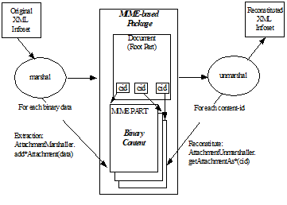

//
// Copyright (c) 2020, 2021 Contributors to the Eclipse Foundation
//

[appendix]
== Enhanced Binary Data Handling

=== Overview

Optimized transmission of binary data as
attachments is described by standards such as Soap [MTOM]/Xml-binary
Optimized Packaging[XOP] and WS-I Attachment Profile 1.0 [WSIAP]. To
optimally support these standards when JAXB databinding is used within a
message passing environment, <<jakarta-xml-bind-attachments>>
specifies an API that allows for an
integrated, cooperative implementation of these standards between a
MIME-based package processor and the Jakarta XML Binding unmarshal/marshal
processes. An enhanced binding of MIME content to Java representation is
specified in <<Binding MIME Binary Data>>.

=== Binding MIME Binary Data

==== Binary Data Schema Annotation

As specified in [MIME], the XML Schema
annotation attribute, `xmime:expectedContentTypes`, lists the expected
MIME content-type(s) for element content whose type derives from the xsd
binary datatypes, `xs:base64Binary` or `xs:hexBinary`.

Jakarta XML Binding databinding recognizes this schema
constraint to improve the binding of MIME type constrained binary data
to Java representation. The `xmime:expectedContentType` attribute is
allowed on type definitions deriving from binary datatypes and on
element declarations with types that derive from binary datatypes. For
Jakarta XML Binding binding purposes, the schema annotation,
`xmime:expectedContentTypes` is evaluated for binding purposes for all
cases EXCEPT when the annotation is on an element declaration with a
named complex type definition. For that case, the
`xmime:expectedContentTypes` annotation must be located directly within
the scope of the complex type definition in order to impact the binding
of the complex type definition’s simple binary content.

===== Binding Known Media Type

When `@xmime:expectedContentTypes` schema
annotation only refers to one MIME type, it is considered a known media
type for the binary data. [MIME] does not require an `xmime:contentType`
attribute to hold the dynamic mime type for the binary data for this
case. JAXB binding can achieve an optimal binding for this case. The
default MIME type to Java datatype are in <<a5119>>.

.Default Binding for Known Media Type
[[a5119]]
[cols=",",options="header",]
|===
| MIME Type | Java Type
| `image/gif` | `java.awt.Image`
| `image/jpeg` | `java.awt.Image`
| `text/xml` or `application/xml` | `javax.xml.transform.Source`
| `_any other MIME types_` | `jakarta.activation.DataHandler`
|===

A JAXB program annotation element,
`@XmlMimeType`, is generated to preserve the known media type for use
at marshal time.

.schema with a known media type
[source,xml,indent="2"]
----
<?xml version="1.0" ?>
<xs:schema xmlns:xs="http://www.w3.org/2001/XMLSchema"
           xmlns:tns="http://example.com/know-type"
           xmlns:xmime="http://www.w3.org/2005/05/xmlmime"
           targetNamespace="http://example.com/know-type">
  <xs:import namespace="http://www.w3.org/2005/05/xmlmime"
             schemaLocation="http://www.w3.org/2005/05/xmlmime"/>
  <xs:element name="JPEGPicture"
              type="xs:base64binary"
              xmime:expectedContentTypes="image/jpeg"/>
</xs:schema>
----

.Jakarta XML Binding binding of Example 8-1
[source,java,indent="4"]
----
import java.awt.Image;
@XmlRegistry
class ObjectFactory {
    @XmlElementDecl(...)
    @XmlMimeType("image/jpeg")
    JAXBELement<Image> createJPEGPicture(Image value);
}
----

The `@XmlMimeType` annotation provides the
MIME content type needed by Jakarta XML Binding Marshaller to specify the mime type
to set `DataHandler.setContentType(String)`.

.Schema for local element declaration annotated with known media type
[[a5140]]
[source,xml,indent="2"]
----
<?xml version="1.0" ?>
<xs:schema xmlns:xs="http://www.w3.org/2001/XMLSchema"
           xmlns:tns="http://example.com/know-type"
           xmlns:xmime="http://www.w3.org/2005/05/xmlmime"
           targetNamespace="http://example.com/know-type">
  <xs:import namespace="http://www.w3.org/2005/05/xmlmime"
             schemaLocation="http://www.w3.org/2005/05/xmlmime"/>
  <xs:complexType name="Item">
    <xs:sequence>
      <xs:element name="JPEGPicture"
                  type="xs:base64Binary"
                  xmime:expectedContentTypes="image/jpeg"/>
    </xs:sequence>
  </xs:complexType>
</xs:schema>
----

.Java Binding of <<a5140>>
[source,java,indent="4"]
----
import java.awt.Image;
public class Item {
    @XmlMimeType("image/jpeg")
    Image getJPEGPicture();
    void setJPEGPicture(Image value);
}
----

===== Binding Preferred Media Types

If there are more than one mime type listed
in `xmime:expectedContentTypes` or if there is one with a wildcard in
it, the annotation specifies the Preferred Media Types and recommends
that the binary data be simple content that has an attribute
`xmime:contentType` that specifies which of the
`xmime:expectedContentTypes` the binary data represents.

Given that the exact media type is not known
for this case, a Preferred Media Type binds to
`jakarta.activation.DataHandler`. `DataHandler` has a property
`get/setContentType` that should be kept synchronized with the value of
the JAXB binding for the `xmime:contentType` attribute.

==== Binding WS-I Attachment Profile `ref:swaRef`

An XML element or attribute with a type
definition of `ref:swaRef` is bound to a JAXB property with base type of
`jakarta.activation.DataHandler` and annotated with `@XmlAttachmentRef`.

=== jakarta.xml.bind.attachments

The abstract classes `AttachmentUnmarshaller`
and `AttachmentMarshaller` in package `jakarta.xml.bind.attachments` are
intended to be implemented by a MIME-based package processor, such as
Jakarta XML Web Services implementation, and are called during JAXB unmarshal/marshal.
The JAXB unmarshal/marshal processes the root part of a MIME-based
package, delegating knowledge of the overall package and its other parts
to the `Attachment*` class implementations.

==== AttachmentUnmarshaller

An implementation of this abstract class by a
MIME-based package processor provides access to package-level
information that is outside the scope of the JAXB unmarshal process. A
MIME-based package processor registers its processing context with a
Jakarta XML Binding processor using the method
`setAttachmentUnmarshaller(AttachmentUnmarshaller)` of
`jakarta.xml.bind.Unmarshaller`.

Interactions between the Unmarshaller and the
abstract class are summarized below. The javadoc specifies the details.

[source,java,indent="4"]
----
public abstract class AttachmentUnmarshaller {
public boolean isXOPPackage();
public abstract DataHandler getAttachmentAsDataHandler(String cid);
public abstract byte[] getAttachmentAsByteArray(String cid);
}
----

The JAXB unmarshal process communicates with
a MIME-based package processor via an instance of AttachmentUnmarshaller
registered with the unmarshaller.
<<opbin>> summarizes this
processing.

* MTOM/XOP processing during unmarshal: +
When `isXOPPackage()` returns true, the unmarshaller replaces each XOP
include element it encounters with MIME content returned by the
appropriate `getAttachment*()` method.
* WS-I AP processing: +
Each element or attribute of type definition `ref:swaRef`, a content-id
uri reference to binary data, is resolved by the unmarshal process by a
call to the appropriate `getAttachment*()` method.

==== AttachmentMarshaller

An `AttachmentMarshaller` instance is
registered with a `jakarta.xml.bind.Marshaller` instance using the method
`Marshaller.setAttachmentMarshaller()`.

Interactions between the Marshaller and the
abstract class is summarized below. See the javadoc for details.

[source,java,indent="4"]
----
public abstract class AttachmentMarshaller {
public boolean isXOPPackage();
public abstract String addMtomAttachment(
                    DataHandler data,
                    String elementNamespace,
                    String elementLocalName);
public abstract String addMtomAttachment(
                    byte[] data,
                    String elementNamespace,
                    String elementLocalName);
public abstract String addSwaRefAttachment(DataHandler data);
}
----

When an AttachmentMarshaller instance is
registered with the Marshaller, the following processing takes place.

* MTOM/XOP processing: +
When `isXOPPackage()` is true and a JAXB property representing binary
data is being marshalled, the method `addMtomAttachment(..)` is called
to provide the MIME-based package processor the opportunity to decide to
optimize or inline the binary data.
+
Note that the schema customization specified in
<<inlinebinarydata-declaration>> can be
used to declaratively disable XOP processing for binary data.
* WS-I AP processing: +
The `addSwaRefAttachment` method is called when marshalling content
represented by a `ref:swaRef` type definition.
 +
One can declaratively customize swaRef processing within a schema using
schema customization @attachmentRef of <jaxb:property>, specified in
<<usage-4>>.

.JAXB marshal/unmarshalling of optimized binary content.
[[opbin]]

