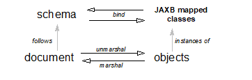

//
// Copyright (c) 2020 Contributors to the Eclipse Foundation
//

== [[a2]]Introduction

XML is, essentially, a platform-independent
means of structuring information. An XML document is a tree of
_elements_ . An element may have a set of _attributes_ , in the form of
key-value pairs, and may contain other elements, text, or a mixture
thereof. An element may refer to other elements via _identifier_
attributes or other types via _type_ attributes, thereby allowing
arbitrary graph structures to be represented.

An XML document need not follow any rules
beyond the well-formedness criteria laid out in the XML 1.0
specification. To exchange documents in a meaningful way, however,
requires that their structure and content be described and constrained
so that the various parties involved will interpret them correctly and
consistently. This can be accomplished through the use of a _schema_ . A
schema contains a set of rules that constrains the structure and content
of a document’s components, _i.e._ , its elements, attributes, and text.
A schema also describes, at least informally and often implicitly, the
intended conceptual meaning of a document’s components. A schema is, in
other words, a specification of the syntax and semantics of a
(potentially infinite) set of XML documents. A document is said to be
_valid_ with respect to a schema if, and only if, it satisfies the
constraints specified in the schema.

In what language is a schema defined? The XML
specification itself describes a sublanguage for writing _document-type
definitions_ , or DTDs. As schemas go, however, DTDs are fairly weak.
They support the definition of simple constraints on structure and
content, but provide no real facility for expressing datatypes or
complex structural relationships. They have also prompted the creation
of more sophisticated schema languages such as XDR, SOX, RELAX, TREX,
and, most significantly, the XML Schema language defined by the World
Wide Web Consortium. The XML Schema language has gained widespread
acceptance. It is the schema language of choice for many of the XML
related specifications authored by industry standard working groups.

Therefore, the design center for this specification is W3C XML Schema
language.

=== Data binding

Any nontrivial application of XML will, then,
be based upon one or more schemas and will involve one or more programs
that create, consume, and manipulate documents whose syntax and
semantics are governed by those schemas. While it is certainly possible
to write such programs using the low-level SAX parser API or the
somewhat higher-level DOM parse-tree API, doing so is not easy. The
resulting code is also difficult to maintain as the schemas evolve.
While useful to some, many applications access and manipulate XML
content within a document; its document structure is less relevant.

It would be much easier to write XML-enabled
programs if we could simply map the components of an XML document to
in-memory objects that represent, in an obvious and useful way, the
document’s intended meaning according to its schema. Of what classes
should these objects be instances? In some cases there will be an
obvious mapping from schema components to existing classes, especially
for common types such as String, Date, Vector, and so forth. In
general, however, classes specific to the schema being used will be
required.

Classes specific to a schema may be derived or
may already exist. In some application scenarios e.g. web services, a
data model composed using user authored classes may already exist. A
schema is derived from existing classes. In-memory objects are instances
of existing classes. In other application scenarios, a data model is
composed by authoring a schema. In such cases, rather than burden
developers with having to write classes specific to schema, we can
generate the classes directly from the schema. In all application
scenarios, we create a Java object-level _binding_ of the schema.

But even applications manipulating documents
at conceptual object level, may desire to access or manipulate
structural information in a document, e.g. element names. Therefore, the
ability for an application to relate between the XML document
representation and the Java object-level binding enables the use of XML
operations over the XML document representation, e.g. Xpath.to bind XML
content to an object model such as DOM is useful.

An _XML data-binding facility_ therefore
contains a _schema compiler and a schema generator_. A schema compiler
can consume a schema and generate schema derived classes specific to the
schema. A schema generator consumes a set of existing classes and
generates a schema.

A schema compiler binds components of a
_source schema_ to schema-derived Java _value classes_. Each value class
provides access to the content of the corresponding schema component via
a set of JavaBeans-style access (_i.e._, `get` and `set`) methods.
_Binding declarations_ provides a capability to customize the binding
from schema components to Java representation.

A schema generator binds existing classes to
schema components. Each class containing Java Beans-style access
(_i.e._, `get` and `set`) methods is bound to a corresponding schema
component. Program annotations provide a capability to customize the
binding from existing classes to derived schema components.

Access to content is through in-memory representation of existing classes.

Such a facility also provides a _binding
framework_ , a runtime API that, in conjunction with the derived or
existing classes, supports three primary operations:

. The _unmarshalling_ of an XML document into
a tree of interrelated instances of both existing and schema-derived
classes,
. The _marshalling_ of such _content trees_
back into XML documents, and
. The _binding,_ maintained by a _binder,_
between an XML document representation and _content tree_.

The unmarshalling process has the capability
to check incoming XML documents for validity with respect to the
schema. +

.Binding XML to Java objects

To sum up: Schemas describe the structure and
meaning of an XML document, in much the same way that a class describes
an object in a program. To work with an XML document in a program we
would like to map its components directly to a set of objects that
reflect the document’s meaning according to its schema. We can achieve
this by compiling the schema into a set of derived content classes or by
compiling a set of existing classes into a schema and marshalling,
unmarshalling and validating XML documents that follow the schema. Data
binding thus allows XML-enabled programs to be written at the same
conceptual level as the documents they manipulate, rather than at the
more primitive level of parser events or parse trees.

Schema evolution in response to changing
application requirements, is inevitable. A document therefore might not
always necessarily follow the complete schema, rather a part of a
versioned schema. Dealing with schema evolution requires both a
versioning strategy as well as more flexible marshalling, unmarshalling
and validation operations.

XML applications, such as workflow
applications, consist of distributed, cooperative components
interoperating using XML documents for data exchange. Each distributed
component may need to access and update only a part of the XML document
relevant to itself, while retaining the fidelity of the rest of the XML
document. This is also more robust in the face of schema evolution,
since the changes in schema may not impact the part of the document
relevant to the application. The _binder_ enables _partial binding_ of
the relevant parts of the XML document to a content tree and
_marshalling_ updates back to the original XML document.

=== Goals

The JAXB architecture is designed with the
goals outlined here in mind.

* [[a25]]Full W3C XML Schema support +
 +
Support for XML Schema features not required
to be supported in JAXB 1.0 has been added in this version.

* [[a27]]Binding existing Java classes to generated XML schema +
 +
This addresses application scenarios where
design begins with Java classes rather than an XML schema. One such
example is an application that exports itself as a web service that
communicates using SOAP and XML as a transport mechanism. The
marshalling of Java object graph is according to program annotations,
either explicit or defaulted, on the existing Java classes.

* Meet data binding requirements for The Java API for XML Web Services(JAX-WS) 2.0 +
 +
JAX-WS 2.0 will use the XML data binding
facility defined by JAXB 2.0. Hence, JAXB 2.0 will meet all data binding
requirements of JAX-WS 2.0.

* Ease of Development: Leverage J2SE 5.0 Language Extensions +
 +
For ease of development, J2SE 5.0 introduces
additional language language extensions.The language extensions include
generics (JSR 14), typesafe enums (JSR201), annotations (JSR 175). Use
of the language extensions in binding of XML schema components to Java
representation will result in a better and simpler binding, thus making
the application development easier.

* Container Managed Environments +
 +
A container managed environment separates
development from the deployment phases. This enables choice of
generation of artifacts such as derived classes or derived schema at
either development or deployment time.
Any requirements related to the deployment of
components using JAXB in a container managed environment will be
addressed.

* Schema evolution +
 +
Schema evolution is a complex and difficult
area; it is also an important area. It is particularly important in data
centric applications such as Web services, where distributed
applications interact using XML as a data interchange format but are
designed with different versions of the schema. It is also important in
document centric applications where schemas are designed for
extensibility. Strategies to address both application scenarios will be
investigated and support added accordingly.

* Application specific behavior +
 +
There should be a way to associate application
specific behavior with schema derived code in a portable manner.

* Partial mapping of XML document relevant to application +
 +
In some application scenarios, only a subset
of the data within a XML document may be relevant to the application.

* Integration with other Java technologies +
 +
Integration or relationship with the following
Java technologies will be clarified. +
** Streaming API For XML (JSR 173) (StAX)

* Relationship to XML related specifications +
 +
XML related specifications will be surveyed to
determine their relationship to JAXB.

* Portability of JAXB mapped classes +
 +
An architecture that provides for a fully
portable JAXB 2.0 applications written to the J2SE platform will be
defined. JAXB 2.0 is targeted for inclusion in a future version of J2SE.
Application portability is a key requirement for inclusion in J2SE. +
 +
JAXB annotated classes must be source level
and binary compatible with any other JAXB 2.0 binding framework
implementation. As in JAXB 1.0, schema-derived interfaces/implementation
classes are only required to be source code compatible with other JAXB
implementations of the same version.

* Preserving equivalence - Round tripping (Java to XML to Java) +
 +
Transforming a Java content tree to XML
content and back to Java content again should result in an equivalent
Java content tree before and after the transformation.

* Preserving equivalence - Round tripping (XML to Java to XML) +
 +
While JAXB 1.0 specification did not require
the preservation of the XML information set when round tripping from XML
document to Java representation and back to XML document again, it did
not forbid the preservation either. The same applies to this version of
the specification.

* Unmarshalling invalid XML content +
 +
Unmarshalling of invalid content was out of
scope for JAXB 1.0. Simple binding rules and unmarshalling mechanisms
that specify the handling of invalid content will be defined.

* Ease of Use - Manipulation of XML documents in Java +
 +
Lower the barrier to entry to manipulating XML
documents within Java programs. Programmers should be able to access and
modify XML documents via a Java binding of the data, not via SAX or DOM.
It should be possible for a developer who knows little about XML to
compile a simple schema and immediately start making use of the classes
that are produced. +
 +
Rather than not supporting XML Schema extensibility concepts that can
not be statically bound, such as unconstrained wildcard content, these
concepts should be exposed directly as DOM or some other XML infoset
preserving representation since there is no other satisfactory static
Java binding representation for them.

* Customization +
 +
Applications sometimes require customization
to meet their data binding requirements. Customization support will
include: +
** XML to Java: +
 +
A standard way to customize the binding of
existing XML schema components to Java representation will be provided.
JAXB 1.0 provided customization mechanisms for the subset of XML Schema
components supported in JAXB 1.0. Customization support will be extended
to additional XML Schema features to be supported in this version of the
specification link:jaxb.html#a25[See Full W3C XML Schema
support].
** Java to XML: +
 +
A standard way to customize the binding of
existing Java classes to XML schema will be added,
link:jaxb.html#a27[See Binding existing Java classes to
generated XML schema].

* Schema derived classes should be natural +
 +
Insofar as possible, derived classes should
observe standard Java API design guidelines and naming conventions. If
new conventions are required then they should mesh well with existing
conventions. A developer should not be astonished when trying to use a
derived class.

* Schema derived classes should match conceptual level of source schema +
 +
It should be straightforward to examine any
content-bearing component of the source schema and identify the
corresponding Java language construct in the derived classes.

=== Non-Goals

* Support for Java versions prior to J2SE 5.0 +
 +
JAXB 2.0 relies on many of the Java language
features added in J2SE 5.0. It is not a goal to support JAXB 2.0 on Java
versions prior to J2SE 5.0.

* Explicit support for specifying the binding of DTD to a Java representation. +
 +
While it was desired to explicitly support
binding DTD to a Java representation, it became impractical to describe
both XML Schema binding and DTD binding. The existence of several
conversion tools that automate the conversion of a DTD to XML Schema
allows DTD users to be able to take advantage of JAXB technology by
converting their existing DTDs to XML Schema.

* XML Schema Extensions +
 +
XML Schema specification allows the annotation
of schemas and schema components with appinfo elements. JAXB 1.0
specifies the use of appinfo elements to customize the generated code.
For this version of the specification, use of appinfo elements for
customization of generated code continues to be in scope. However, use
of appinfo element to introduce validation constraints beyond those
already described in XML Schema 1.0 specification is out of scope.

* Support for SOAP Encoding +
 +
SOAP Encoding is out of scope. Use of the SOAP
encoding is essentially deprecated in the web services community, e.g.
the WS-I Basic Profile[WSIBP] excludes SOAP encoding.

* Support for validation on demand by schema derived classes +
 +
While working with a content tree
corresponding to an XML document it is often necessary to validate the
tree against the constraints in the source schema. JAXB 1.0 made it
possible to do this at any time, without the user having to first
marshal the tree into XML. However it is a non goal in JAXB 2.0, which
leverages the JAXP 1.3 validation API.

* Object graph traversal +
 +
Portable mechanisms to traverse a graph of
JavaBean objects will not be addressed in JAXB 2.0.

* Mapping any existing Java classes to any existing XML schema +
 +
The JAXB annotation mechanism is not
sophisticated enough to enable mapping an arbitrary class to all XML
schema concepts.

=== Conventions

Within normative prose in this specification,
the words _should_ and _must_ are defined as follows:

*  __should__ +
Conforming implementations are permitted to but need not behave as
described.
*  __must__ +
Conforming implementations are required to behave as described;
otherwise they are in error.

Throughout the document, the XML namespace
prefix `xs:` and `xsd:` refers to schema components in W3C XML Schema
namespace as specified in [XSD Part 1] and [XSD Part 2]. The XML
namespace prefix `xsi:` refers to the XML instance namespace defined in
[XSD Part 1]. Additionally, the XML namespace prefix `jaxb:` refers to
the JAXB namespace, `http://java.sun.com/xml/ns/jaxb`. The XML
namespace prefix `ref:` refers to the namespace
`http://ws-i.org/profiles/basic/1.1/xsd` as defined in [WSIBP] and
[WSIAP].

All examples in the specification are for
illustrative purposes to assist in understanding concepts and are
non-normative. If an example conflicts with the normative prose, the
normative prose always takes precedence over the example.

=== Expert Group Members

The following people have contributed to this
specification.

[cols=",",]
|===
|Chavdar Baikov |SAP
AG

|David Bau |

|Arnaud Blandin |

|Stephen Brodsky
|IBM

|Russell Butek |IBM

|Jongjin Choi |TMAX

|Glen Daniels |Sonic
Software

|Blaise Doughan
|Oracle

|Christopher Fry
|BEA Systems

|Stanley Guan
|Oracle

|Mette Hedin |

|Kohsuke Kawaguchi
|Sun Microsystems, Inc.

|Sravan Kumar
|Pramati Technologies

|Changshin Lee |Tmax
Soft, Inc.

|Anjana Manian
|Oracle

|Ed Merks |IBM

|Steve Perry
|Fidelity Information Services

|Radu Preotiuc-Pietro
|BEA

|Srividya Rajagopalan
|Nokia Corporation

|Yann Raoul |

|Bjarne Rasmussen
|Novell, Inc.

|Adinarayana Sakala
|IONA Technologies PLC

|Dennis M. Sosnoski
|

|Keith Visco |

|Stefan Wachter |

|Umit Yalcinalp |

|Scott Ziegler |BEA
Systems

|Zulfi Umrani
|Novell, Inc.
|===

=== Acknowledgements

This document is a derivative work of concepts
and an initial draft initially led by Mark Reinhold of Sun Microsystems.
Our thanks to all who were involved in pioneering that initial effort.
The feedback from the Java User community on the initial JAXB technology
prototype greatly assisted in identifying requirements and directions.

The data binding experiences of the expert
group members have been instrumental in identifying the proper blend of
the countless data binding techniques that we have considered in the
course of writing this specification. We thank them for their
contributions and their review feedback.

Kohsuke Kawaguchi and Ryan Shoemaker have
directly contributed content to the specification and wrote the
companion javadoc. The following JAXB technology team members have been
invaluable in keeping the specification effort on the right track: Tom
Amiro, Leonid Arbouzov, Evgueni Astigueevitch, Jennifer Ball, Carla
Carlson, Patrick Curran, Scott Fordin, Omar Fung, Peter Kacandes, Dmitry
Khukhro, Tom Kincaid, K. Ari Krupnikov, Ramesh Mandava, Bhakti Mehta, Ed
Mooney, Ilya Neverov, Oleg Oleinik, Brian Ogata, Vivek Pandey, Cecilia
Peltier, Evgueni Rouban and Leslie Schwenk. The following people, all
from Sun Microsystems, have provided valuable input to this effort:
Roberto Chinnici, Chris Ferris, Mark Hapner, Eve Maler, Farrukh Najmi,
Eduardo Pelegri-llopart, Bill Shannon and Rahul Sharma.

The JAXB TCK software team would like to
acknowledge that the NIST XML Schema test suite [NIST] has greatly
assisted the conformance testing of this specification.

=== Acknowledgements for JAXB 2.0

Version 2.0 of this specification was created
under the Java Community Process as JSR-222. This specification is
shaped by valuable input from expert group members, people with Sun, and
Java User community feedback based on their experience with JAXB 1.0.

The data binding experience of the expert
group has been very instrumental in identifying usage scenarios
(including those from web services),design and evaluation of different
databinding techniques. We thank them for their contributions and review
feedback.

The following people, all from Sun
Microsystems, have provided valuable input. The experiences of the
reference implementation team, led by Kohsuke Kawaguchi, has been
influential in identifying data binding solutions. Kohsuke Kawaguchi and
Ryan Shoemaker have directly contributed content to the companion
javadoc.Addtional feedback was provided by the following JAXB technology
team members: Bhakti Mehta, Ed Mooney, Ryan Shoemaker, Karthikeyan
Krishnamurthy, Tom Amiro, Leonid Arbouzov, Leonid Kuskov, Dmitry
Fazunenko, Dmitry Lepekhin, Alexey Vishentsev, Omar Fung, and Anita
Jindal. Valuable input was provided by the following people from Sun:
Eduardo Pelegri-Llopart, Graham Hamilton, Mark Hapner, Bill Shannon.

The JAXB TCK software team would like to
acknowledge that the NIST XML Schema test suite [NIST] has greatly
assisted the conformance testing of this specification.

