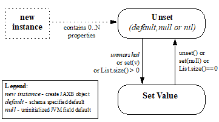
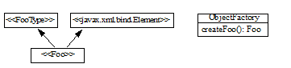
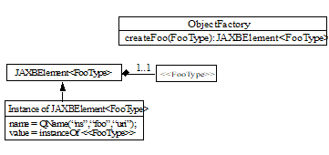
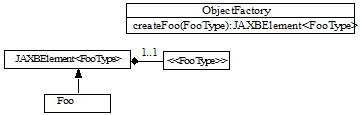
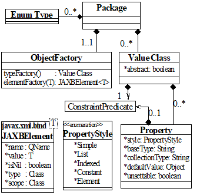
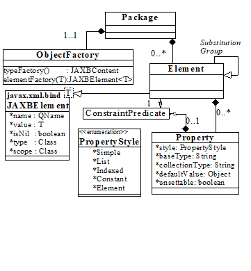

//
// Copyright (c) 2020 Contributors to the Eclipse Foundation
//

== Java Representation of XML Content

This section defines the basic binding
representation of package, value class, element classes, properties and
enum type within the Java programming language. Each section briefly
states the XML Schema components that could be bound to the Java
representation. A more rigorous and thorough description of possible
bindings and default bindings occurs in link:jaxb.html#a694[See
Binding XML Schema to Java Representations]” and in
link:jaxb.html#a1498[See Customizing XML Schema to Java
Representation Binding].”

=== Mapping between XML Names and Java Identifiers

XML schema languages use _XML names_, _i.e._,
strings that match the Name production defined in XML 1.0 (Second
Edition) to label schema components. This set of strings is much larger
than the set of valid Java class, method, and constant identifiers.
link:jaxb.html#a4649[See Appendix], “Binding XML Names to Java
Identifiers,” specifies an algorithm for mapping XML names to Java
identifiers in a way that adheres to standard Java API design
guidelines, generates identifiers that retain obvious connections to the
corresponding schema, and results in as few collisions as possible. It
is necessary to rigorously define a standard way to perform this mapping
so all implementations of this specification perform the mapping in the
same compatible manner.

=== Java Package

Just as the target XML namespace provides a
naming context for the named type definitions, named model groups,
global element declarations and global attribute declarations for a
schema vocabulary, the Java package provides a naming context for Java
interfaces and classes. Therefore, it is natural to map the target
namespace of a schema to be the package that contains the Java value
class representing the structural content model of the document.

A package consists of:

* A _name_ , which is either derived directly
from the XML namespace URI as specified in
link:jaxb.html#a4788[See Generating a Java package name]” or
specified by a binding customization of the XML namespace URI as
described in link:jaxb.html#a1674[See package].”
* A set of Java value classes representing the
content models declared within the schema.
* A set of Java element classes representing
element declarations occurring within the schema.
link:jaxb.html#a642[See Java Element Representation]” describes
this binding in more detail.
* A public class `ObjectFactory` contains:
** An instance factory method signature for
each Java content within the package. +
 +
Given Java value class named Foo, here is the derived factory method:

 public Foo createFoo();

** An element instance factory method
signature for each bound element declaration.

 public JAXBElement<T> createFoo(T elementValue);

** Dynamic instance factory allocator method signature:

 public Object newInstance(Class javaContentInterface);

** Property setter/getter +
Provide the ability to associate implementation specific property/value
pairs with the instance creation process.

 java.lang.Object getProperty(String name);
 void setProperty(String name, Object value);

* A set of enum types.
* Package javadoc.

*_Example:_* +
Purchase Order Schema fragment with `targetNamespace`:

[source,xml]
----
<xs:schema xmlns:xs="http://www.w3.org/2001/XMLSchema"
            xmlns:po="http://www.example.com/PO1"
            targetNamespace="http://www.example.com/PO1">
  <xs:element name="purchaseOrder" type="po:PurchaseOrderType"/>
  <xs:element name="comment"       type="xs:string"/>
  <xs:complexType name="PurchaseOrderType"/>
  ...
</xs:schema>
----

Default derived Java code:

[source,java]
----
package com.example.PO1;
import jakarta.xml.bind.JAXBElement;
public class PurchaseOrderType {...};
public Comment { String getValue() {...} void setValue(String) {...} }
...
public class ObjectFactory {
    PurchaseOrderType createPurchaseOrderType();
    JAXBElement<PurchaseOrderType> createPurchaseOrder(PurchaseOrderType elementValue);
    Comment createComment(String value);
    ...
}
----

=== Enum Type

A simple type definition whose value space is
constrained by enumeration facets can be bound to a Java enum type. Enum
type was introduced in J2SE 5.0 and is described in Section 8.9 of
[JLS]. Enum type is a significant enhancement over the typesafe enum
design pattern that it was designed to replace. If an application wishes
to refer to the values of a class by descriptive constants and
manipulate those constants in a type safe manner, it should consider
binding the XML component containing enumeration facets to an enum type.

An enum type consists of:

* A _name_ , which is either computed
directly from an XML name or specified by a binding customization for
the schema component.
* A _package name_, which is either computed
from the target namespace of the schema component or specified within a
binding declaration as a customization of the target namespace or a
specified package name for components that are scoped to no target
namespace.
* Outer Class Names is “_._” separated list of outer class names. +
 +
By default, if the XML component containing a
typesafe enum class to be generated is scoped within a complex type as
opposed to a global scope, the typesafe enum class should occur as a
nested class within the Java value class representing the complex type
scope. +
Absolute class name is PackageName.[OuterClassNames.]Name. +
Note: Outer Class Name is null if class is a top-level class. +
 +
The schema customization <jaxb:globalBindings localScoping=”toplevel”/>,
specified in Section link:jaxb.html#a1582[See Usage], disables
the generation of schema-derived nested classes and can be used to
override the default binding of a nested schema component binding to
nested Java class.

* A set of _enum constants_.
* Class javadoc is a combination of a documentation annotation
from the schema component and/or javadoc specified by customization.

An _enum constant_ consists of:

* A _name_, which is either computed from the
enumeration facet value or specified by customization.
* A _value_ for the constant. Optimally, the
_name_ is the same as the _value_. This optimization is not possible
when the enumeration facet value is not a valid Java identifier.
* A datatype for the constant’s value.
* _Javadoc for the constant field_ is a
combination of a documentation annotation for an enumeration value facet
and/or javadoc specified by customization.

=== Content Representation

A complex type definition is bound to either
a Java value class or a content interface, depending on the value of the
global binding customization *[jaxb:globalBinding]*
`@generateValueClass`, specified in link:jaxb.html#a1582[See
Usage]”. Value classes are generated by default. The attributes and
children element content of a complex type definition are represented as
properties of the Java content representation. Property representations
are introduced in link:jaxb.html#a541[See Properties].

==== Value Class

A value class consists of:

* A _name_ , which is either computed
directly from an XML name or specified by a binding customization for
the schema component.
* A package name, which is either computed
from the target namespace of the schema component or specified by a
binding customization of the target namespace or a specified package
name for components that are scoped to no target namespace.
* The _outer class name_ context, a dot-separated list of Java class names. +
 +
By default, if the XML schema component for
which a Java value class is to be generated is scoped within a complex
type as opposed to globally, the complex class should occur as a nested
class within the Java value class representing the complex type scope.
The schema customization <jaxb:globalBindings localScoping=”toplevel”/>,
specified in Section link:jaxb.html#a1582[See Usage], disables
the generation of schema-derived nested classes and all classes are
generated as toplevel classes. +
 +
The absolute class name is PackageName.[OuterClassNames.]Name. +
Note: The OuterClassNames is null if the class is a top-level class.

* A base class that this class extends. See
link:jaxb.html#a917[See Complex Type Definition] for further
details.
* A set of Java properties providing access
and modification to the complex type definition’s attributes and content
model represented by the value class.
* Class-level javadoc is a combination of a
documentation annotation from the schema component and/or javadoc
specified within customization.
* Creation
  ** A value class supports creation via a
public constructor, either an explicit one or the default no-arg
constructor.
  ** A factory method in the package’s
`ObjectFactory` class (introduced in link:jaxb.html#a482[See
Java Package]”). The factory method returns the type of the Java value
class. The name of the factory method is generated by concatenating the
following components:
+
--
    *** The string constant `create`.
    *** If the Java value class is nested within another value class,
then the concatenation of all outer Java class names.
    *** The _name_ of the Java value class.
--
+
For example, a Java value class named `Foo`
that is nested within Java value class `Bar` would have the following
factory method signature generated in the containing Java package’s
`ObjectFactory` class:

 Bar.Foo createBarFoo() {...}

==== Java Content Interface

This binding is similar to the value class binding
with the following differences.

* A content interface is a public interface
while a value class is a public class.
* A content interface can only be created
with an ObjectFactory method whereas a value class can be created using
a public constructor. The factory method signature is the same for both
value class and content interface binding to ease switching between the
two binding styles.
* A content interface contains the method
signatures for the set of properties it contains, while a value class
contains method implementations.

=== Properties

The schema compiler binds local schema
components to _properties_ within a Java value class.

A property is defined by:

* A _name_, which is either computed from the XML name
or specified by a binding customization for the schema component.
* A _base type_, which may be a Java
primitive type (_e.g._, `int`) or a reference type.
* An optional _predicate_ , which is a
mechanism that tests values of the base type for validity and throws a
`TypeConstraintException` if a type constraint expressed in the source
schema is violated.footnote:constraint[Note that it is optional for a JAXB
implementation to support type constraint checks
when setting a property in this version of the specification.]
* An optional _collection type_ , which is
used for properties whose values may be composed of more than one value.
* A _default value_ . Schema component has a
schema specified default value which is used when property’s value is
not set and not nil.
* Is _nillable_ . A property is nillable when
it represents a nillable element declaration.

A property is _realized_ by a set of _access methods_.
Several property models are identified in the following
subsections; each adds additional functionally to the basic set of
access methods.

A property’s access methods are named in the
standard JavaBeans style: the name-mapping algorithm is applied to the
property name and then each method name is constructed by prefixing the
appropriate verb (`get`, `set`, etc.).

[[a552]]A property is
said to have a _set value_ if that value was assigned to it during
unmarshallingfootnote:[An unmarshalling
implementation should distinguish between a value from an XML instance
document and a schema specified defaulted value when possible. A
property should only be considered to have a _set value_ when there exists
a corresponding value in the XML content being unmarshalled.
Unfortunately, unmarshalling implementation paths do exist that can not
identify schema specified default values, this situation is considered a
one-time transformation for the property and the defaulted value will be
treated as a _set value_.] or by invoking its mutation method.
The _value_ of a property is its _set value_, if defined; otherwise, it is
the property’s schema specified _default value_, if any; otherwise, it is
the default initial value for the property’s base type as it would be
assigned for an uninitialized field within a Java
classfootnote:[Namely, a `boolean` field type defaults to `false`,
`integer` field type defaults to `0`, object reference field type
defaults to `null`, floating point field
type defaults to `+0.0f`.]. link:jaxb.html#50536473_21325[Figure 5.1]
illustrates the states of a JAXB property and the invocations that
result in state changes.

==== Simple Property

A non-collection property `prop` with a base
type _Type_ is realized by the two methods

[source,java,indent=8]
----
public Type getId();
public void setId(Type value);
----

where _Id_ is a metavariable that represents
the Java method identifier computed by applying the name mapping
algorithm described in link:jaxb.html#a4656[See The Name to
Identifier Mapping Algorithm]” to prop. There is one exception to this
general rule in order to support the boolean property described in
[BEANS]. When _Type_ is boolean, the `get__Id__` method specified above is
replaced by the method signature, _boolean_ `is__Id__()`.

* The `get` or `is` method returns the
property’s value as specified in the previous subsection. If _null_ is
returned, the property is considered to be absent from the XML content
that it represents.
* The `set` method defines the property’s _set value_
to be the argument `value`. If the argument value is `null`, the
property’s _set value_ is discarded. Prior to setting the property’s value
when TypeConstraint validation is enabledfootnote:[Note that it is
optional for a JAXB implementation to support type constraint checks
when setting a property in this version of the specification.],
a non-`null` value is validated by applying the property’s predicate. If
`TypeConstraintException` is thrown, the property retains the value it
had prior to the `set` method invocation.

When the base type for a property is a
primitive non-reference type and the property’s value is optional, the
corresponding Java wrapper class can be used as the base type to enable
discarding the property’s set value by invoking the set method with a
null parameter. link:jaxb.html#a610[See `isSet` Property
Modifier] describes an alternative to using a wrapper class for this
purpose. The *[jaxb:globalBinding]* customization `@optionalProperty`
controls the binding of an optional primitive property as described in
link:jaxb.html#a1582[See Usage].

*_Example:_* +
In the purchase order schema, the _partNum_
attribute of the _item_ element definition is declared:

[source,xml,indent=4]
----
<xs:attribute name="partNum" type="SKU" use="required"/>
----

This element declaration is bound to a simple
property with the base type `java.lang.String`:

[source,java,indent=4]
----
public String getPartNum();
public void setPartNum(String x);
----

The `setPartNum` method could apply a
predicate to its argument to ensure that the new value is legal, _i.e._,
that it is a string value that complies with the constraints for the
simple type definition, SKU, and that derives by restriction from
`xs:string` and restricts the string value to match the regular
expression pattern `"\d{3}-[A-Z]{2}"`.

It is legal to pass `null` to the
`setPartNum` method even though the `partNum` attribute declaration’s
attribute `use` is specified as required. The determination if `partNum`
content actually has a value is a local structural constraint rather
than a type constraint, so it is checked during validation rather than
during mutation.

==== Collection Property

A collection property may take the form of an
_indexed property_ or a _list property_. The base type of an indexed
property may be either a primitive type or a reference type, while that
of a list property must be a reference type.

A collection consists of a group of
collection items. If one of the collection items can represent a
nillable element declaration, setting a collection item to `null` is
semantically equivalent to inserting a nil element, `xsi:nil="true"` ,
into the collection property. If none of the collection items can ever
represent a nillable element declaration, setting a collection item to
`null` is the semantic equivalent of removing an optional element from
the collection property.

===== Indexed Property

This property follows the indexed property
design pattern for a multi-valued property from the JavaBean
specification. An indexed property `prop` with base type _Type_ is
realized by the five methods

[source,java,indent=8]
----
public Type[] getId();
public void setId(Type[] value);
public void setId(int index, Type value);
public Type getId(int index);
public int getIdLength();
----

regardless of whether _Type_ is a primitive
type or a reference type. _Id_ is computed from `prop` as it was defined
in simple property. An array item is a specialization of the collection
item abstraction introduced in the collection property overview.

* `get__Id__()` +
The array `getter` method returns an array containing the property’s
value. If the property’s value has not set, then `null` is returned.
* `set__Id__(_Type_ [])` +
The `array setter` method defines the property’s set value. If the
argument itself is `null` then the property’s set value, if any, is
discarded. If the argument is not `null` and `TypeConstraint` validation
is enabledfootnote:constraint[] then the sequence of values in the
array are first validated by applying the property’s predicate, which
may throw a `TypeConstraintException`. If the `TypeConstraintException`
is thrown, the property retains the value it had prior to the `set`
method invocation. The property’s value is only modified after the
`TypeConstraint` validation step.
* `set__Id__(int, _Type_)` +
The indexed `setter` method allows one to set a value within the array.
The runtime exception `java.lang.ArrayIndexOutOfBoundsException` may be
thrown if the index is used outside the current array bounds. If the
value argument is non-null and TypeConstraint validation is enabledfootnote:constraint[],
the value is validated against the property’s predicate, which may throw
an unchecked `TypeConstraintException`. If `TypeConstraintException` is
thrown, the array index remains set to the same value it had before the
invocation of the indexed `setter` method. When the array item
represents a nillable element declaration and the indexed setter value
parameter is null, it is semantically equivalent to inserting a nil
element into the array.
* `get__Id__(int)` +
The indexed `getter` method returns a single element from the array.
The runtime exception `java.lang.ArrayIndexOutOfBoundsException` may be
thrown if the index is used outside the current array bounds. In order
to change the size of the array, you must use the array set method to
set a new (or updated) array.
* `get__Id__Length()` +
The indexed length method returns the length of the array. This method
enables you to iterate over all the items within the indexed property
using the indexed mutators exclusively. Exclusive use of indexed
mutators and this method enable you to avoid the allocation overhead
associated with array `getter` and `setter` methods.

The arrays returned and taken by these
methods are not part of the content object’s state. When an array
`getter` method is invoked, it creates a new array to hold the returned
values. Similarly, when the corresponding array `setter` method is
invoked, it copies the values from the argument array.

To test whether an indexed property has a set
value, invoke its `array getter` method and check that the result is not
`null`. To discard an indexed property’s set value, invoke its array
`setter` method with an argument of `null`.

See the customization attribute
`collectionType` in link:jaxb.html#a1580[See <globalBindings>
Declaration]” and link:jaxb.html#a1783[See <property>
Declaration]” on how to enable the generation of indexed property
methods for a collection property.

*_Example:_* +
In the purchase order schema, we have the
following repeating element occurrence of element _item_ within
`complexType` _Items_.

[source,xml,indent=4]
----
<xs:complexType name="Items">
  <xs:sequence>
    <xs:element name="item" minOccurs="1" maxOccurs="unbounded">
      <xs:complexType>...</xs:complexType>
  </xs:element>
</xs:complexType>
----

The content specification of this element
type could be bound to an array property realized by these five methods:

[source,java,indent=4]
----
public Items.ItemType[] getItem();
public void setItem(Items.ItemType[] value);
public void setItem(int index, Items.ItemType value);
public Items.ItemType getItem(int index);
public int getItemLength();
----

===== List Property

A list property `prop` with base type _Type_
is realized by the method where `List`
[source,java,indent=8]
----
public List<Type> getId();
----
is the interface `java.util.List`,
_Id_ is defined as above. If base type is a primitive type, the
appropriate wrapper class is used in its place.

* The `get` method returns an object that
implements the `List<Type>` interface, is mutable, and contains the
values of type _Type_ that constitute the property’s value. If the
property does not have a set value or a schema default value, a zero
length `java.util.List` instance is returned.

The `List` returned by the `get` method is a
component of the content object’s state. Modifications made to this list
will, in effect, be modifications to the content object. If
`TypeConstraint` validation is enabled, the list’s mutation methods
apply the property’s predicate to any non-`null` value before adding
that value to the list or replacing an existing element’s value with
that value; the predicate may throw a `TypeConstraintException`. The
collection property overview discussion on setting a collection item to
null specifies the meaning of inserting a null into a List.

The `unset` method introduced in
link:jaxb.html#a610[See isSet Property Modifier] enables one to
discard the set value for a List property.

[NOTE]
.Design Note
====
There is no setter method for a List property. The getter returns
the List by reference. An item can be added to the List returned by
the getter method using an appropriate method defined on `java.util.List`.
Rationale for this design in JAXB 1.0 was to enable the implementation
to wrapper the list and be able to perform checks as content was added
or removed from the List.

====

*_Example:_* +
The content specification of the _item_
element type could alternatively be bound to a list property realized by
one method:

[source,java,indent=4]
----
public List<Item> getItem();
----

The list returned by the `getItem` method
would be guaranteed only to contain instances of the `Item` class. As
before, its length would be checked only during validation, since the
requirement that there be at least one `item` in an element instance of
complex type definition `Items` is a structural constraint rather than a
type constraint.

==== Constant Property

An attribute use named _prop_ with a schema
specified fixed value can be bound to a Java constant value. _Id_ is
computed from _prop_ as it was defined in simple property. The value of
the fixed attribute of the attribute use provides the `_<fixedValue>_`
constant value.

[source,java,indent=8]
----
public static final Type ID = <fixedValue>;
----

The binding customization attribute
`fixedAttributeToConstantProperty` enables this binding style.
link:jaxb.html#a1580[See <globalBindings> Declaration]” and
link:jaxb.html#a1783[See <property> Declaration]” describe how
to use this attribute.

==== `isSet` Property Modifier

This optional modifier augments a modifiable
property to enable the manipulation of the property’s value as
a _set value_ or a _defaulted value_. Since this functionality
is above and beyond the typical JavaBean pattern for a property,
the method(s) associated with this modifier are not generated by default.
link:jaxb.html#a1498[See Customizing XML Schema to Java
Representation Binding]” describes how to enable this customization
using the `generateIsSetMethod` attribute.

The method signatures for the `isSet`
property modifier are the following:

[source,java,indent=8]
----
public boolean isSetId();
----

where `_Id_` is defined as it was for simple and collection property.

* The `isSet` method returns `true` if the
property has been set during unmarshalling or by invocation of the
mutation method `setId` with a non-`null` value.footnote:[A Java application
usually does not need to distinguish between the absence of a element
from the infoset and when the element occurred with nil content. Thus,
in the interest of simplifying the generated API, methods were not
provided to distinguish between the two. Two annotation elements
@XmlElement.required and @XmlElement.nillable allow a null value to be
marshalled as an empty or nillable element.] +
To aid the understanding of what `isSet` method implies,
note that the unmarshalling process only unmarshals _set values_
into XML content.

A list property and a simple property with a
non-reference base type require an additional method to enable you to
discard the _set value_ for a property:

[source,java,indent=8]
----
public void unsetId();
----

* The `unset` method marks the property as
having no _set value_. A subsequent call to `getId` method returns the
schema-specified default if it existed; otherwise, it returns the Java
default initial value for `Type`.

All other property kinds rely on the
invocation of their set method with a value of null to discard the set
value of its property. Since this is not possible for primitive types or
a List property, the additional method is generated for these
cases illustrate the
method invocations that result in transitions between the possible
states of a JAXB property
value.

.[[a623]]States of a Property Value

*_Example:_* +
In the purchase order schema, the `partNum`
attribute of the element `item`’s anonymous complex type is declared:

[source,xml,indent=4]
----
<xs:attribute name="partNum" type = "SKU" use="required"/>
----

This attribute could be bound to a `isSet`
simple property realized by these four methods:

[source,java,indent=8]
----
public String getPartNum();
public void setPartNum(String skuValue);
public boolean isSetPartNum();
public void unsetPartNum();
----

It is legal to invoke the `unsetPartNum`
method even though the attribute’s `use` is `"required"` in the XML
Schema. That the attribute actually has a value is a local structural
constraint rather than a type constraint, so it is checked during
validation rather than during mutation.

==== Element Property

This property pattern enables the dynamic
association of an element name for a JAXB property. Typically, the
element name is statically associated with a JAXB property based on the
schema’s element name. Element substitution groups and wildcard content
allow an XML document author to use Element names that were not
statically specified in the content model of the schema. To support
these extensibility features, an application uses element property
setters/getters to dynamically introduce element names at runtime.

The method signatures for the `Element`
property pattern are the following:

[source,java,indent=8]
----
public void setId(JAXBElement<? extends Type> value);
public JAXBElement<? extends Type> getId();
----

where `_Id_` and `_Type_` are defined as they
were for simple and collection property. The fully qualified Java name
for `_JAXBElement<T>_` is `_jakarta.xml.bind.JAXBElement<T>_`. The generic
types in the method signatures are expressed as a bounded wildcard to
support element substitution group, see details in
link:jaxb.html#a1023[See Element Declaration]”.

==== Property Summary

The following core properties have been defined:

* Simple property - JavaBean design pattern for single value property
* Indexed property - JavaBean design pattern for multi-valued property
* List property - Leverages java.util.Collection
* Constant property

The methods generated for these four core
property kinds are sufficient for most applications. Configuration-level
binding schema declarations enable an application to request finer
control than provided by the core properties. For example, the `isSet`
property modifier enables an application to determine if a property’s
value is set or not.

=== Java Element Representation

Based on rationale and criteria described in
link:jaxb.html#a1023[See Element Declaration], the schema
compiler binds an element declaration to a Java instance that implements
`jakarta.xml.bind.JAXBElement<T>`. `JAXBElement<T>` class provides access
to the basic properties of an XML element: its name, the value of the
element’s datatype, and whether the element’s content model is set to
nil, i.e. `xsi:nil="true"`. Optional properties for an Xml element that
corresponds to an element declaration from a known schema include the
element declaration’s declared type and scope.

The enhanced, default binding for an element
declaration only generates a element instance factory method and is
described in link:jaxb.html#a645[See Named Java Element
instance]”.footnote:[The exception case is
that an element declaration with an anonymous type definition is bound
to a schema-derived value class by default as described in
link:jaxb.html#a1084[See Binding of an anonymous complex type
definition]”.] The customized binding that generates
a schema-dervied Element class for an element declaration is described
in link:jaxb.html#a657[See Java Element Class]”.

==== Named Java Element instance

Based on the normative binding details
described in link:jaxb.html#a1040[See Bind to JAXBElement<T>
Instance], the schema compiler binds an element declaration to an
element instance factory method.

The following is a generic element factory signature.

[source,java,indent=8]
----
package elementDeclarationTargetNamespace;
class ObjectFactory {
    jakarta.xml.bind.JAXBElement<ElementType>
                                createElementName(ElementType value);
}
----

The element factory method enables an
application to work with elements without having to directly know the
precise `javax.xml.namespace.QName`. The element factory method
abstraction sets the Xml element name with the Java representation of
the element, thus shielding the JAXB user from the complexities of
manipulating namespaces and QNames.

.Binding of global element declaration to element factory
[source,xml+java,indent=4]
----
<xs:schema targetNamespace=”a” xmlns:a=”a”/>
<xs:element name=”Foo” type=”xsd:int”/>

class ObjectFactory {
    // returns JAXBElement with its name set to QName(“a”, “Foo”).
    JAXBElement<Integer> createFoo(Integer value);
}
----

==== Java Element Class

Based on criteria to be identified in
link:jaxb.html#a1068[See Bind to Element Class], the schema
compiler binds an element declaration to a Java element class. An
element class is defined in terms of the properties of the
link:jaxb.html#a4937[See Element Declaration Schema Component]
as follows:

* An element class name is generated from the
element declaration’s name using the XML Name to Java identifier name
mapping algorithm specified in link:jaxb.html#a4656[See The Name
to Identifier Mapping Algorithm].
* Scope of element class
** Global element declarations are declared in
package scope.
** By default, local element declarations
occur in the scope of the first ancestor complex type definition that
contains the declaration. The schema customization <jaxb:globalBindings
localScoping=”toplevel”/>, specified in Section
link:jaxb.html#a1582[See Usage], disables the generation of
schema-derived nested classes and all classes are generated as toplevel
classes.
* Each generated Element class must extend
the Java class `jakarta.xml.bind.JAXBElement<T>`. The type T of the
`JAXBElement<T>` is derived from the element declaration’s type.
Anonymous type definition binding is a special case that is specified in
link:jaxb.html#a1084[See Binding of an anonymous complex type
definition]
* A factory method is generated in the
package’s `ObjectFactory` class introduced in
link:jaxb.html#a482[See Java Package].” The factory method
returns `JAXBElement<T>`. The factory method has one parameter that is
of type `T`. The name of the factory method is generated by
concatenating the following components:
+
--
** The string constant `create`.
** If the Java element class is nested within
a value class, then the concatenation of all outer Java class names.
** The _name_ of the Java value class.
--
+
The returned instance has the Xml Element
name property set to the QName representing the element declaration’s
name. +
For example, a Java element class named `Foo`
that is nested within Java value class `Bar` would have the following
factory method generated in the containing Java package’s
`ObjectFactory` class:

 JAXBElement<Integer> createBarFoo(Integer value)

* A public no-arg constructor is generated. +
The constructor must set the appropriate Xml element name, just as the
element factory method does.
* The Java element representation extends
`JAXBElement<T>` class, its properties provide the capability to
manipulate
** the value of the element’s content +
Xml Schema’s type substitution capability is enabled by this property.
** whether the element’s content model is `nil`

*_Example:_* +
Given a complex type definition with mixed contentfootnote:[Bind mixed
content describes why <ASimpleElement> element is bound to a Java
Element representation.]footnote:[Assume a
customization that binds this local element declaration to an element
class. By default, this local declaration binds to a element instance
factory returning JAXBElement<Integer>]:

[source,xml,indent=4]
----
<xs:complexType name="AComplexType" mixed="true">
  <xs:sequence>
    <xs:element name="ASimpleElement" type="xs:int"/>
  </xs:sequence>
</xs:complexType>
----

Its Java representation:

[source,java,indent=4]
----
public value class AComplexType {
    public class ASimpleElement extends
                        jakarta.xml.bind.JAXBElement<Integer> {
    }
    ...
};
class ObjectFactory {
    AComplexType createAComplexType();
    JAXBElement<Integer>
            createAComplexTypeASimpleElement(Integer value);
    ...
}
----

==== Java Element Representation Summary

Element declaration binding evolved inJakarta XML Binding
to support XML Schema type substitution. The following diagrams
illustrate the binding changes for the following schema fragment:

[source,xml,indent=8]
----
<xs:element name=”foo” type=”fooType”/>
----

.JAXB 1.0: isA Relationship between generated element interface and its type

.Jakarta XML Binding: hasA Relationship between element instance and its type as described in link:jaxb.html#a645[See Named Java Element instance]”

.Jakarta XML Binding: hasA Relationship between generated element class and its type as described in link:jaxb.html#a657[See Java Element Class]”

While a JAXB 1.0 Element interface implemented its type’s interface,
a Jakarta XML Binding Element instance has a
composition relationship to the value of the element declaration’s type,
accessible via the `jakarta.xml.bind.JAXBElement<T>` property `Value` .
This change reflects the relationship that type substitution allows an
element declaration to be associated with many different datatypes, not
just the datatype that was defined statically within the schema.

An added benefit to the default binding
change is to reduce the overhead associated with always generating Java
Element classes for every global element declaration. A value class
is generated for every complex type definition and only a factory
method needs to be generated for each global element declaration.

=== Summary

The composition and relationships between the
Java components introduced in this section are reflected in the
following diagram.

.UML diagram of Java Representationfootnote:[See next figure fordefault binding for anonymous type definition.]

.UML diagram when xs:element is bound to schema-derived Element class

See also link:jaxb.html#UNKNOWN[See
Summarize default XSD to Java binding for Figure 5.1 and Figure 5.2].

