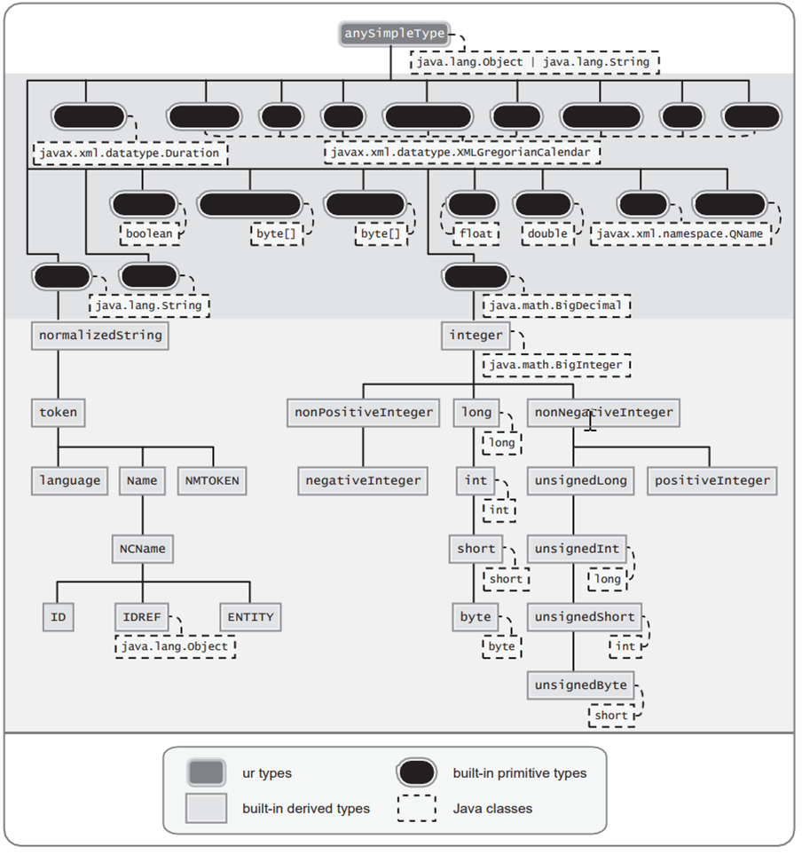
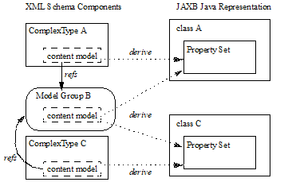
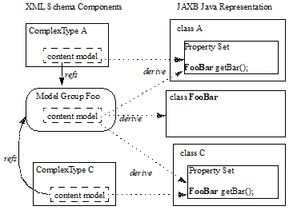

//
// Copyright (c) 2020 Contributors to the Eclipse Foundation
//

== Binding XML Schema to Java Representations

This chapter describes binding of XML schema
components to Java representations. The default binding is identified in
this chapter and the next chapter specifies the customizations that
override default binding.

=== Overview

The abstract model described in [XSD Part 1]
is used to discuss the default binding of each schema component type.
Each schema component is described as a list of properties and their
semantics. References to properties of a schema component as defined in
[XSD Part 1] are denoted using the notation _{schema property}_
throughout this section. References to properties of information items
as defined in [XML-Infoset] are denoted by the notation *[property]*.

All JAXB implementations are required to
implement the default bindings specified in this chapter. However, users
and JAXB implementors can use the global configuration capabilities of
the custom binding mechanism to override the defaults in a portable
manner.

For each binding of a schema component to its
Java representation, there is a description of Java mapping
annotation(s), described in link:jaxb.html#a2236[See Java Types
To XML]“, to be generated with the Java representation. The
standardization of these mapping annotations assist in specifying the
portability of a schema-derived JAXB-annotated classes. All JAXB
implementations are required to be able to unmarshal/marshal another
implementation’s schema-derived Java value classes by interpreting the
specified mapping annotations. Note that each mapping annotation is
described independent of whether it is the default mapping or a
customized mapping, JAXB implementations are allowed to optimize away
redundant mapping annotations that are the default mapping annotation.

[NOTE]
.Design Note
====
Note that the mapping annotations generated on the schema derived
classes do not capture all aspects from the original schema.
A schema generated from the mapping annotations of the schema derived
classes differs from the original schema used to generate
the schema-derived classes. The original schema is more precise
for validation purposes than the one generated from the schema-derived classes.

====

All examples are non-normative. Note that in
the examples, the schema-derived code does not list all required mapping
annotations. In the interest of being terse, only the mapping
annotations directly connected to the schema component being discussed
are listed in its example.

=== Simple Type Definition

A schema component using a simple type
definition typically binds to a Java property. Since there are different
kinds of such schema components, the following Java property attributes
(common to the schema components) are specified here and include:

* base type
* collection type if any
* predicate

The rest of the Java property attributes are
specified in the schema component using the simple type definition.

While not necessary to perform by default,
this section illustrates how a simple type definition is bound to a JAXB
mapped class. This binding is necessary to preserve a simple type
definition referred to by `xsi:type` attribute in an Xml instance
document. See link:jaxb.html#a1582[See Usage]“for the
customization that enables this binding.

==== Type Categorization

The simple type definitions can be categorized as:

* schema built-in datatypes [XSD PART2]
* user-derived datatypes

Conceptually, there is no difference between
the two. A schema built-in datatype can be a primitive datatype. But it
can also, like a user-derived datatype, be derived from a schema
built-in datatype. Hence no distinction is made between the schema
built-in and user-derived datatypes.

The specification of simple type definitions
is based on the abstract model described in Section 4.1, “Simple Type
Definition” [XSD PART2]. The abstract model defines three varieties of
simple type definitions: atomic, list, union. The Java property
attributes for each of these are described next.

==== Atomic Datatype

If an atomic datatype has been derived by
restriction using an “enumeration” facet, the Java property attributes
are defined by link:jaxb.html#a829[See Enum Type].” Otherwise
they are defined as described here.

The base type is derived upon the XML
built-in type hierarchy [XSD PART2, Section 3] reproduced below.

.XML Built-In Type Hierarchy

The above diagram is the same as the one in
[XSD PART2] except for the following:

* Only schema built-in atomic datatypes derived by restriction have been shown.
* The schema built-in atomic datatypes have been annotated with Java data types
from the “Java Mapping for XML Schema Built-in Types” table below.

[NOTE]
.Design Note
====
xs:anyURI is not bound to java.net.URI by default since not all
possible values of xs:anyURI can be passed to the java.net.URI constructor.
Using a global JAXB customization described in Section 7.9, “<javaType> Declaration“,
a JAXB user can override the default mapping to map xs:anyURI to java.net.URI.

====

The following is a mapping for subset of the
XML schema built-in data types to Java data types. This table is used to
specify the base type later.

.[[a725]]Java Mapping for XML Schema Built-in Types
[cols="2*",options="header"]
|===
|XML Schema Datatype |Java Datatype
| *xsd:string* | *java.lang.String*
| *xsd:integer* | *java.math.BigInteger*
| *xsd:int* | *int*
| *xsd:long* | *long*
| *xsd:short* | *short*
| *xsd:decimal* | *java.math.BigDecimal*
| *xsd:float* | *float*
| *xsd:double* | *double*
| *xsd:boolean* | *boolean*
| *xsd:byte* | *byte*
| *xsd:QName* | *javax.xml.namespace.QName* footnote:jaxp[JAXP defines package
`javax.xml.datatype` and `javax.xml.namespace`]
| xsd:dateTime |javax.xml.datatype.XMLGregorianCalendar footnote:jaxp[]
| *xsd:base64Binary* | *byte[]*
| *xsd:hexBinary* | *byte[]*
| xsd:unsignedInt | long
| xsd:unsignedShort | int
| xsd:unsignedByte | short
| xsd:time | javax.xml.datatype.XMLGregorianCalendar footnote:jaxp[]
| xsd:date | javax.xml.datatype.XMLGregorianCalendar footnote:jaxp[]
| xsd:g* | javax.xml.datatype.XMLGregorianCalendar footnote:jaxp[]
| xsd:anySimpleType +
(for xsd:element of this type)footnote:[enable type substitution for element of xsd:anySimpleType] | java.lang.Object
| xsd:anySimpleType +
(for xsd:attribute of this type) | java.lang.String
| xsd:duration | javax.xml.datatype.Duration footnote:jaxp[]
| xsd:NOTATION | javax.xml.namespace.QName footnote:jaxp[]
|===

The base type is determined as follows:

. Map by value space bounding facets +
If the simple type derives from or is `xsd:integer` and has either a
constraining lower and/or upper bounds facet(s) or totalDigits facet,
check if the following optimized binding is possible:
* If the simple type derives from or is
`xsd:short`, `xsd:byte` or `xsd:unsignedByte`, go to step 2.
* If the value space for the simple type is
representable in the range of `java.lang.Integer.MIN_VALUE` and
`java.lang.Integer.MAX_VALUE`, map to java primitive type, `int`.
* If the value space for the simple type is
representable in the range of `java.lang.Long.MIN_VALUE` and
`java.lang.Long.MAX_VALUE`, map to java primitive type, `long`.
* Else go to step 2.
. Map by datatype +
If a mapping is defined for the simple type in Table 6.1, the base type
defaults to its defined Java datatype.
. Map by base datatype +
Otherwise, the base type must be the result obtained by repeating the
step 1 and 2 using the _{base type definition}_. For schema datatypes
derived by restriction, the _{base type definition}_ represents the
simple type definition from which it is derived. Therefore, repeating
step 1 with _{base type definition}_ essentially walks up the XML Schema
built-in type hierarchy until a simple type definition which is mapped
to a Java datatype is found.

The Java property predicate must be as
specified in “Simple Type Definition Validation Rules,” Section
4.1.4[XSD PART2].

*_Example:_* +
The following schema fragment (taken from
Section 4.3.1, “Length” [XSD PART2]):

[source,xml,indent=4]
----
<xs:simpleType name="productCode">
  <xs:restriction base="xs:string">
    <xs:length value="8" fixed="true"/>
  </xs:restriction>
</xs:simpleType>
----

The facet “length” constrains the length of a
product code (represented by `productCode`) to 8 characters (see
section 4.3.1 [XSD PART2] for details).

The Java property attributes corresponding to
the above schema fragment are:

* There is no Java datatype mapping for `productCode`.
So the Java datatype is determined by walking up the
built-in type hierarchy.
* The `{base type definition}` of `productCode`
is `xs:string`. `xs:string` is mapped to `java.lang.String`
(as indicated in the table, and assuming no customization). Therefore,
`productCode` is mapped to the Java datatype `java.lang.String`.
* The predicate enforces the constraints on the length.

===== Notation

Given that the value space of `xsd:NOTATION`
is the set of `xsd:QName`, bind `xsd:NOTATION` type to
`javax.xml.namespace.QName`.

For example, the following schema:

[source,xml]
----
<xs:schema targetNamespace="http://e.org" xmlns:e="http://e.org"
            xmlns:xs="http://www.w3.org/2001/XMLSchema">
  <xs:notation name="jpeg" public="image/jpeg" system="jpeg.exe"/>
  <xs:notation name="png" public="image/png" system="png.exe"/>
  <xs:simpleType name="pictureType">
    <xs:restriction base="xs:NOTATION">
      <xs:enumeration value="e:jpeg"/>
      <xs:enumeration value="e:png"/>
    </xs:restriction>
  </xs:simpleType>
  <xs:complexType name="Picture">
    <xs:simpleContent>
      <xs:extension base="xs:hexBinary">
        <xs:attribute name="format" type="e:pictureType"/>
      </xs:extension>
    </xs:simpleContent>
  </xs:complexType>
</xs:schema>
----

is mapped to the following Java code:

[source,java]
----
package org.e;
import javax.xml.namespace.QName;
public class Picture {
    void setValue(byte[] value) {...}
    byte[] getValue() {...}
    void setFormat(QName value)\{...}
    QName getFormat() {...}
}
----

With the following usage scenario:

[source,java,indent=4]
----
Picture pic = ...;
pic.setFormat(new QName("http://e.org","jpeg"));
----

===== Bind to a JAXB mapped class

By default, a named simple type definition is
not bound to a Java class. This binding is only necessary to enable the
precise type of an `xsi:type` substitution to be preserved as described
in link:jaxb.html#a1158[See Type Substitution of a Simple Type
Definition]“. This binding is enabled via the global binding
customization attribute _@mapSimpleTypeDef_ specified in
link:jaxb.html#a1582[See Usage]“.

The binding of a named simple type definition
to a Java value class is based on the abstract model properties in
link:jaxb.html#a4867[See Simple Type Definition Schema
Component]. The Java value class must be defined as specified here,
unless the ref attribute is specified on the `<jaxb:class>` declaration,
in which case the schema compiler will simply assume that the nominated
class is already bound to this simple type.

* *name*: name is the Java identifier
obtained by mapping the XML name _{name}_ using the name mapping
algorithm, specified in link:jaxb.html#a4656[See The Name to
Identifier Mapping Algorithm]. Note that anonymous simple type
definition’s are never bound to a Java value class.
* *package*: The schema-derived Java value class is generated
into the Java package that represents the binding of _{target namespace}_
* *outer class name*: There is no outer class name for a global
simple type definition.
* *base class*: Due to a constraint specified for @XmlValue
in Section 8, this class can not extend any other class. The derivation
by restriction hierarchy for simple type definitions can not be captured
in the schema-derived Java value class.
* *value property*: Same as the binding of simple content in
link:jaxb.html#a973[See Simple Content Binding] to an @XmlValue
annotated JAXB property.

The next two examples illustrate the binding
of a simple type definition to a Java value class when the appropriate
JAXB schema customization is enabled.

[#a816]
.Simple type definition
[source,xml,indent=4]
----
<xs:simpleType name="productCode">
  <xs:restriction base="xs:string">
    <xs:length value="8" fixed="true"/>
  </xs:restriction>
</xs:simpleType>
----

.Binding of <<a816>>
[source,java,indent=4]
----
@XmlType(name="productCode")
public class ProductCode {
    @XmlValue
    String getValue();
    void setValue(String value);
}
----

===== Annotations for standard XML datatypes

By default, a schema-derived JAXB property
bound from one of the following standard XML datatypes is annotated with
the specified mapping annotation.

[cols="2*",options="header"]
|===
| `*Schema Type*` | `*JAXB Property Annotation*`
| `xsd:ID` | `@XmlID`
| `xsd:IDREF` | `@XmlIDREF`
| `ref:swaRef` | `@XmlAttachmentRef`
|===

Note that JAXB schema customizations could
override these default binding.

==== Enum Type

The default mapping for a named atomic type
that is derived by restriction with enumeration facet(s) and whose
restriction base type (represented by _{base type definition}_) is
`xs:String` footnote:[Exception cases that
do not bind to enum type: when the base type is or derives from `xs:ID`
and `xs:IDREF`. Rationale for not binding these type definitions to an
enum type is in link:jaxb.html#a2126[See Customizable Schema
Elements]“.] or derived from it is mapped to an
enum type. The *[typesafeEnumBase]* attribute customization described in
link:jaxb.html#a1580[See <globalBindings> Declaration]," enables
global configuration to alter what Xml built-in datatypes are bound by
default to an enum type. An anonymous simple type definition is never
bound to an enum class by default, but it can be customized as described
in link:jaxb.html#a2090[See <typesafeEnum> Declaration]” to bind
to an enum type.

===== Example binding

An example is provided first followed by a
more formal specification.

XML Schema fragment:

[source,xml,indent=4]
----
<xs:simpleType name="USState">
  <xs:restriction base="xs:NCName">
    <xs:enumeration value="AK"/>
    <xs:enumeration value="AL"/>
  </xs:restriction>
</xs:simpleType>
----

The corresponding enum type binding is:

[source,java,indent=4]
----
public enum USState {
    AK, AL;
    public String value() { return name(); }
    public static USState fromValue(String value) {...}
};
----

===== Enum type binding

The characteristics of an _enum type_ are
derived in terms of the properties of the
link:jaxb.html#a4867[See Simple Type Definition Schema
Component] as follows:

The enum type binding is defined as follows:

* *name*: The default name of the enum type,
_enumType_, is computed by applying the XML Name to Java identifier
mapping algorithm to the _{name}_ of the simple type definition. There
is no mechanism to derive a name for an anonymous simple type
definition, the customization must provide the *name*.
* *package name*: The package name is
determined from the _{targetnamespace}_ of the schema that directly
contains the simple type definition.
* *outer class name*:
** There is no *outer class name* for a global
simple type definition.
** There is no *outer class name* when schema
customization, *[jaxb:globalBindings]* _@localScoping_ , specified in
Section link:jaxb.html#a1582[See Usage], has a value of
_toplevel_.
** The *outer class name* for an anonymous
simple type definition is computed by traversing up the anonymous simple
type definition’s ancestor tree until the first ancestor is found that
is:
*** an XML component that is mapped to a Java value class, the *outer
class name* is composed of the concatenation of this Java value class’s
*outer class name*, "**.**", and its *name*.
*** a global declaration or definition is reached. There is no *outer
class name* for this case.
* *enum constants*: Specified in next section.

Note that since a Java enum type is
essentially a final class, it is not possible for it to be subclassed.
Thus, any derivations of a simple type definition bound to an enum type
can not be captured by an equivalent Java inheritance relationship.

The schema-derived enum is annotated, either
explicitly or by default mapping annotations, with the mapping
annotation @XmlEnum, specified in Section 8. The @XmlEnum annotation
elements are derived in terms of the abstract model properties for a
simple type definition summarized in link:jaxb.html#a4867[See
Simple Type Definition Schema Component] as follows:

.Annotate enum type with @XmlEnum element-value pairs
[cols="2*",options="header"]
|===
| @XmlEnum element | @XmlEnum value
| name | simple type definition's {name}
| namespace | {target namespace}
| value | the java type binding of the simple type definition’s _{base type definition}_
|===

===== Enum Constant

An enum constant is derived for each
enumeration facet of the atomic type definition. The characteristics of
an _enum constant_ of the enum type are derived in terms of the properties
of the link:jaxb.html#a4899[See Enumeration Facet Schema
Component] as follows:

* *name*: The name is either specified via
customization, `jaxb:typesafeEnumMember` described in
link:jaxb.html#a2092[See Usage]“, or the name is computed as
specified in link:jaxb.html#a863[See XML Enumvalue-to-Java
Identifier Mapping]“.
* *type*: The Java type binding of the simple
type definition’s _{base_type_definition}_.
* *value* : The conversion of string
_{value}_ to *type*. *Value* is manipulated via the following
generated enum type methods:

 public        type         value();
 public static enumTypeName fromValue(type value);

To assist an application in manipulating the
enum constants that comprise an enum type, all enum types have the
following two implicitly declared static methods as specified in Section
8.9 in [JLS3]. The enum type’s static method `values()` returns an array
of all enum constants. The static method `valueOf(String name)` returns
the enum constant represented by the name parameter.

===== XML Enumvalue-[[a863]]to-Java Identifier Mapping

The default name for the enum constant is
based on mapping of the XML enumeration value to a Java identifier as
described below.

The XML enumeration value _{value}_ is
mapped to a Java Identifier using the algorithm specified in
link:jaxb.html#a4773[See Deriving a legal Java identifier from
an enum facet value]“. If there is a collision among the generated
constant fields *name* or if it is not possible to generate a legal Java
identifier for one or more of the generated constant field names, see
link:jaxb.html#a1633[See @typesafeEnumMemberName]“for
customization options to resolve this error case.

===== Enum Constant Name differs from its Value

For all cases where there exist at least one
enumeration constant name that is not the same as the enumeration
constant’s value, the generated enum type must have a final value field
that is set by the enum type’s constructor. The code generation template
is the following:

.At least one enum constant name differs from its value.
[source,java]
----
public enum enumType {
    EnumConstantName1(EnumConstantValue1),
    ...
    EnumConstantNameX(EnumConstantValueX);
    public EnumConstantValueType value() { return value; }
    public static enumType fromValue(EnumConstantValueType val)
        {...}

    final private EnumConstantValueType value;
    private enumType(EnumConstantValueType value) {
        this.value = value;
    }
}
----

.Code template when enum constant name is same as its enum constant value.
[source,java,subs="+quotes,+macros"]
----
public enum enumType {
    EnumConstantName1, ..., EnumConstantNameX;
    public Stringfootnote:[Note for this case, the _enumConstantValueType_ is always `java.lang.String`.] value() { return name(); }
    public static enumType fromValue(String value) {...}
}
----

The schema-derived enum constant is
annotated, either explicitly or by default mapping annotations, with the
mapping annotation specified in Section 8. The `@XmlEnumValue`
annotation elements are derived in terms of the abstract model
properties for a enumerated facet summarized in
link:jaxb.html#a4899[See Enumeration Facet Schema Component] as
follows:

.Annotate enum constant with @XmlEnumValue element-value pairs
[cols="2*",options="header"]
|===
| @XmlEnumValue element | @XmlEnumValue value
| value | Enumeration facet’s {value}
|===

Given following schema fragment:

.Schema-derived enum type when enumeration facet’s value does not match enum constant name.

[source,xml,indent=4]
----
<xs:simpleType name="Coin">
  <!-- Assume jaxb customization that binds Coin to an enumType -->
  <xs:restriction base="xs:int"> +
    <!-- Assume jaxb customization specifying enumConstantName -->
    <xs:enumeration value="1"/> <!-- name="penny"-->
    <xs:enumeration value="5"/> <!-- name="nickel"-->
    <xs:enumeration value="10"/><!-- name="dime"-->
    <xs:enumeration value="25"/><!-- name="quarter-->
  </xs:restriction>
</xs:simpleType>
----

Schema-derived enum type:

[source,java,indent=4]
----
@XmlEnum(value="java.lang.Integer.class")
public enum Coin {
    @XmlEnumValue("1") PENNY(1),
    @XmlEnumValue("5") NICKEL(5),
    @XmlEnumValue("10") DIME(10),
    @XmlEnumValue("25") QUARTER(25);

    public int value() { return value; }
    public static Coin fromValue(int value) {...}

    private final Integer value;
    Coin(int value) { this.value = value; }
}
----

==== List

A list simple type definition can only
contain list items of atomic or union datatypes. The item type within
the list is represented by the schema property _{item type definition}_.

The Java property attributes for a list
simple type definition are:

* The _base type_ is derived from the _{item type definition}_ as follows.
If the Java datatype for _{item type definition}_ is a Java primitive type,
then the base type is the wrapper
class for the Java primitive type. Otherwise, the Java datatype is
derived from the XML datatype as specified in
link:jaxb.html#a715[See Atomic Datatype]” and
link:jaxb.html#a829[See Enum Type].”
* The _collection type_ defaults to an
implementation of `java.util.List`. Note that this specification does
not specify the default implementation for the interface
`java.util.List`, it is implementation dependent.
* The _predicate_ is derived from the “Simple
Type Definition Validation Rules,” in section 4.1.4,[XSD PART2].

*_Example:_* +
For the following schema fragment:

[source,xml,indent=4]
----
<xs:simpleType name="xs:USStateList">
  <xs:list itemType="xs:string"/>
</xs:simpleType>
----

The corresponding Java property attributes
are:

* The _base type_ is derived from _{item type definition}_
which is XML datatype, `_"xs:string"_` , thus the Java
datatype is `java.util.String` as specified in
link:jaxb.html#a725[See Java Mapping for XML Schema Built-in
Types].
* The _collection type_ defaults to an implementation of `java.util.List`.
* The _predicate_ only allows instances of
_base type_ to be inserted into the list. When failfast check is being
performedfootnote:[link:jaxb.html#a1582[See Usage]
describes the `enableFailFastCheck` customization and
link:jaxb.html#a256[See Validation]” defines fail-fast
checking.], the list’s mutation methods apply the
property’s predicate to any non-`null` value before adding that value
to the list or replacing an existing element’s value with that value;
the predicate may throw a `TypeConstraintException`.

The schema-derived property is annotated,
either explicitly or by default mapping annotations, with the mapping
annotation @XmlList, specified in Section 8.

==== Union Property

A union property _prop_ is used to bind a
union simple type definition schema component. A union simple type
definition schema component consists of union members which are schema
datatypes. A union property, is therefore, realized by:

[source,java,indent=8]
----
public Type getId();
public void setId(Type value);
----

where `_Id_` is a metavariable that represents
the Java method identifier computed by applying the name mapping
algorithm described in link:jaxb.html#a4656[See The Name to
Identifier Mapping Algorithm] to _prop_ .

The _base type_ is String. If one of the
member types is derived by list, then the Union property is represented
as the appropriate collection property as specified by the customization
`<jaxb:globalBindings>` *@collectionType* value, specified in
link:jaxb.html#a1582[See Usage].”

* The `getId` method returns the set value.
If the property has no set value then the value `null` is returned. The
value returned is Type.
* The `setId` method sets the set value. +
If value is `null`, the property’s _set value_ is discarded. Prior to
setting the property’s value when TypeConstraint validation is enabled,
a non-`null` value is validated by applying the property’s predicate,
which may throw a `TypeConstraintException`. No setter is generated if
the union is represented as a collection property.

*_Example: Default Binding: Union_*

The following schema fragment:
[source,xml,indent=4]
----
<xs:complexType name="CTType">
  <xs:attribute name="state" type="ZipOrName"/>
</xs:complexType>
<xs:simpleType name="ZipOrName"
               memberTypes="xs:integer xs:string"/>
----

is bound to the following Java representation.

[source,java]
----
public class CTType {
    String getState() {...}
    void setState(String value) {...}
}
----

==== Union

A simple type definition derived by a union
is bound using the union property with the following Java property
attributes:

* the _base type_ as specified in
link:jaxb.html#a899[See Union Property].”
* if one of the member types is derived by `<xs:list>`,
then the union is bound as a Collection property.
* The _predicate_ is the schema constraints
specified in “Simple Type Definition Validation Rules,” Section 4.1.4
[XSD PART2].

=== Complex Type Definition

==== Aggregation of Java Representation

A Java representation for the entire schema
is built based on aggregation. A schema component aggregates the Java
representation of all the schema components that it references. This
process is done until all the Java representation for the entire schema
is built. Hence a general model for aggregation is specified here once
and referred to in different parts of the specification.

The model assumes that there is a schema
component _SP_ which references another schema component _SC_. The Java
representation of _SP_ needs to aggregate the Java representation of
_SC_. There are two possibilities:

* _SC_ is bound to a property set.
* _SC_ is bound to a Java datatype or a Java value class.

Each of these is described below.

===== Aggregation of Datatype/Class

If a schema component _SC_ is bound to a Java
datatype or a Java value class, then _SP_ aggregates _SC’s_ Java
representation as a simple property defined by:

* *name*: the name is the class/interface
name or the Java datatype or a name determined by SP. The name of the
property is therefore defined by the schema component which is
performing the aggregation.
* *base type*: If SC is bound to a Java
datatype, the base type is the Java datatype. If SC is bound to a Java
value class, then the base type is the class name, including a dot
separated list of class names within which SC is nested.
* *collection type*: There is no collection type.
* *predicate*: There is no predicate.

===== Aggregation of Property Set

If _SC_ is bound to a property set, then _SP_
aggregates by adding _SC’s_ property set to its own property set.

Aggregation of property sets can result in
name collisions. A name collision can arise if two property names are
identical. A binding compiler must generate an error on name collision.
Name collisions can be resolved by using customization to change a
property name.

==== Java value class

The binding of a complex type
definition to a Java value class is based on the abstract model
properties in link:jaxb.html#a4907[See Complex Type Definition
Schema Component]. The Java value class must be defined as specified
here, unless the ref attribute is specified on the _<jaxb:class>_
customization, in which case the schema compiler will simply assume that
the nominated class is already bound to this complex
type.footnote:[Note that
link:jaxb.html#a1084[See Binding of an anonymous complex type
definition] defines the name and package property for anonymous type
definitions occurring within an element declaration.]

* *name*: name is the Java identifier
obtained by mapping the XML name _{name}_ using the name mapping
algorithm, specified in link:jaxb.html#a4656[See The Name to
Identifier Mapping Algorithm]. For the handling of an anonymous complex
type definition, see link:jaxb.html#a1084[See Binding of an
anonymous complex type definition]” for how a *name* value is derived
from its parent element declaration.
* *package*:
** For a global complex type definition, the
derived Java value class is generated into the Java package that
represents the binding of _{target namespace}_
** For the value of *package* for an anonymous
complex type definition, see link:jaxb.html#a1084[See Binding of
an anonymous complex type definition]".
* *outer class name*:
** There is no outer class name for a global
complex type definition.
** link:jaxb.html#a1084[See Binding of
an anonymous complex type definition]" defines how to derive this
property from the element declaration that contains the anonymous
complex type definition.
* *base class*: A complex type definition
can derive by restriction or extension (i.e. _{derivation method}_ is
either "extension" or "restriction"). However, since there is no concept
in Java programming similar to restriction, both are handled the same.
If the _{base type definition}_ is itself mapped to a Java value class
(Ci2), then the base class must be Ci2. This must be realized as:
+
--
[source,java]
----
public class Ci1 extends Ci2 {
    .....
}
----
--
+
See example of derivation by extension at the
end of this section.

* *abstract*: The generated Java class is
abstract when the complex type definition’s _{abstract}_ property is
`true`.
* *property set*: The Java representation of
each of the following must be aggregated into Java value class’s
property set (link:jaxb.html#a918[See Aggregation of Java
Representation]).
** A subset of _{attribute uses}_ is
constructed. The subset must include the schema attributes corresponding
to the `<xs:attribute>` children and the _{attribute uses}_ of the
schema attribute groups resolved by the <ref> attribute. Every
attribute’s Java representation (link:jaxb.html#a1252[See Attribute use])
in the set of attributes computed above must be aggregated.
** If the optional _{attribute wildcard}_ is
present, either directly or indirectly, a property defined by
link:jaxb.html#a1306[See Attribute Wildcard]“is generated.
** The Java representation for _{content type}_ must be aggregated.
+
For a “Complex Type Definition with complex
content,” the Java representation for _{content type}_ is specified in
link:jaxb.html#a1332[See Content Model - Particle, Model Group,
Wildcard].”
+
For a complex type definition which is a “Simple Type Definition with
simple content,” the Java representation for _{content type}_ is
specified in link:jaxb.html#a973[See Simple Content Binding].”
** If a complex type derives by restriction,
there is no requirement that Java properties representing the attributes
or elements removed by the restriction to be disabled. This is because
(as noted earlier), derivation by restriction is handled the same as
derivation by extension.
* When the complex type definition’s
_{abstract}_ property is `false`, a factory method is generated in the
package’s `ObjectFactory` class introduced in
link:jaxb.html#a482[See Java Package]. The factory method
returns the type of the Java value class. The name of the factory method
is generated by concatenating the following components:
** The string constant `create`.
** The _name_ of the Java value class.

The schema-derived Java value class is
annotated, either explicitly or by default mapping annotations, with the
mapping annotation @XmlType, specified in Section
link:jaxb.html#a2578[See @XmlType]. The @XmlType annotation
elements are derived in terms of the abstract model properties for a
complex type definition summarized in link:jaxb.html#a4907[See
Complex Type Definition Schema Component] as follows:

.[[a956]]Annotate Java value class with @XmlType element-value pairs
[width="100%",cols="50%,50%",options="header",]
|===
| @XmlType element | @XmlType value
| name | complex type definition's {name}
| namespace | {target namespace}
| propOrder a | When \{content type} is element-only
{content model} and top-level {compositor} is xs:sequence, ordered
list of JAXB property names representing order of xs:elements in
{content model}.
 +

All other cases do not need to set propOrder.

|===

*_Example:_* Complex Type: Derivation by Extension

XML Schema Fragment (from XSD PART 0 primer):

[source,xml,indent=4]
----
<xs:complexType name="Address">
  <xs:sequence>
    <xs:element name="name" type="xs:string"/>
    <xs:element name="street" type="xs:string"/>
    <xs:element name="city" type="xs:string"/>
  </xs:sequence>
</xs:complexType>
<xs:complexType name="USAddress">
  <xs:complexContent>
    <xs:extension base="ipo:Address">
      <xs:sequence>
        <xs:element name="state" type="xs:string"/>
        <xs:element name="zip" type="xs:integer"/>
      </xs:sequence>
    </xs:extension>
  </xs:complexContent>
</xs:complexType>
----

Default Java binding:

[source,java,indent=4]
----
public class Address {
    String getName() {...}
    void setName(String) {...}
    String getStreet() {...}
    void setStreet(String) {...}
    void getCity() {...}
    void setCity(String) {...}
}

import java.math.BigInteger;

public class USAdress extends Address {
    String getState() {...}
    void setState(String) {...} {
    BigInteger getZip() {...}
    void setZip(BigInteger) {...}
}

class ObjectFactory {
    Address createAddress() {...}
    USAddress createUSAddress() {...}
}
----

===== Simple Content Binding

====== Binding to Property

By default, a complex type definition with
simple content is bound to a Java property defined by:

* *name*: The property name must be `value`.
* *base type, predicate, collection type*:
As specified in [XSD Part 1], when a complex type has simple content,
the content type (_{content type}_) is always a simple type schema
component. And a simple type component always maps to a Java datatype
(link:jaxb.html#a702[See Simple Type Definition]”). Values of
the following three properties are copied from that Java type:
** base type
** predicate
** collection type

The schema-derived JAXB property representing
simple content is annotated, either explicitly or by default mapping
annotations, with the mapping annotation @XmlValue, specified in Section
link:jaxb.html#a3331[See @XmlValue].

*_Example:_* Simple Content: Binding To Property

XML Schema fragment:
[source,xml,indent=4]
----
<xs:complexType name="internationalPrice">
  <xs:simpleContent>
    <xs:extension base="xs:decimal">
      <xs:attribute name="currency" type="xs:string"/>
    </xs:extension>
  </xs:simpleContent>
</xs:complexType>
----

Default Java binding:

[source,java,indent=4]
----
class InternationalPrice {
    /** Java property for simple content */
    @XmlValue
    java.math.BigDecimal getValue() {...}
    void setValue(java.math.BigDecimal value) {...}

    /** Java property for attribute */
    String getCurrency() {...}
    void setCurrency(String) {...}
}
----

==== xsd:anyType

`xsd:anyType` is the root of the type
definition hierarchy for a schema. All complex type definitions in a
schema implicitly derive from `xsd:anyType`. Given that the JAXB
architecture does not define a common base class for all JAXB class
bindings of complex type definitions, the only possible binding property
base type binding for `xsd:anyType` is to `java.lang.Object`. This
binding enables all possible type and element substitutions for an
element of type `xsd:anyType`.

.Binding of element with type _xsd:anyType_
[source,xml,indent=4]
----
<xs:element name="anyContent/> <!-- @type defaults to xs:anyType -->
<xs:complexType name="base">
  <xs:sequence>
    <xs:element ref="anyContent/>
    <xs:element name="anyContentAgain" type="xs:anyType"/>
  </xs:sequence>
</xs:complexType>
----
[source,java,indent=4]
----
public class Base {
    void setAnyContent(Object obj);
    Object getAnyContent();
    void setAnyContentAgain(Object obj);
    Object getAnyContentAgain();
}
----

A schema author defines an element to be of
type `xs:anyType` to defer constraining an element to a particular type
to the xml document author. Through the use of `xsi:type` attribute or
element substitution, an xml document author provides constraints for an
element defined as `xs:anyType`. The JAXB unmarshaller is able to
unmarshal a schema defined `xsd:anyType` element that has been
constrained within the xml document to an easy to access JAXB mapped
class. However, when the xml document does not constrain the
`xs:anyType` element, JAXB unmarshals the unconstrained content to an
element node instance of a supported DOM API.

Type substitution is covered in more detail
in Section link:jaxb.html#a1148[See Type Substitution of a
Complex Type Definition] and link:jaxb.html#a1158[See Type
Substitution of a Simple Type Definition]. Element substitution is
covered in more detail in Section link:jaxb.html#a1223[See Bind
to a Simple Element property].

=== Attribute Group Definition

There is no default mapping for an attribute
group definition. When an attribute group is referenced, each attribute
in the attribute group definition becomes a part of the _[attribute uses]_
property of the referencing complex type definition. Each attribute is
mapped to a Java property as described in
link:jaxb.html#a1252[See Attribute use]“. If the attribute group
definition contains an attribute wildcard, denoted by the
`xs:anyAttribute` element, then the referencing complex type definition
will contain a property providing access to wildcard attributes as
described in link:jaxb.html#a1306[See Attribute Wildcard]“.

=== Model Group Definition

When a named model group definition is
referenced, the JAXB property set representing its content model is
aggregated into the Java value class representing the complex type
definition that referenced the named model group definition as
illustrated in link:jaxb.html#a999[See Binding for a reference
to a model group definition.]”

.[[a999]]Binding for a reference to a model group definition.

This binding style results in the same
properties occurring within both Java value class’s A and C to represent
the referenced Model Group B’s content model.

When a model group definition’s content model
contains an XML Schema component that is to be bound to a Java value
class, element class or enum type, it is desirable to only create a
single Java representation, not one for each complex content that
references the named model group definition. This default binding from a
model group definition’s content model is defined in
link:jaxb.html#a1012[See Deriving Class Names for Named Model
Group Descendants]."

To meet the JAXB goal of predictable
unmarshalling of invalid XML content, the JAXB 1.0 customization for
binding a model group to a JAXB mapped class is no longer supported.
link:jaxb.html#a386[See Flexible Unmarshalling]“details the
rationale behind this change.

==== Bind to a set of properties

A non-repeating reference to a model group
definition, when the particle referencing the group has _{max occurs}_
equal to one, results in a set of content properties being generated to
represent the content model. link:jaxb.html#a1332[See Content
Model - Particle, Model Group, Wildcard]” describes how a content model
is bound to a set of properties and has examples of the binding.

==== Bind to a list property

A reference to a model group definition from
a particle with a repeating occurrence is bound by default as specified
in link:jaxb.html#a1402[See Bind a repeating occurrence model
group]“.

*_Example:_* +
Schema fragment contains a particle that
references the model group definition has a _{maxOccurs}_ value greater
than one.

[source,xml,indent=4]
----
<xs:group name="AModelGroup">
  <xs:choice>
    <xs:element name="A" type="xs:int"/>
    <xs:element name="B" type="xs:float"/>
  </xs:choice>
</xs:group>

<xs:complexType name="foo">
  <xs:sequence>
    <xs:group ref="AModelGroup" maxOccurs="unbounded"/>
    <xs:element name="C" type="xs:float"/>
  </xs:sequence>
</xs:complexType>
----

Derived Java representation:

[source,java,indent=4]
----
public class Foo {
    /** A valid general content property of AModelGroup content model.*/
    @XmlElements({
        @XmlElement(type=Integer.class, name="A"),
        @XmlElement(type=Float.class, name="B")})
    java.util.List<Object> getAModelGroup() {...}

    float getC() {...}
    void setC(float value) {...}
};
----

==== Deriving Class Names for Named Model Group Descendants

When a model group definition’s content model
contains XML Schema components that need to be bound to a Java class or
interface, this section describes how to derive the package and name for
the Java value class, enum type or element class derived from the
content model of the model group definition. The binding of XML Schema
components to Java classes/interfaces is only performed once when the
model group definition is processed, not each time the model group
definition is referenced as is done for the property set of the model
group definition.

XML Schema components occurring within a
model group definition’s content model that are specified by this
chapter and the customization chapter to be bound to a Java value class,
interface or typesafe enum class are bound as specified with the
following naming exceptions:

* *package*: The element class, Java value
class or typesafe enum class is bound in the Java package that
represents the target namespace containing the model group definition.
* *name*: The name of the interface or
class is generated as previously specified with one additional step to
promote uniqueness between interfaces/classes promoted from a model
group definition to be bound to a top-level class within a Java package.
By default, a prefix for the interface/class name is computed from the
model group definition’s _{name}_ using the XML name to Java identifier
algorithm. If the schema customization *[jaxb:globalBindings]*
_@localScoping_ has a value of _toplevel_, then a prefix is not
generated from the model group definition’s _{name}_.

For example, given a model group definition
named _Foo_ containing an element declaration named _bar_ with an
anonymous complex type definition, the anonymous complex type definition
is bound to a Java value class with the name _FooBar_. The following
figure illustrates this example.

.Default binding for anonymous type def within a model group definition.

Note that even customization specified Java
value class, interface or typesafe enum class names are prepended with
the model group definition’s name. Thus, if a model group definition
named `Foo` contains an anonymous simple type definition with a typesafe
enum class customization name of `Colors`, the enum type name is
`FooColors`.

=== Attribute Declaration

An attribute declaration is bound to a Java
property when it is referenced or declared, as described in
link:jaxb.html#a1252[See Attribute use],” from a complex type
definition.

==== Bind global attribute to a QName Constant

To assist the dynamic access to schema-defined global attributes
described in Section 6.9, “Attribute Wildcard", a global attribute
declaration is bound to a JAXB QName constant, derived in terms of
the properties of the “Attribute Declaration Schema Component”
as follows:

* A _package name_, which is either computed from the attribute
declaration _{target namespace}_ or specified by binding
customization of the target namespace or a specified package
name for components that are scoped to no target namespace.
* The _name_ of the generated constant is derived from
the element declaration _{name}_ using the XML Name to Java
identifier mapping algorithm for a constant name or
specified by a binding customization of the attribute’s name.
* The QName constant is a JAXB constant property in class _ObjectFactory_.
* The QName constant value is initialized using the attribute declaration’s
_{target namespace}_ and _{name}_.

.Bind global attribute declaration to a JAXB QName constant
[source,xml,indent=4]
----
<xs:schema targetNamespace="http://e.org" xmlns:a="http://e.org">
  <xs:attribute name="isOpen" type="xs:boolean"/>
</xs:schema>
----
[source,java,indent=4]
----
package org.e;
public class ObjectFactory {
    /** <xs:attribute name="{http://e.org}isOpen" type="xs:boolean"/> */
    public static final javax.xml.namespace.QName IS_OPEN =
                new QName("http://e.org", "isOpen");
...
}
----

=== Element Declaration

This section describes the binding of an XML
element declaration to a Java representation. For a description of how
this binding has changed since the previous version, see
link:jaxb.html#a680[See Java Element Representation Summary]“.
This section introduces why a JAXB technology user has to use instances
of JAXB element as opposed to instances of Java datatypes or Java value
class when manipulating XML content.

An XML element declaration is composed of the
following key components:

* its qualified name is _{target namespace}_ and _{name}_
* its value is an instance of the Java class binding of its _{type definition}_
* whether the element’s content is _{nillable}_

Typically, an instance of
`jakarta.xml.bind.JAXBElement<T>`, returned by an element factory method,
represents an element declaration’s key components. An instance of a
Java value class or content interface represents only the value of an
element. Commonly in JAXB binding, the Java representation of XML
content enables one to manipulate just the value of an XML element, not
an actual element instance. The binding compiler statically associates
the XML element qualified name to a content property and this
information is used at unmarshal/marshal time. For cases where the
element name can be dynamically altered at runtime, the JAXB user needs
to manipulate elements, not element values. The following schema/derived
Java code example illustrates this point.

*_Example:_* +

Given the XML Schema fragment:
[source,xml,indent=4]
----
<xs:complexType name="chair_kind">
  <xs:sequence>
    <xs:element name="has_arm_rest" type="xs:boolean"/>
  </xs:sequence>
</xs:complexType>
----

Schema-derived Java value class:
[source,java,indent=4]
----
public class ChairKind {
    boolean isHasArmRest() {...}
    void setHasArmRest(boolean value) {...}
}
----

A user of the Java value class `ChairKind`
never has to create a Java instance that both has the value of local
element `has_arm_rest` and knows that its XML element name is
`has_arm_rest`. The user only provides the value of the element to the
content-property `hasArmRest`. A JAXB implementation associates the
content-property `hasArmRest` with XML element name `has_arm_rest` when
marshalling an instance of `ChairKind`.

The next schema/derived Java code example
illustrates when XML element information can not be inferred by the
derived Java representation of the XML content. Note that this example
relies on binding described in link:jaxb.html#a1384[See Bind
wildcard schema component].”

*_Example:_*

[source,xml,indent=4]
----
<xs:complexType name="chair_kind">
  <xs:sequence>
    <xs:any/>
  </xs:sequence>
</xs:complexType>
----

[source,java,indent=4]
----
public class ChairKind {
    @XmlAnyElement(lax="true")
    java.lang.Object getAny() {...}
    void setAny(java.lang.Object elementOrValue) {...}
}
----

For this example, the user can provide an
Element instance to the `any` content-property that contains both the
value of an XML element and the XML element name since the XML element
name could not be statically associated with the content-property `any`
when the Java representation was derived from its XML Schema
representation. The XML element information is dynamically provided by
the application for this case. link:jaxb.html#a1332[See Content
Model - Particle, Model Group, Wildcard] cover additional circumstances
when one can use JAXB elements.

==== Bind to _JAXBElement<T>_ Instance

The characteristics of the generated
ObjectFactory element factory method that returns an `JAXBElement<T>`
instance are derived in terms of the properties of the
link:jaxb.html#a4937[See Element Declaration Schema Component]
as follows:

* The element factory method is generated
into the `ObjectFactory` class in the Java package that represents the
binding of the element declaration’s _{target namespace}_.
* The element factory method returns an
instance of `jakarta.xml.bind.JAXBElement<T>`, where `T` is the Java
value class representing the _{type definition}_ of the element
declaration. The factory method sets the element name of the returned
instance to the element declaration’s fully qualified name.
* The element factory method has a single
parameter that is an instance of type `T`, where `T` is the Java value
class representing the _{type definition}_ of the element declaration.
* The name of the factory method is generated
by concatenating the following components:
** The string constant `create`.
** By default, if the element declaration is
nested within another XML Schema component, then the concatenation of
all outer Java class names representing those XML Schema components. If
the schema customization *[jaxb:globalBindings]*  _@localScoping_ has a
value of toplevel, skip this step.
** A name that is generated from the element
declaration's _{name}_ using the XML Name to Java identifier name
mapping algorithm specified in link:jaxb.html#a4656[See The Name
to Identifier Mapping Algorithm].
* The `JAXBElement<T>` property for nil
test whether an element’s content model is `xsi:nil="true"`.

For example, an element declaration named
`Foo` with a type of `xs:int` that is nested within the content
model of complex type definition `Bar` would have the following factory
method generated in the containing Java package's `ObjectFactory` class:

[source,java,indent=8]
----
JAXBElement<Integer> createBarFoo(Integer value) {...}
----

Default binding rules require an element
declaration to be bound to element factory method under the following
conditions:

* All non-abstract, named element
declarations with global _{scope}_ are bound to an element factory method
that returns an `JAXBElement<T>` instance. The rationale is that any
global element declaration can occur within a wildcard context and one
might want to provide element instances, not instances of the element’s
type, the element’s value, for this case.
* All local element declarations, having a
_{scope}_ of a complex type definition, occurring within content that is
mapped to a general content property of JAXB elements must have an
element factory method generated. General content property is specified
in link:jaxb.html#a1344[See General content property]” An
example of when a content model is mapped to a general content property,
forcing the generation of element declarations is at
link:jaxb.html#a1359[See Examples].”

The schema-derived element factory method is
annotated, either explicitly or by default mapping annotations, with the
mapping annotation `@XmlElementDecl`, specified in Section 8. The
`@XmlElementDecl` annotation elements are derived in terms of the
abstract model properties for an element declaration summarized in
link:jaxb.html#a4937[See Element Declaration Schema Component]
as follows:

.Annotate element instance factory with @XmlElementDecl element-value pairs.
[width="100%",cols="50%,50%",options="header",]
|===
| @XmlElementDecl element |@XmlElementDecl value
| name | element declaration's _{name}_
| namespace | _{target namespace}_
| scope | If _{scope}_ is _global_, `JAXBElement.GlobalScope.class` else the JAXB
Java value class representing the __{scope}__ing complex type definition.
| substitutionHeadName | If optional _{substitution group affiliation}_ exists,
its local name.
| substitutionHeadNamespace | If optional _{substitution group affiliation}_ exists,
its namespace.
|===

The element declaration’s _{type}_ can
result in additional JAXB annotations being generated on the element
instance factory. For more details, see link:jaxb.html#a820[See
Annotations for standard XML datatypes]“and @XmlList in
link:jaxb.html#a883[See List]“.

The schema-derived ObjectFactory class
containing the @XmlElementDecl annotations is annotated with
@XmlRegistry annotation.

==== Bind to Element Class

link:jaxb.html#a1698[See <class>
Declaration]“customization enables the binding of an element declaration
with a named type definition to a schema-derived Element class. The
characteristics of the schema-derived Element class are derived in terms
of the properties of the link:jaxb.html#a4937[See Element
Declaration Schema Component] as follows:

* The _name_ of the generated Java Element
class is derived from the element declaration _{name}_ using the XML Name
to Java identifier mapping algorithm for class names.
* Each generated Element class must extend
the Java value class `jakarta.xml.bind.JAXBElement <T>`. The next bullet
specifies the schema-derived Java class name to use for generic
parameter `T`.
* If the element declaration’s _{type definition}_ is
** Anonymous
+
Generic parameter `T` from the second bullet
is set to the schema-derived class represented the anonymous type
definition generated as specified in Section 6.7.3.
** Named
+
Generic parameter `T` from the second bullet is
set to the Java class representing the element declaration’s
_{type definition}_.
* The `ObjectFactory` method to create an
instance of _name_ has a single parameter that is an instance of type `T`.
By default, the name of the ObjectFactory method is derived by
concatenating _outerClassNames_ and _name_. When schema customization,
*[jaxb:globalBindings]* _@localScoping,_ specified in Section
_link:jaxb.html#a1582[See Usage],_ has a value of _toplevel_,
then the outer Classnames are ommitted from the factory method name.
* If _{scope}_ is
** *Global*: The derived Element class is
generated into the Java package that represents the binding of
_{target namespace}_.
** *A Complex Type Definition*: By default,
the derived Element class is generated within the Java value class
represented by the complex type definition value of _{scope}_. When
_@localScoping_ is _toplevel_ , the derived element class is generated
as a toplevel class.
* The property for nil test whether element’s content model is `xsi:nil="true"`.
* Optional _{value constraint}_ property with
pair of `default` or `fixed` and a value. +
If a default or fixed value is specified, the data binding system must
substitute the default or fixed value if an empty tag for the element
declaration occurs in the XML content.

A global binding customization,
*@generateElementClass*, specified in link:jaxb.html#a1580[See
<globalBindings> Declaration]“enables this binding over the default
binding specified in the previous subsection.

==== Binding of an anonymous complex type definition

An anonymous complex type definition is bound
to a generated schema-derived Java value class by default.

The naming characteristics of the generated
Java value class is derived in terms of the properties of the
link:jaxb.html#a4937[See Element Declaration Schema Component]
as follows:

* The _name_ of the generated Java value class
is derived from the element declaration _{name}_ using the XML Name to
Java identifier.
* The _package_ of the generated Java value
class is the same as the package derived from the element declaration’s
_{target namespace}_.
* The _outer class names_ of the generated
Java value class is determined by the element declaration’s _{scope}_.
If _{scope}_ is:
** Global +
There is no outer class name.
** A Complex Type Definition +
By default, the derived Java value class is generated nested within the
Java value class represented by the complex type definition value of
_{scope}_. The derived Java value is not generated nested when schema
customization *[globalBindings]* has attribute _@localScoping_ with a
value of _toplevel_.
* _base class_: Same as defined in
link:jaxb.html#a933[See Java value class]“.
*  _property set_: As defined in
link:jaxb.html#a933[See Java value class]“.
* A type factory method is generated in the
package’s `ObjectFactory` class introduced in
link:jaxb.html#a482[See Java Package].” The factory method
returns the type of the Java value class. The name of the factory method
is generated by concatenating the following components:
** The string constant `create`.
** If the element declaration containing the
anonymous complex type definition is nested within another complex type
definition representing a value class and [globalBindings] @localScoping
has a value of _nested_ , then the concatenation of all outer Java class
names. This step is skipped when @localScoping has a value of _toplevel_.
** The _name_ of the Java value class.

The schema-derived value class is annotated
with the mapping annotation `@XmlType`, specified in Section
link:jaxb.html#a2578[See @XmlType]. The `@XmlType` annotation
elements are set as described in link:jaxb.html#a956[See
Annotate Java value class with @XmlType element-value pairs] with one
exception: `@XmlType.name()` is set to the empty string.

As long as the element declaration is not one
of the exception cases specified in link:jaxb.html#a1113[See
Bind Element Declaration to JAXBElement]", the schema-derived value
class is annotated with the mapping annotation `@XmlRootElement`
specified in Section 8. The `@XmlRootElement` annotation elements are
derived in terms of the abstract model properties for the referenced
global element declaration summarized in
link:jaxb.html#a4937[See Element Declaration Schema Component]
as follows:

.Annotate JAXB Mapped Class with @XmlRootElement element-value pairs
[width="100%",cols="50%,50%",options="header",]
|===
| @XmlRootElement element | @XmlRootElement value
|namespace a| When element declaration _{target namespace}_ is absent, +
(i.e. unqualified local element declaration), @XmlElement.namespace() is
not set. +

Otherwise, set @XmlElement.namespace() to
value of _{target namespace}_. (either a qualified local element
declaration or a reference to a global element)

Note: same result could be achieved with
package level annotation of @XmlSchema and not setting
@XmlElement.namespace.
| name | element declaration _{name}_
|===

*_Example:_*

Given XML Schema fragment:
[source,xml,indent=4]
----
<xs:element name="foo">
  <xs:complexType>
    <xs:sequence>
      <xs:element name="bar" type="xs:int"/>
    </xs:sequence>
  </xs:complexType>
</xs:element>
----

Derived Java code:
[source,java,indent=4]
----
/* Value class representing element
declaration with an anonymous complex type definition. */
@XmlType(name="")
@XmlRootElement(namespace="", name="foo")
public class Foo {
    int getBar() {...}
    void setBar(int value) {...}
};
class ObjectFactory {
    // type factory method
    Foo              createFoo() {...}
    // element factory method
    JAXBElement<Foo> createFoo(Foo value) {...}
}
----

===== Bind Element Declaration to JAXBElement

An element declaration with an anonymous
complex type definition is not bound to a `@XmlRootElement`,annotated
schema-derived class when the element declaration is:

* nillable
* the head element or a member of a
substitution group
* non-global (i.e. declared within a complex
type definition)

When one or more of the above conditions are
met, the schema-derived class representing the anonymous complex type
definition must not be annotated with `@XmlRootElement`. Instead, an
element factory that returns `JAXBElement<__anonymousTypeValueClass__>`
may be generated as specified in link:jaxb.html#a1040[See
Bind to JAXBElement<T> Instance]“.

*_Example:_*

Given XML Schema fragment:
[source,xml,indent=4]
----
<xs:element name="foo" nillable="true">
  <xs:complexType>
    <xs:sequence>
      <xs:element name="bar" type="xs:int"/>
    </xs:sequence>
  </xs:complexType>
</xs:element>
----

Derived Java code:
[source,java,indent=4]
----
/* Value class representing anonymous complex type definition. */
@XmlType(name="")
public class Foo {
    int getBar() {...}
    void setBar(int value) {...}
};
@XmlRegistry
class ObjectFactory {
    // type factory method
    Foo              createFoo() {...}
    // element factory method
    @XmlElementDecl(name="foo", namespace="", nillable="true")
    JAXBElement<Foo> createFoo(Foo value) {...}
}
----

==== Bind to a Property

A local element declaration is bound by
default to a Java property as described in
link:jaxb.html#a541[See Properties]. The characteristics of the
Java property are derived in terms of the properties of the
link:jaxb.html#a4937[See Element Declaration Schema Component]
and link:jaxb.html#a5022[See Particle Schema Component] as
follows:

* The _name_ of the Java property is derived
from the _{element declaration}_ property’s _{name}_ property using the
XML Name to Java Identifier mapping algorithm described in
link:jaxb.html#a4656[See The Name to Identifier Mapping
Algorithm].
* A _base type_ for the Java property is
derived from the `{element declaration}` property’s `{type
definition}` property as described in binding of Simple Type Definition
in _link:jaxb.html#a702[See Simple Type Definition]_ .” or
link:jaxb.html#a917[See Complex Type Definition]". If the base
type is initially a primitive type and this JAXB property is _optional_,
the *[jaxb:globalBinding]* customization `@optionalProperty` controls
the binding of an optional primitive property as described in
link:jaxb.html#a1582[See Usage]“.
* An optional _predicate_ for the Java
property is constructed from the `{element declaration}` property’s
`{type definition}` property as described in the binding of simple type
definition to a Java representation.
* An optional _collection type_ for the Java property is derived from:
** `{element declaration}` property’s
`{type definition}` property as described in the binding of simple type
definition to a Java representation
**  the `{particle}` property’s `{max occurs}`
value being greater than one.
* Element defaulting +
The default value is derived from the element declaration’s \{value
constraint} property’s value. Unlike attribute defaulting, an element
only defaults when there is an empty element tag in an xml document. The
element’s default value is captured by mapping annotation
`@XmlElement.defaultValue()`. The unmarshaller sets the property to
this default value when it encounters an empty element tag. The
marshaller can output an empty element tag whenever the element’s
`@XmlValue` property value is the same as its defaulted value..
* A local element declaration that binds to a
JAXB property with a primitive base type is bound as an _optional_ JAXB
property if the element declaration is a member of a choice model group
or the element declaration’s particle has optional occurrence, `{min
occurs}` value is `"0"`, or belongs to a model group that has optional
occurrence. By default, the optional JAXB property binds the property’s
base type to the Java wrapper class for the primitive type. One can test
and set the absence of an optional property using null. The
*[jaxb:globalBinding]* customization `@optionalProperty` controls
alternative bindings of an optional primitive property as described in
link:jaxb.html#a1582[See Usage]“.
* If the element declaration’s _{nillable}_
property is `"true"` , the base type for the Java property is mapped to
the corresponding Java wrapper class for the Java primitive type.
Setting the property to the `null` value indicates that the property has
been set to the XML Schema concept of `@xs:nil="true"`.

This Java property is a member of the Java
value class that represents the binding of the complex type definition
containing the local element declaration or reference to global element.

The schema-derived JAXB property getter
method is annotated, either explicitly or by default mapping
annotations, with the mapping annotation `@XmlElement`, specified in
Section 8, “@XmlElement”. The `@XmlElement` annotation elements are
derived in terms of the abstract model properties for the referenced
global element declaration summarized in
link:jaxb.html#a4937[See Element Declaration Schema Component]
as follows:

.Annotate JAXB Property with @XmlElement element-value pairs
[width="100%",cols="50%,50%",options="header",]
|===
| @XmlElement element | @XmlElement value
|namespace a| When element declaration _{target namespace}_ is absent, +
(i.e. unqualified local element declaration), @XmlElement.namespace() is
not set. +

Otherwise, set @XmlElement.namespace() to
value of _{target namespace}_. (either a qualified local element
declaration or a reference to a global element)

Note: same result could be achieved with
package level annotation of @XmlSchema and not setting
@XmlElement.namespace.
| name | element declaration _{name}_
| nillable | element declaration _{nillable}_
| defaultValue |if element declaration _{value constraint}_ is not absent,
set defaultValue() to _{value constraint}_ ’s value.
|===

link:jaxb.html#a1240[See Xml Schema
example containing an element substitution group]illustrates how to
define an element substitution group and to reference the head element
of the substitution group within an Xml Schema.
link:jaxb.html#a1242[See avo binding of Xml Schema from CODE
EXAMPLE 6-5] illustrates the Java bindings of the element substation
enabled schema. link:jaxb.html#a1244[See Element substitution
using Java bindings from CODE EXAMPLE 6-6] demonstrates element
substitution using the JAXB API.link:jaxb.html#a1246[See Invalid
element substitution using Java bindings from CODE EXAMPLE 6-6]
illustrates invalid element substitution handling.

===== Type Substitution of a Complex Type Definition

link:jaxb.html#a917[See Complex Type
Definition]“describes that when a complex type definition is mapped to
Java value class that the type definition derivation hierarchy is
preserved in the Java class hierarchy. This preservation makes it quite
natural for Java to support the Xml Schema mechanism type substitution
across all complex type definitions.

Performing an invalid type substitution is
not detected as a fail-fast check when setting the JAXB property or
checked as part of marshalling the element declaration. Invalid type
substitution can be checked by optional validation that can be enabled
as part of unmarshalling or marshalling process.

The following three code examples illustrate
how type substitution is supported in JAXB for a complex type
definition hierarchy.

.[[a1152]]Xml Schema example containing type derivation hierarchy
[source,xml,indent=4,subs=+quotes]
----
<xs:schema targetNamespace="travel:acme" xmlns:a="travel:acme">

  <!-- Define type definition derivation hierarchy -->
  <xs:complexType name="**TransportType**">...</xs:complexType>
  <xs:complexType name="**PlaneType**">
    <xs:extension base="a:TransportType">...</xs:complexType>
  <xs:complexType name="**AutoType**">
    <xs:extension base="a:TransportType">...</xs:complexType>
  <xs:complexType name="**SUV**">
    <xs:extension base="a:AutoType">...</xs:complexType>

  <xs:complexType name="**itinerary**">
    <xs:sequence>
      <!-- Type substitution possible for "transport". -->
      <xs:element name="**transport**" type="**TransportType**"/>
    </xs:sequence>
  </xs:complexType>
</xs:schema>
----

.[[a1154]]Java binding of Xml Schema from link:jaxb.html#a1240[See Xml Schema example containing an element substitution group]
[source,java,indent=4,subs=+quotes]
----
package travel.acme;

// Type derivation hierarchy from schema is preserved in Java binding.
public class *TransportType* {...}
public class *PlaneType* extends TransportType {...}
public class *AutoType* extends TransportType {...}
public class *SUV* extends AutoType {...}

public class ObjectFactory {
    // Type Factories
    TransportType createTransportType() {...}
    AutoType createAutoType() {...}
    PlaneType createPlaneType() {...}
    TrainType createSUV() {...}
}

public class Itinerary {
    // Simple property supports type substitution.
    *TransportType* getTransport() {...}
    void setTransport(**TransportType** value)
}
----

.Type substitution using Java bindings from link:jaxb.html#a1242[See avo binding of Xml Schema from CODE EXAMPLE 6-5]
[source,java,indent=8,subs=+quotes]
----
ObjectFactory of = ...;
Itinerary itinerary = of.createItinerary();
itinerary.setTransport(of.createTransportType); // Typical Use

*// Type Substitution*
// transport marshalled as <e:transport xsi:type="e:AutoType">
itinerary.setTransport(of.createAutoType());

// transport marshalled as <e:transport xsi:type="e:PlaneType">
itinerary.setTransport(of.createPlaneType());
----

===== Type Substitution of a Simple Type Definition

An XML element declaration having a simple
type definition is bound most naturally to a JAXB property with a base
type that is a primitive Java datatype. Unfortunately, this strongly
typed binding conflicts with fully supporting type substitution of a
simple type definition. Unlike the JAXB binding of complex type
definitions, the simple type derivation hierarchy is not preserved when
binding builtin XML Schema simple type definitions to corresponding Java
datatypes as specified in link:jaxb.html#a715[See Atomic
Datatype]“. Since there is not a natural Java inheritance hierarchy to
support simple type substitution, a JAXB property customization is
required to enable optimal support of simple type substitution.

For example, the most natural binding of an
XML Schema built-in datatype `xs:int` is to the Java primitive datatype,
`int`. However, simple type substitution implies that an `xs:short` or
a complex type definition that derives by extension from `xs:int` can be
type substituted for an `xs:int` within an XML document using the
`xsi:type` attribute. The strongly typed JAXB property with Java type
`int` would never allow for a Java value class for the complex type to
be assigned to a JAXB property of type `int`.

By default, unmarshalling handles simple type
substitution by assigning the relevant part of the type substituted
content to the JAXB property. When the value of the xsi:type attribute
resolves to:

* a type that derives by restriction from the
element’s schema type.
The substituted value is always parsable into a legal value of the base
type of the JAXB property being type substituted.
* a complex type that derives by extension
from element’s schema type. The JAXB binding
of the substituted complex type definition must have
one JAXB property annotated with an `@XmlValue` that is assignable to
the type substituted JAXB property’s base type. Attribute(s) associated
with the complex type definition can not be preserved by the default
binding.

The rationale behind the default binding is
that substitution of a simple type definition occurs rarely. The default
JAXB binding is more convenient and precise for programmer to use. Its
one drawback is that it does not faithfully preserve `xsi:type`
occurring in an XML document.

To enable more comprehensive support of
simple type substituting of an XML element with a simple type
definition, the JAXB property customization specified in
link:jaxb.html#a1809[See Generalize/Specialize baseType with
attribute @name] enables setting the property’s base type to the more
general type of `java.lang.Object`. This binding allows for retention of
the XML document `xsi:type` and attributes associated with complex type
definition substituted for an XML element with a simple type definition.
When an `xsi:type` value refers to a type definition not registered with
`JAXBContext` instance, the content is unmarshalled as the element’s
schema type.

To preserve an application-defined simple
type definition involved in simple type substitution, it must be mapped
to a JAXB mapped class as described in link:jaxb.html#a803[See
Bind to a JAXB mapped class]“. This can be achieved for all simple type
definitions in a schema using the customization `<jaxb:globalBinding
mapSimpleTypeDefs="true"/>` or it can be achieved per simple type
definition using <jaxb:class> customization. An invalid simple type
substitution can be detected by JAXP validation enabled at unmarshal
or marshal time

Below are examples of the type substitution
of an XML element’s simple type definition for the default and
customized binding.

.[[a1168]]Schema fragment to illustrate simple type substitution
[source,xml,indent=4,subs=+quotes]
----
<xsd:element name="Price">
  <xsd:complexType>
    <xsd:sequence>
      <xsd:element name="name" type="xsd:string"/>
      _<!-- element price subject to type substitution -->_
      <xsd:element name="price" type="xsd:int"/>
    </xsd:sequence>
  </xsd:complexType>
</xsd:element>
<xsd:complexType name="AmountType">
  <xsd:simpleContent> _<!-- type substitutable for xs:int -->_
    <xsd:extension base="xsd:int">
      <xsd:attribute name="currency" type="xsd:string"/>
    </xsd:extension>
  </xsd:simpleContent>
</xsd:complexType>
<xsd:simpleType name="AppInt">
  <xsd:restriction base="xsd:int"/>
</xsd:simpleType>
----

.[[a1170]]XML documents with simple type substitution
[source,xml,indent=4,subs=+quotes]
----
<product>
  <name>hotdog</name>
  <price>3</price>
</product>

<product>
  <name>peanuts</name>
  <price **xsi:type="short"**>4</price>
</product>

<product>
  <name>popcorn</name>
  <price **xsi:type="AppInt"**>5</price>
</product>

<product>
  <name>sushi</name>
  <price **xsi:type="AmountType"** currency="yen">500</price>
</product>
----

====== Default Handling of Simple Type Substitution

.[[a1176]]Default JAXB binding of link:jaxb.html#a1168[See Schema fragment to illustrate simple type substitution]
[source,java,indent=4]
----
public class AmountType {
    @XmlValue
    int getValue() {...} void setValue(int value) {...}
    String getCurrency() {...} void setCurrency(String value) {...}
}

@XmlRootElement(namespace="", name="product")
public class Product {
    int getPrice() {...} void setPrice(int value) {...}
    int getName() {...} void setName(String value) {...}
}
----

Unmarshalling XML document fragments from
link:jaxb.html#a1170[See XML documents with simple type
substitution] into link:jaxb.html#a1176[See Default JAXB binding
of CODE EXAMPLE 6-1] JAXB binding of element `product` results in the
`xsi:type` and attributes associated with JAXB mapped class `Price`
being lost as part of the unmarshal process. This loss is illustrated by
comparing link:jaxb.html#a1179[See Product instances from
unmarshalling XML docs from CODE EXAMPLE 6-2] with
link:jaxb.html#a1204[See Product instances from unmarshalling
XML docs from CODE EXAMPLE 6-2].

.[[a1179]]Product instances from unmarshalling XML docs from link:jaxb.html#a1170[See XML documents with simple type substitution]
[width="100%",cols="20%,20%,20%,20%,20%",options="header",]
|===
| document xsi:type | Product.name +
value | Product.price +
value | Product.price +
type | marshal Product.price xsi:type
| | hotdog | 3 | int |
| xs:short | peanuts | 4 | int |
| AppInt | popcorn | 5 | int |
| AmountType | sushi | 500 | int |
|===

====== Simple Type Substitution enabled by JAXB customizations.

The simple type definition `AppInt` is mapped
to a JAXB class either by `<jaxb:class>` customization or by
`<jaxb:globalBindings mapSimpleTypeDef="true"/>`. The JAXB property
`Product.Price` is mapped to a JAXB property with a general base type of
`java.lang.Object` with following external JAXB schema customization:

[source,xml,indent=4]
----
<jaxb:bindings schemaLocation="CODE EXAMPLE"
        node="//xsd:element[@name=’price’]">
  <jaxb:property>
    <jaxb:baseType name="java.lang.Object" />
  </jaxb:property>
</jaxb:bindings>
----

specified in link:jaxb.html#a1809[See
Generalize/Specialize baseType with attribute @name]“.

.[[a1201]]Customized JAXB binding of link:jaxb.html#a1168[See Schema fragment to illustrate simple type substitution]
[source,java,indent=4]
----
public class AmountType {
    @XmlValue
    int getValue() {...} void setValue(int value) {...}
    String getCurrency() {...} void setCurrency(String value) {...}
}

public class AppInt {
    @XmlValue
    int getValue() {...} void setValue(int value) {...}
}

public class Product {
    // enable simple type substitution with base type of Object
    @XmlElement(type=java.lang.Integer.class)
    Object getPrice() {...} void setPrice(Object value) {...}
    int getName() {...} void setName(String value) {...}
}
----

Unmarshalling XML document fragments from
link:jaxb.html#a1170[See XML documents with simple type
substitution] into link:jaxb.html#a1201[See Customized JAXB
binding of CODE EXAMPLE 6-1] JAXB binding of element `product` preserves
the `xsi:type` and attributes associated with JAXB mapped class
`AmountType` is illustrated in link:jaxb.html#a1204[See Product
instances from unmarshalling XML docs from CODE EXAMPLE 6-2].

.[[a1204]]Product instances from unmarshalling XML docs from link:jaxb.html#a1170[See XML documents with simple type substitution]
[width="100%",cols="20%,20%,20%,20%,20%",options="header",]
|===
| document xsi:type | Product.name +
value | Product. +
price +
value | Product. +
price +
Java type | Marshal +
Product. +
price +
xsi:type
| | hotdog | 3 | Integer |
| xs:short | peanuts | 4 | Short | xs:short
| AppInt | popcorn | 5 | AppInt | AppInt
| AmountType | sushi | {value=500, +
currency=”yen”} | AmountType | AmountType
|===

==== Bind to a Simple Element property

Element substitution group is an Xml Schema
mechanism that enables the substitution of one named element for
another. This section uses terms and concepts described in Section 4.6
of [XSD Part 0] and normatively defined in Section 2.2.2.2 of [XSD Part
1].

The following constraints assist in defining
the Java binding that enables element substitution group:

. Element substitution is only possible for a
reference to a global element.
.. Assuming the absence of the Xml Schema
constraints on substitution, any global element can be made the head
element of a substitution group.
. All elements in a substitution group must
derive from or have the same type definition as the head element.

To support element substitution, for
each global element reference to a head element of a substitution group
or to an abstract element, it is necessary to generate the Element
property bindings defined in link:jaxb.html#a630[See Element
Property].footnote:[Element substitution
extensibility does allow element substitution(s) to be defined in a
separate schema than a global element reference occurs. When schemas are
not compiled at same time, the schema to java binding declaration,
<jaxb:property generateElementProperty=”true”/> described in
link:jaxb.html#a1786[See Usage] forces the generation of an
element property for a global element reference, independent of it not
belonging to a element substitution group.] This property enables the overriding
of the schema-specified element name bound to a JAXB property by setting
and getting the JAXB element representation,
`jakarta.xml.bind.JAXBElement<T>`. The name property of the `JAXBElement<T>`
instance overrides the schema specified element declaration name.
To enable the passing of any element that could be part of the element
substitution group, it is necessary to accept any JAXBElement derivation
that extends Java binding of the head element’s type definition. Using
the upper bounded wildcard notation for a generic JAXBElement container,
`JAXBElement<? extends T>`, the element property is able to get and set
any element that has an element value that is a subtype of T. Compile
time checking will not allow invalid JAXBElement derivations to be
passed to the Element property setter. When the element type is correct
but the element name is not part of the substitution group, this invalid
scenario can only be caught at runtime by validation or optional
fail-fast checking by the element property
setter.footnote:[The desire to reduce
the overall number of schema-derived classes generated by default
influenced the decision to default to binding an element declaration to
an element instance factory. A customization described in
link:jaxb.html#a1580[See <globalBindings> Declaration] exists
that binds each element declaration to a Java element class so element
substitution checking can be enforced entirely by strongly typed method
signatures.]

The schema-derived Element property getter
method is annotated, either explicitly or by default mapping
annotations, with the mapping annotation `@XmlElementRef`, specified in
Section 8.10.3, “@XmlElementRef”. The `@XmlElementRef` annotation
elements are derived in terms of the abstract model properties for the
referenced global element declaration summarized in
link:jaxb.html#a4937[See Element Declaration Schema Component]
as follows:

.Annotate Element Property with @XmlElementRef element-value pairs
[cols="1,1",options="header",]
|===
| @XmlElementRef element | @XmlElementRef value
| value | jakarta.xml.bind.JAXBElement.class
| namespace | referenced element declaration _{target namespace}_
| name | referenced element declaration _{name}_
|===

link:jaxb.html#a1240[See Xml Schema
example containing an element substitution group]illustrates how to
define an element substitution group and to reference the head element
of the substitution group within an Xml Schema.
link:jaxb.html#a1242[See avo binding of Xml Schema from CODE
EXAMPLE 6-5] illustrates the Java bindings of the element substation
enabled schema. link:jaxb.html#a1244[See Element substitution
using Java bindings from CODE EXAMPLE 6-6] demonstrates element
substitution using the JAXB API.link:jaxb.html#a1246[See Invalid
element substitution using Java bindings from CODE EXAMPLE 6-6]
illustrates invalid element substitution handling.

.[[a1240]]Xml Schema example containing an element substitution group
[source,xml,indent=4]
----
<xs:schema targetNamespace="travel:acme" xmlns:a="travel:acme">

  <!-- See type definition derivation hierarchy defined in CODE EXAMPLE for
complexType definitions TransportType, PlaneType, AutoType and SUV.-->
  <!-- Define element substitution group. a:transport is head element. -->
  <xs:element name="transport" type="a:TransportType"/>
  <xs:element name="plane" type="a:PlaneType" substitutionGroup="a:transport" />
  <xs:element name="auto" type="a:AutoType" substitutionGroup="a:transport" />

  <xs:complexType name="itinerary">
    <xs:sequence>
      <!-- Global element reference.
           References head element of element substitution group. -->
      <xs:element ref="a:transport"/>
    </xs:sequence>
  </xs:complexType>
</xs:schema>
----

.[[a1242]]avoid binding of Xml Schema from link:jaxb.html#a1240[See Xml Schema example containing an element substitution group]
[source,java,indent=4]
----
package travel.acme;
public class ObjectFactory {
    // Type Factories
    TransportType createTransportType();
    AutoType createAutoType();
    PlaneType createPlaneType();
    TrainType createSUVType();

    // Element Instance Factories
    JAXBElement<AutoType> createAuto(AutoType value);
    JAXBElement<PlaneType> createPlane(PlaneType value);
    JAXBElement<TransportType> createTrain(TransportType value);
}

// See Java binding of type derivation hierarchy in CODE EXAMPLE 6-5

public class Itinerary {
    // Element substitution supported by See [Element Property]
    JAXBElement<? extends TransportType> getTransport();
    void setTransport(JAXBElement<? extends TransportType> value);
}
----

.[[a1244]]Element substitution using Java bindings from link:jaxb.html#a1242[See avo binding of Xml Schema from CODE EXAMPLE 6-5]
[source,java,indent=8,subs=+quotes]
----
ObjectFactory of = ...;
Itinerary itinerary = of.createItinerary();
itinerary.setTransport(of.createTransportType()); // Typical use.

**// Element substitution:**
__// Substitute <e:auto> for schema specified <e:transport>.__
itinerary.setTransport(of.createAuto(of.createAutoType()));

__// Substitute <e:plane> for schema specified <e:transport>__
itinerary.setTransport(of.createPlane(of.createPlaneType()));

**// Combination of element and type substitution:**
__// Substitutes <e:auto xsi:type="e:SUV"> for <e:transport>__
itinerary.setTransport(of.createAuto(of.createSUV()));
----

.[[a1246]]Invalid element substitution using Java bindings from link:jaxb.html#a1242[See avoid binding of Xml Schema from CODE EXAMPLE 6-5]
[source,xml,indent=4]
----
<!-- Add elements not part of element substitution group. -->
<xs:element name="apple" type="xsd:string"/>
<xs:complexType name="spaceShuttle">
  <xs:extension base="a:TransportType">...</xs:complexType>
<xs:element name="spaceShuttle" type="a:spaceShuttleType">
----

[source,java,indent=8,subs=+quotes]
----
ObjectFactory of = ...;
Itinerary itinerary = of.createItinerary();
**// Invalid element substitution**
**// compile time error: method not found**
// Element apple of type JAXBElement<String> does not match
// bounded wildcard JAXBElement<? extends TransportType>.
itinerary.setTransport(of.createApple("granny smith"));

**// Invalid element substitution detected by validation.**
// Element spaceShuttle not part of substitution group.
// Adding _substitutionGroup="transport"_ to line 4 fixes this.
itinerary.setTranport(
of.createSpaceShuttle(of.createSpaceShuttleType()));
----

==== Bind to an Element Collection property

A repeating occurrence element declaration
that is element substitutable binds solely to a JAXB Collection property
of JAXBElement.

.Bind repeating occurrence element substitution variant of link:jaxb.html#a1240[See Xml Schema example containing an element substitution group]
[source,xml,indent=4,subs=+quotes]
----
<!--deleted schema that remains same -->
<xs:complexType name="itinerary">
  <xs:sequence>
    **<!-- Repeating occurance to substitutable global element reference. -->**
    <xs:element ref="a:transport" **maxOccurs="unbounded"** />
  </xs:sequence>
</xs:complexType>
----

Java Binding:
[source,java,indent=4]
----
public class Itinerary {
    List<JAXBElement<? extends TransportType>> getTransport();
}
----

=== Attribute use

A ‘required’ or ‘optional’ attribute use is
bound by default to a Java property as described in
link:jaxb.html#a541[See Properties]. The characteristics of the
Java property are derived in terms of the properties of the
link:jaxb.html#a5012[See Attribute Use Schema Component] and
link:jaxb.html#a4965[See Attribute Declaration Schema Component]
as follows:

* The _name_ of the Java property is derived
from the _{attribute declaration}_ property’s _{name}_ property using the
XML Name to Java Identifier mapping algorithm described in
link:jaxb.html#a4656[See The Name to Identifier Mapping
Algorithm].
* A _base type_ for the Java property is
derived from the `{attribute declaration}` property’s `{type
definition}` property as described in binding of Simple Type Definition
in _link:jaxb.html#a702[See Simple Type Definition]_ . If the
base type is initially a primitive type and this JAXB property is
_optional_ , the *[jaxb:globalBinding]* customization
`@optionalProperty` controls the binding of an optional primitive
property as described in link:jaxb.html#a1582[See Usage]“.
* An optional _predicate_ for the Java
property is constructed from the `{attribute declaration}` property’s
`{type definition}` property as described in the binding of simple type
definition to a Java representation.
* An optional _collection type_ for the Java
property is derived from the `{attribute declaration}` property’s
`{type definition}` property as described in the binding of simple type
definition to a Java representation.
* The _default value_ for the Java property
is the _value_ from the attribute use’s _{value constraint}_ property. If
the optional _{value constraint}_ is absent, the default value for the
Java property is the Java default value for the base type.
* The JAXB property is _optional_ when the
attribute use’s `{required}` property is `false`.

This Java property is a member of the Java
value class that represents the binding of the complex type definition
containing the attribute use

The JAXB property getter for this attribute
is annotated, either explicitly or via default mapping, with the mapping
annotation @XmlAttribute, specified in Section
link:jaxb.html#a3230[See @XmlAttribute]. The @XmlAttribute
element values are derived in terms of the properties of the
link:jaxb.html#a5012[See Attribute Use Schema Component] and
link:jaxb.html#a4965[See Attribute Declaration Schema Component]
as follows:

.[[a1262]]Annotate Attribute property getter method with @XmlAttribute annotation
[cols="1,1",options="header",]
|===
| @XmlAttribute element | @XmlAttribute value
| name | attribute declaration's _{name}_
| namespace | if attribute declaration’s _{target namespace}_ absent,
set to “” +
otherwise, set to _{target namespace}_
| required | attribute use's _{required}_
|===

[NOTE]
.Design Note
====
Since the target namespace is not being considered when mapping
an attribute to a Java property, two distinct attributes
that have the same _{name}_ property but not the same _{target namespace}_
will result in a Java property naming collision.
As specified generically in Section D.2.1, “Collisions and conflicts”,
the binding compiler detect this name collision between
the two distinct properties and reports the error.
The user can provide a customization that provides an alternative
Java property name to resolve this situation.

====

*_Example:_* +

Given XML Schema fragment:
[source,xml,indent=4]
----
<xs:complexType name="USAddress">
  <xs:attribute name="country" type="xs:string"/>
</xs:complexType>
----

Default derived Java code:
[source,java,indent=4]
----
public class USAddress {
    @XmlAttribute(name="country", targetNamespace="", required="false");
    public String getCountry() {...}
    public void setCountry(String value) {...}
}
----

==== Bind to a Java Constant property

Rather than binding to a read/write JAXB
property, an attribute use with a `fixed` _{value constraint}_ property
can be bound to a Java Constant property. This mapping is not performed
by default since `fixed` is only a validation constraint. The user must
set the binding declaration attribute `fixedAttributeToConstantProperty`
on `<jaxb:globalBinding>` element as specified in
link:jaxb.html#a1582[See Usage] or on`<jaxb:property>` element
as specified in link:jaxb.html#a1786[See Usage] to enable this
mapping.

*_Example:_* +

Given XML Schema fragment:
[source,xml,indent=4]
----
<xs:annotation><xs:appinfo>
  <jaxb:globalBindings fixedAttributeAsConstantProperty="true"/>
</xs:appinfo></xs:annotation>
<xs:complexType name="USAddress">
  <xs:attribute name="country" type="xs:NMTOKEN" fixed="US"/>
</xs:complexType>
----

If the appropriate binding schema
customization enables mapping a fixed XML value to Java constant
property, the following Java code fragment is generated.

[source,java,indent=4]
----
public class USAddress {
    @XmlAttribute
    public static final String COUNTRY="US";
    ...
}
----

The schema-derived constant for this fixed
attribute is annotated, either explicitly or via default mapping, with
the mapping annotation `@XmlAttribute`. The elements of `@XmlAttribute`
are set as described in link:jaxb.html#a1262[See Annotate
Attribute property getter method with @XmlAttribute annotation]

Note that if derivation by restriction
constrains an existing attribute declaration to be fixed, this
refinement must not be bound to a constant property. The initial binding
of the attribute to a JAXB property remains the only binding of the
attribute in the Java class hierarchy.

===== Contributions to Local Structural Constraint

If the attribute use’s _{required}_ property
is true, the local structural constraint for an instance of the Java
value class requires that the corresponding Java property to be set when
the Java value class instance is validated.

==== Binding an IDREF component to a Java property

An element or attribute with a type of
`xs:IDREF` refers to the element in the instance document that has an
attribute with a type of `xs:ID` or derived from type `xs:ID` with the
same value as the `xs:IDREF` value. Rather than expose the Java
programmer to this XML Schema concept, the default binding of an
`xs:IDREF` component maps it to a Java property with a base type of
`java.lang.Object`. The caller of the property setter method must be
sure that its parameter is identifiable. An object is considered
identifiable if one of its properties is derived from an element or
attribute that is or derives from type `xs:ID`. The JAXB mapped class
must have one property annotated with an `@XmlID` program annotation as it
is specified in Section 8. There is an expectation that all instances
provided as values for properties’ representing an `xs:IDREF` should
have the Java property representing the `xs:ID` of the instances set
before the content tree containing both the `xs:ID` and `xs:IDREF` is
marshalled. If a property representing an `xs:IDREF` is set with an
object that does not have its `xs:ID` set, the `NotIdentifiableEvent` is
reported by marshalling.

* The _name_ of the Java property is derived
from the _{name}_ property _of the attribute or element_ using the XML Name
to Java Identifier mapping algorithm described in
link:jaxb.html#a4656[See The Name to Identifier Mapping
Algorithm].
* A _base type_ for the Java property is java.lang.Object.
* There is no _predicate_ for a property representing an `xs:IDREF`.
* An optional _collection type_
* Default and fixed values can not be
supported for an attribute with type `xs:IDREF`.

The schema-derived JAXB property representing
xs:IDREF(s) is annotated, either explicitly or by default mapping
annotations, with the mapping annotation @XmlIDREF, specified in Section
8.

*_Example:_* +

Given XML Schema fragment:
[source,xml,indent=4,subs=+quotes]
----
<xs:complexType name="Book">
  <xs:sequence>
    __<xs:element name="author" type="xs:IDREF"/>__
    <!-- ... -->
  </xs:sequence>
</xs:complexType>
<xs:complexType name="AuthorBio">
  <xs:sequence> <!-- ... --> </xs:sequence>
  __<xs:attribute name="name" type="xs:ID"/>__
</xs:complexType>
----

Schema-derived Java value class:
[source,java,indent=4]
----
public class Book {
    @XmlIDREF
    java.lang.Object getAuthor() {...}

    /** Parameter referencedObj should have an attribute or
     * child element with base type of xs:ID by validation
     * or marshal time.
     */
    void setAuthor(java.lang.Object referencedObj) {...}
}
public class AuthorBio {
    @XmlID
    String getName() {...}
    void setName(String value) {...}
}
----

Demonstration of a Java content instance
referencing another instance:

[source,java,indent=8]
----
Book book = ...;
AuthorBio authorBio = ...;
book.setAuthor(authorBio);
authorBio.setName("<some author’s name>");
// The content instance root used to validate or marshal book must
// also include "authorBio" as a child element somewhere.
// A Java content instance is not included
----

Note that `ID` and `IDREF` mechanisms do not
incorporate type definitions that can be referenced. To generate
stronger typing for a JAXB property representing an IDREF, the schema
customization described in link:jaxb.html#a1809[See
Generalize/Specialize baseType with attribute @name]" can be used to
specialize the binding.. link:jaxb.html#a1820[See Specialize
binding of an IDREF via customization] illustrates the generation of
stronger typing for the above example.

=== Attribute Wildcard

Attribute wildcard is an extensibility
feature in XML Schema. It enables an XML document author to introduce
attribute(s) to an element that were not statically associated with the
element’s complex type definition. Obviously, it is not possible to bind
such an attribute to a strongly typed JAXB property as the previous
section describes for attribute use schema component. The JAXB binding
of a complex type definition that contains an attribute wildcard,
directly or indirectly, provides dynamic access to the wildcard
attributes via the following property:
[source,java,indent=8]
----
// Return, by reference, a mapping of
attribute QName and String. +
Map<QName, String> getOtherAttributes();
----
The returned attribute map provides dynamic
access to wildcard attributes associated with a complex type definition.
The key to the map is the attribute’s QName and the key’s value is the
String value of the attribute.

The schema-derived property getter method is
annotated, either explicitly or by default mapping annotations, with the
mapping annotation `@XmlAnyAttribute`, specified in Section 8.

The following code examples show the JAXB
binding for xs:anyAttribute and how to manipulate wildcard attributes
using this binding.

.Bind anyAttribute to a JAXB property
[source,xml,indent=4,subs=+quotes]
----
<xs:schema targetNamespace="http://a.org">
  <xs:complexType name="**widget**">
    <xs:anyAttribute/>
    <xs:attribute name="color" type="xs:string"/>
  </xs:complexType>
</xs:schema>
----
[source,java,indent=4,subs=+quotes]
----
package org.a;
import javax.xml.namespace.QName;
import java.util.Map;
public class **Widget**  {
    String getColor() {...}
    void setColor(String value) {...}
    @XmlAnyAttribute Map<QName, String> **getOtherAttributes** () {...}
}
----

.Dynamic access to wildcard attribute and attribute use
[source,java,indent=4]
----
import jakarta.xml.bind.DatatypeConverter;
Widget w = ...;
Map attrs = w.getOtherAttributes();

// access schema-defined global attribute associated with
// complexType defintion widget via attribute wildcard.
QName IS_OPEN = new QName("http://example.org", "isOpen");
boolean isOpen = DatatypeConverter.parseBoolean(attrs.get(IS_OPEN));

// set wildcard attribute value
attrs.put(IS_OPEN, DatatypeConverter.printBoolean(false));

// semantically the same results setting attribute use via
// dynamic or static setter for attribute use.
attrs.put(new QName("color"), "red");

// iterate over wildcard attributes
for (Map.Entry<QName,String> e: attrs.entrySet()) {
System.out.println("Attribute: " + e.getKey() +
                   " Value:" + e.getValue());
}
----

=== Redefine

Redefinition allows an existing XML Schema
component to be “renamed” and its new definition takes the place of the
old one. The binding of the redefined schema components, simple and
complex type definitions and model and attribute group declarations, are
described in the following subsections.

==== Bind Redefined Simple Type Definition

As introduced in
link:jaxb.html#a702[See Simple Type Definition]“, a schema
component using a simple type definition typically binds to a JAXB
property. The base type, collection type and predicate of the JAXB
property are derived from the simple type definition. Thus, the redefine
of a simple type definition results in the redefinition of the simple
type definition being used to derive the base type, collection type and
predicate of the JAXB property.

The one exception to this binding is that a
simple type definition with enum facets is sometimes bound to an enum
type. A redefined simple type definition that binds to an enum type, as
described in link:jaxb.html#a829[See Enum Type]“, is not bound
to a Java representation, only the redefinition is bound to an enum
type.

==== Bind Redefined Complex Type Definition

A redefinition of a type definition must use
the original type definition as its base type definition. The redefined
complex type definition is bound to a Java value class or interface name
that prepends “_” to the class name. The redefinition complex type
definition is bound to a class that extends the JAXB class that
represents the redefined complex type definition.

.Binding of a redefined complex type definition
[source,xml,indent=4]
----
File: v1.xsd:
<!-- Extracted from Section 4.2.2 of [XSD1] -->
<xs:complexType name="personName">
  <xs:sequence>
    <xs:element name="title" type="xs:string" minOccurs="0"/>
    <xs:element name="forename" type="xs:string"
                minOccurs="0" maxOccurs="unbounded"/>
  </xs:sequence>
</xs:complexType>

File: v2.xsd:
<xs:redefine schemaLocation="v1.xsd">
  <xs:complexType name="personName">
    <xs:complexContent>
      <xs:extension base="personName">
        <xs:sequence>
          <xs:element name="generation" minOccurs="0"/>
        </xs:sequence>
      </xs:extension>
    </xs:complexContent>
  </xs:complexType>
</xs:redefine>
----
Java binding:
[source,java,indent=4]
----
// binding of file v1.xsd complex type definition for personName
@XmlType(name="_PersonName")
public class _PersonName {
    void setTitle(String value); String getTitle();
    List<String> getForename();
}
// binding of v2.xsd redefinition for complex type personName
@XmlType(name="PersonName")
public class PersonName extends _PersonName {
    void setGeneration(Object value); Object getGeneration();
}
----

==== Bind Redefined Group Definition

The attribute or model group redefinition is
used instead of the initial group definition to construct the property
set of the content model(s) that reference the redefined attribute or
model group definition. The construction of a property set is described
in link:jaxb.html#a933[See Java value class]“.

Since there is no binding of an attribute or
model group definition to a Java representation, no other special case
handling is required for this binding.

=== Identity Constraint

An identity constraint does not represent any
data, it represents a constraint that is enforced by validation. These
constraints can be checked by optional validation that can be enabled at
either unmarshal and/or marshal time.

=== Content Model - Particle, Model Group, Wildcard

This section describes the possible Java
bindings for the content model of a complex type definition schema
component with a _{content type}_ property of `mixed` or `element-only`.
The possible element content(s) and the valid ordering between those
contents are constrained by the _{particles}_ describing the complex type
definition’s content model. The Java binding of a content model is
realized by the derivation of one or more content-properties to
represent the element content constrained by the model group. Section
6.12.1 through 6.12.7 describes the _element binding_ of a content
model.

==== Element binding style

The ideal Java binding would be to map each
uniquely named element declaration occurring within a content model to a
single JAXB property. The model group schema component constraint,
element declarations consistent, specified in [XSD-Part 1] ensures that
all element declarations/references having the same {target namespace}
and {name} must have the same top-level type definition. This model
allows the JAXB technology user to specify only the content and the JAXB
implementation infers the valid ordering between the element content
based on the _{particles}_ constraints in the source schema.

However, there do exist numerous scenarios that this ideal binding is not
possible for parts of the content model or potentially the entire
content model. For these cases, default binding has a fallback position
of representing the element content and the ordering between the content
using a _general content model_. The scenarios where one must fallback
to the general content model will be identified later in this
subsection.

==== Bind each element declaration name to a JAXB property

This approach relies on the fact that a model
group merely provide constraints on the ordering between children
elements and the user merely wishes to provide the content. It is
easiest to introduce this concept without allowing for repeating
occurrences of model groups within a content model. Conceptually, this
approach presents all element declarations within a content model as a
set of element declaration __{name}__’s. Each one of the __{name}__’s is
mapped to a content-property. Based on the element content that is set
by the JAXB application via setting content-properties, the JAXB
implementation can compute the order between the element content using
the following methods.

Computing the ordering between element
content within *[children]* of an element information item

* Schema constrained fixed ordering or
semantically insignificant ordering
+
The sequence in the schema represents an
ordering between children elements that is completely fixed by the
schema. Schema-constrained ordering is not exposed to the Java
programmer when mapping each element in the sequence to a Java property.
However, it is necessary for the marshal/unmarshal process to know the
ordering. No new ordering constraints between children elements can be
introduced by an XML document or Java application for this case.
Additionally, the Java application does not need to know the ordering
between children elements. When the compositor is `all`, the ordering
between element content is not specified semantically and any ordering
is okay. So this additional case can be handled the same way.

* Schema only constrains content and does not
significantly constrain ordering
+
If the ordering between the children elements
is significant and must be accessible to the Java application, then the
ordering is naturally preserved in Java representation via a collection.
Below are examples where schema provides very little help in
constraining order based on content.
+
--
[source,xml,indent=4]
----
<xs:choice maxOccurs="unbounded"> ... </xs:choice>
<xs:sequence maxOccurs="unbounded"> ... </xs:sequence>
----
--

==== General content property

A general content property is, as its name
implies, the most general of all content properties. Such a property can
be used with any content specification, no matter how complex. A general
content property is represented as a List property as introduced in
link:jaxb.html#a595[See List Property]. Unlike the prior
approach where the JAXB implementation must infer ordering between the
element content, this approach always requires the JAXB technology user
to specify a valid ordering of element and text content. This approach
has the benefit of providing the application with more control over
setting and knowing the order between element content.

A general content property is capable of
representing both element information items and character data items
occurring within *[children]* of an element information item. Character
data is inserted into the list as java.lang.String values. Element data
is added to the list as instances of JAXB element. To support wildcard
content occurring as part of a general content property, xml data
content with no static Java binding is added and accessed from the list
as instances of `org.w3c.org.dom.Node`.

The schema-derived Collection property getter
method is annotated, either explicitly or by default mapping
annotations, with the mapping annotations reflecting what content is
within the Collection.

* If the content model is mixed, the property
is annotated as `@XmlMixed`. See link:jaxb.html#a1369[See Bind
mixed content]“for details.
* link:jaxb.html#a1351[See Collection
of Element types]“describes an optimized binding of a collection of
element values, instead of a collection of JAXB elements annotated with
`@XmlElementRefs(@XmlElementRef, ...)`.
* If optimized binding can not be used, each
element in the content model is represented by an `@XmlElementRef`,
described in link:jaxb.html#a1223[See Bind to a Simple Element
property]“. If there is more than one element annotations needed, they
must occur as elements in the map annotation `@XmlElementRefs` specified
in Section 8.10.3, “@XmlElementRef”.

===== Collection of Element types

If the content model for a general content
property meets all of the following constraints, the collection can be
optimized to be a list of value classes instead of a list of JAXB
elements.

* If the content model is not mixed and does not contain a wildcard.
* If none of the element declarations in the
content model are abstract or the head of an element substitution group.
* If none of the element declarations in the
content model have a xml datatype that is or derives from xs:list or
xs:IDREF.
* For all element declarations in the content
model, there does not exist two distinct element declarations whose
types bind to the same Java datatype.
* If not more than one element declaration in
the content model is nillable.

Such a collection is annotated with `@XmlElements` annotation,
specified in Section 8, that contains a
`@XmlElement` annotation for each unique Java datatype within the
collection. The `@XmlElement` annotation associates an element name with
each unique Java datatype in the collection

===== Examples

*_Example 1:_ Complex content model of Elements with primitive types* +
[source,xml,indent=4]
----
<xs:complexType name="Base">
  <xs:choice maxOccurs="unbounded">
    <xs:element name="A" type="xs:string"/>
    <xs:element name="B" type="xs:string"/>
    <xs:element name="C" type="xs:int"/>
  </xs:choice>
</xs:complexType>
----
[source,java,indent=4]
----
public class ObjectFactory \{
    // Element instance factories.
    JAXBElement<String> createBaseA(String value) {...}
    JAXBElement<String> createBaseB(String value) {...}
    JAXBElement<Integer> createBaseC(Integer value) {...}
    // Type factories
    Base createBase() {...}
}

public class Base {
    /**
     * A general content list that can contain
     * element instances representing A, B and/or C.
     */
    @XmlElementRefs({
        @XmlElementRef(name="A", value=JAXBElement.class),
        @XmlElementRef(name="B", value=JAXBElement.class),
        @XmlElementRef(name="C", value=JAXBElement.class)})
    List<JAXBElement> getAOrBOrC()\{...}
}
----

*_Example 2:_ Optimized Binding to a Collection of Element Types* +
XML Schema fragment:
[source,xml,indent=4]
----
<xs:complexType name="AType"/>
<xs:complexType name="BType"/>
<xs:complexType name="FooBar">
  <xs:choice maxOccurs="unbounded">
    <xs:element name="foo" type="AType"/>
    <xs:element name="bar" type="BType"/>
  </xs:choice>
</xs:complexType>
----

Default derived Java code:
[source,java,indent=4]
----
public class AType {...}
public class BType {...}

class ObjectFactory {
    // element instance factories only
    JAXBElement<AType> createFooBarFoo(AType value);
    JAXBElement<BType> createFooBarBar(BType value);
}

public class FooBar {
    /** Collection of element types: AType and BType. */
    @XmlElements({
        @XmlElement(value=AType.class, name="Foo"),
        @XmlElement(value=BType.class, name="Bar")})
    List<Object> getFooOrBar() {...}
};
----

==== Bind mixed content

When a complex type definition’s _{content type}_
is “mixed,” its character and element information content is
bound to general content list as described in
link:jaxb.html#a1344[See General content property].” Character
information data is inserted as instances of `java.lang.String` into a
JAXB collection property.

The schema-derived Collection property getter
method is annotated, either explicitly or by default mapping
annotations, with the mapping annotation `@XmlMixed`, specified in
Section 8.

*_Example:_* +

Schema fragment loosely derived from mixed
content example from [XSD Part 0].
[source,xml,indent=4]
----
<xs:element name="letterBody">
  <xs:complexType mixed="true">
    <xs:sequence>
      <xs:element name="name" type="xs:string"/>
      <xs:element name="quantity" type="xs:positiveInteger"/>
      <xs:element name="productName" type="xs:string"/>
      <!-- etc. -->
    </xs:sequence>
  </xs:complexType>
</xs:element>
----

Derived Java code:
[source,java,indent=4]
----
import java.math.BigInteger;
class ObjectFactory {
    // element instance factories only
    JAXBElement<LetterBody> createLetterBody(LetterBody value);
    JAXBElement<String> createLetterBodyName(String value);
    JAXBElement<BigInteger> createLetterBodyQuantity(BigInteger value);
    JAXBElement<String> createLetterBodyProductName(String value);
}

public class LetterBody implements JAXBElement<LetterBody> {
    /** Mixed content can contain instances of Element classes
        Name, Quantity and ProductName. Text data is represented as
        java.util.String for text. */
    @XmlMixed
    @XmlElementRefs( {
        @XmlElementRef(name="productName", type=JAXBElement.class),
        @XmlElementRef(name="quantity", type=JAXBElement.class),
        @XmlElementRef(name="name", type=JAXBElement.class)})
    List getContent() {...}
}
----

The following instance document
[source,xml,indent=4]
----
<letterBody>
Dear Mr.<name>Robert Smith</name>
Your order of <quantity>1</quantity> <productName>Baby
Monitor</productName> shipped from our warehouse. ....
</letterBody>
----

could be constructed using JAXB API.
[source,java,indent=4]
----
LetterBody lb = ObjectFactory.createLetterBody(null);
List gcl = lb.getContent();
gcl.add("Dear Mr.");
gcl.add(ObjectFactory.createLetterBodyName("Robert Smith")); 
gcl.add("Your order of ");
gcl.add(ObjectFactory.
    createLetterBodyQuantity(new BigInteger("1")));
gcl.add(ObjectFactory.createLetterBodyProductName("Baby Monitor"));
gcl.add("shipped from our warehouse");
----

Note that if any element instance is placed
into the general content list, _gcl_, that is not an instance of
`LetterBody.Name`, `LetterBody.Quantity` or `LetterBody.ProductName`,
validation would detect the invalid content model. With the fail fast
customization enabled, element instances of the wrong type are detected
when being added to the general content list, _gcl_.

==== Bind wildcard schema component

A wildcard is mapped to a simple content-property with:

* Content-property name set to the constant “`any`”.
A binding schema customization could provide a more
semantically meaningful content-property name.
* Content-property _base type_ set to
`java.lang.Object` by default.
Wildcard content is represented as one of the
following:
.. JAXB element +
Either an instance of `jakarta.xml.bind.JAXBElement<T>` or a JAXB class
annotated with `@XmlRootElement`. +
Corresponds to a recognized global element tag name registered with
the instance `jakarta.xml.bind.JAXBContext`, meaning the schema(s)
describing the element content is registered with the _JAXBContext_
instance, see link:jaxb.html#a298[See JAXBContext] on how
bindings are registered with a `JAXBContext` instance.,
.. instance of `jakarta.xml.bind.JAXBElement`. +
Corresponds to an unknown element name but a recognized type
definition specified by *_@xsi:type_* on the element. JAXBElement
_declaredType_ is set to `java.lang.Object` since the unknown element
declaration’s default type is `xs:anyType`.
.. element node instance of a supported xml infoset API. +
Necessary to represent Xml data content that does not have a schema
defined element or type definition. Such content is allowed by element
*xs:any* with attribute *@processContents="lax"* or "`*skip*`".
* See content-property predicate for a wildcard.
* If the `maxOccurs` is greater than one, the
content property is mapped to a collection property. The default
collection property is a List property of base type java.lang.Object.
* There is no _default value_.

Since the schema does not contain any
information about the element content of a wildcard content, even the
content-property, by default, can not infer an XML element tag for
wildcard element content.

The schema-derived property getter method for
representing wildcard content is annotated, either explicitly or by
default mapping annotations, with the mapping annotation
`@XmlAnyElement`, specified in Section 8. The @XmlAnyElement annotation
element values are derived in terms of the abstract model properties for
wildcard summarized in link:jaxb.html#a5032[See Wildcard Schema
Component] as follows:

.Annotate JAXB property with @XmlAnyElement element-value pairs
[cols="1,1",options="header"]
|===
| @XmlAnyElement element | @XmlAnyElement element value
| lax | If wildcard schema component’s _{process contents}_ is `lax` or `strict_`, +
set `@XmlAnyElement.lax()` to `true`. +
 +
else if _{process contents}_ is `skip`, set `@XmlAnyElement.lax()` to `false`.
| value | `jakarta.xml.bind.annotation.W3CDomHandler.class`
|===

==== Bind a repeating occurrence model group

A choice or sequence model group, containing
more than one member, with a repeating occurrence, `maxOccurs` attribute
greater than one, is bound to a general content property in the
following manner:

* Content-property _name_ is derived in following ways:
** If a named model group definition is being
referenced, the value of its _{name}_ property is mapped to a Java
identifier for a method using the algorithm specified in
link:jaxb.html#a4656[See The Name to Identifier Mapping
Algorithm].
** To derive a content property _name_ for
unnamed model group, see link:jaxb.html#a4780[See Deriving an
identifier for a model group].
* Content-property _base type_ set to
`java.lang.Object`. A binding schema customization could provide a more
specialized java class.
* Content-property _predicate_ validates the
order between element instances in the list and whether the occurrence
constraints for each element instance type is valid according to the
schema.
* Since the `maxOccurs` is always greater
than one, the content property is mapped to a collection property. The
default collection property is a List property.
* There is no _default value_.

The schema-derived collection property is
annotated as specified in link:jaxb.html#a1344[See General
content property] and link:jaxb.html#a1351[See Collection of
Element types].

*_Local structural Constraints_*

The list content property’s value must
satisfy the content specification of the model group. The ordering and
element contents must satisfy the constraints specified by the model
group.

==== Content Model Default Binding

The following rules define _element_ binding
style for a complex type definition’s content model.

. If _{content type}_ is mixed, bind the
entire content model to a general content property with the
content-property name `"content"`. See
link:jaxb.html#a1369[See Bind mixed content] for more details.
. If (1) a particle has _{max occurs}_ >1 and
(2) its _{term}_ is a model group and (3) all the particles in the model
group have \{terms} that bind to different Java datatypes, bind to a
collection of element types. See complete list of constraints required
to perform this optimized binding in link:jaxb.html#a1351[See
Collection of Element types].
. If (1) a particle has _{max occurs}_ >1 and
(2) its _{term}_ is a model group, then that particle and its descendants
are mapped to one general content property that represents them. See
link:jaxb.html#a1402[See Bind a repeating occurrence model
group] for details.
. Process all the remaining particles (1)
whose _{term}_ are wildcard particles and (2) that did not belong to a
repeating occurrence model group bound in step 2. If there is only one
wildcard, bind it as specified in link:jaxb.html#a1384[See Bind
wildcard schema component].” If there is more than one, then fallback to
representing the entire content model as a single general content
property. See link:jaxb.html#a1344[See General content
property]).
. Process all particles (1) whose _{term}_ are
element declarations and (2) that do not belong to a repeating
occurrence model group bound in step 2.
+
First, we say a particle has a label _L_ if it
refers to an element declaration whose _{name}_ is _L_. Then, for all the
possible pair of particles _P_ and _P’_ in this set, if the following
constraints are not met:
+
--
.. If _P_ and _P’_ have the same label, then they
must refer to the same element declaration.
.. If _P_ and _P’_ refer to the same element
reference, then its closest common ancestor particle may not have
sequence as its _{term}_.
--
+
If either of the above constraints are
violated, it is not possible to map each element declaration to a unique
content property. Fallback to representing the entire content model as a
single general content property.

+
Otherwise, create a content property for each
label _L_ as follows:

* The content property _name_ is derived from label name _L_.
* The _base type_ will be the Java type to
which the referenced element declaration maps.
* The content property _predicate_ reflects the
occurrence constraint.
* The content property _collection type_
defaults to `‘list’` if there exist a particle with label _L_ that has
_{maxOccurs}_ > 1.
* For the default value, if all particles
with label _L_ has a _{term}_ with the same _{value constraint}_ default or
fixed value, then this value. Otherwise none.

Below is an example demonstrating of not
meeting the uniqueness constraints of 5(a) and 5(b) specified above.

[source,xml,indent=4]
----
<xs:sequence>
  <xs:choice>
    <xs:element ref="ns1:bar"/> (A)
    <xs:element ref="ns2:bar"/> (B)
  </xs:choice>
  <xs:element ref="ns1:bar"/> (C)
</xs:sequence>
----

The pair _(A,B)_ violates the first clause
because they both have the label “bar” but they refer to different
element declarations. The pair _(A,C)_ violates the second clause because
their nearest common ancestor particle is the outermost `<sequence>`.
This model group fragment is bound to a general content property.

===== Default binding of content model “derived by extension”

If a content-property naming collision occurs
between a content-property that exists in an base complex type
definition and a content-property introduced by a “derive by extension”
derived complex type definition, the content-properties from the
colliding property on are represented by a general content property with
the default property name `rest`.

*_Example:_* derivation by extension content model with a content-property collision.

Given XML Schema fragment:
[source,xml,indent=4]
----
<xs:complexType name="Base">
  <xs:sequence>
    <xs:element name="A" type="xs:int"/>
    <xs:element name="B" type="xs:int"/>
  </xs:sequence>
</xs:complexType>

<xs:complexType name="Derived">
  <xs:complexContent>
    <xs:extension base="Base">
      <xs:sequence>
        <xs:element name="A" type="xs:int"/>
      </xs:sequence>
    </xs:extension>
  </xs:complexContent>
</xs:complexType>
----

Default binding derived Java codefootnote:[Specifying a
customization of the local element declaration A within Derived complex
type to a different property name than A would avoid the fallback
position for this case.]:
[source,java,indent=4]
----
public class Base {
    int getA() {...} void setA(int) {...}
    int getB() {...} void setB(int) {...}
}

public class Derived extends Base {
    /**
     * Instances of Derived.A must be placed in this general
     * content propert that represents the rest of the content
     * model. */
    List getRest() {...}
}

class ObjectFactory {
    // element instance factories only
    JAXBElement<Integer> createDerivedA(Integer value) {...}
}
----

===== Bind single occurrence choice group to a choice content property

Setting the `choiceContentProperty` attribute
of `<jaxb:globalBindings>` as specified in
link:jaxb.html#a1582[See Usage] enables this customized binding
option.

A non-repeating choice model group is bound
to a simple property. The simple choice content property is derived from
a choice model group as follows:

* The choice content property name is either
the referenced model group definition _{name}_ or obtained using the
algorithm specified in link:jaxb.html#a4780[See Deriving an
identifier for a model group].
* The choice content property `base type` is
the first common supertype of all items within the choice model group,
with `java.lang.Object` always being a common root for all Java
objects.footnote:[Note that primitive
Java types must be represented by their Java wrapper classes when base
type is used in the choice content property method signatures. Also, all
sequence descendants of the choice are treated as either a general
content property or are mapped to their own value class.]
* The predicate
* The collection type defaults to List if one
or more items in the choice model group bind to List.
* No default value.

A choice property consists of the following
methods:

* The `getChoiceID` method returns the set
value. If the property has no set value then the value `null` is
returned. Note that a set value of a primitive Java type is returned as
an instance of the corresponding Java wrapper class.
* The `setChoiceID` method has a single
parameter that is the type of the choice content property `base type`.

The `globalBindings` and property
customization attribute, `choiceContentProperty`, enables this
customized binding. The customization is specified in
link:jaxb.html#a1580[See <globalBindings> Declaration].

*_Example:_* +

XML Schema representation of a choice model group.
[source,xml,indent=4]
----
<xs:choice>
  <xs:element name="foo" type="xs:int"/>
  <xs:element name="bar" type="xs:string"/>
</xs:choice>
----

Derived choice content property method
signatures:
[source,java,indent=8]
----
void setFooOrBar(Object) {...}
Object getFooOrBar() {...}
----

=== Modifying Schema-Derived Code

There exist a number of use cases on why a
developer would find it beneficial to modify schema-derived classes.
Here are some of those use cases.

* Add functionality to schema-derived
classes. +
Since schema-derived classes are derived from a data description
language, the derived classes only represent data and have no
object-level functionality.
* Add polymorphic methods to Java class hierarchy generated
from XML Schema type definition derivation hierarchy.
* Initialize a JAXB property or field
representing an XML element with a default value. Regretfully, XML
Schema element defaulting is insufficient to accomplish this. Note that
XML Schema attribute defaulting is sufficient and does not require this
approach.

The JAXB schema-derived class was
designed to be easily understandable and modifiable by a developer. For
many development environments, it is not sufficient to only run the
schema compiler once due to modification of the schema-derived classes.
Since schemas evolve over time, it is desirable to have the ability to
regenerate schema-derived classes from an updated schema while
preserving modification made by a developer. Given the complexities of
supporting this capability, a JAXB implementation is not required to
support regeneration from a schema into previously modified
schema-derived classes. External tools, such as an IDE, could assist in
supporting the sophisticated task of regeneration of a modified
schema-derived class in the future. To enable tools to support
regeneration, a JAXB implementation is required to have an option for
generating an annotation that enables a portable means for
distinguishing between developer code and generated code in a
schema-derived class.The next section describes the portable format for
distinguishing between generated and developer added/modified methods
and/or fields in a schema-derived class.

==== Distinguish between generated and user added code

A schema compiler must have an option to
generate the Jakarta Annotation, `@jakarta.annotation.Generated`
annotation, specified in [CA], on every generated class, method and
field. If a developer does modify an `@Generated` annotated method or
field, they must denote this modification by deleting the `@Generated`
annotation. If a developer adds a new method or field, it will not have
an `@Generated` annotation on it. Based on these conventions, a JAXB
implementation in conjunction with an IDE or other external tool, would
be able to support regeneration of schema-derived code while preserving
developer additions/modifications to methods and fields in a
schema-derived class.

When schema compiler option to generate
`@Generated` annotation is selected, the table describes the annotation
to be generated.

.Annotate generated class, field and property with @Generated element-value pairs
[cols="1,1",options="header"]
|===
| @Generated element | @Generated element value
| value | fully qualified class name of schema compiler
| date | date of generation of schema-derived class.
Value must follow the ISO 8601 standard.
| comment | optional. Is implementation specific.
|===

=== Default Binding Rule Summary

Note that this summary is non-normative and
all default binding rules specified previously in the chapter take
precedence over this summary.

* Bind the following to Java package:
** XML Namespace URI
* Bind the following XML Schema components to Java value class:
** Named complex type
* Bind to typesafe enum class:
** A named simple type definition with a
basetype that derives from `"xs:NCName"` and has enumeration facets.
* Bind the following XML Schema components to
an element instance factory that returns `jakarta.xml.bind.JAXBElement<T>`
** A global element declaration with a named type definition.
** Local element declaration with a named type
definition that can be inserted into a general content list.
* Bind the following XML Schema components to a Java Element class
** A global element declaration with anonymous
type definition to a Java value class.
** Local element declaration with anonymous
type definition that can be inserted into a general content list.
* Bind to Java property
** Attribute use
** Particle with a term that is an element reference or local element declaration.
+
Additionally, generate an element property
for an element reference to the head element of a substitution group.
* Bind to JAXB property: +
`getOtherAttributes(): java.util.Map<QName, String>`
** Attribute Wildcard occurring directly or
indirectly via an attribute group reference in a complex type
definition.
* Bind model group and wildcard content with
a repeating occurrence and complex type definitions with `mixed`
_{content type}_ to:
** A general content property - a List
content-property that holds Java instances representing element
information items and character data items. To support dynamic Xml
content that validates against xs:any processContents=”lax” or “skip”,
allow instances of org.w3c.dom.Node into the list.

.Summarize default XSD to Java binding for Figure 5.1 and Figure 5.2
[cols="1,1",options="header"]
|===
| XML Schema | Java Representation
| Schema targetNamespace | Package
| Global Element Declaration with named type definition | ObjectFactory.elementInstanceFactory method returning JAXBElement<T>
Value must follow the ISO 8601 standard.
| Global Complex Type Definition (Named) | value class/class + ObjectFactory.typeInstanceFactory method
a| Global Simple Type Definition

* derive base of string
* has @enum facet(s) | enum type
| SimpleType facets | ConstraintPredicate
a| Attribute Uses

Local Element Declaration | Property
a| facet *@maxOccurs > 1* xsd:list | PropertyStyle List
a| **@fixed**PropertyStyle | Constant
| Global Element Declaration with anonymous type definition | value class for anonymous type + ObjectFactory.typeInstanceFactory + ObjectFactory.elementInstanceFactory method
| Element reference to SubstitutionGroup Head maxOccurs = “1” | Simple + Element property
| Element reference to SubstitutionGroup Head maxOccurs > “1” | List<JAXBElement<T>>
|===

