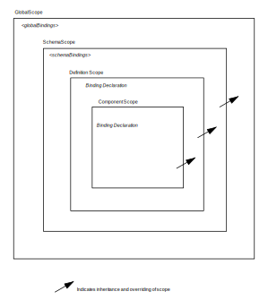

//
// Copyright (c) 2020, 2021 Contributors to the Eclipse Foundation
//

== Customizing XML Schema to Java Representation Binding

The default binding of source schema
components to derived Java representation by a binding compiler
sometimes may not meet the requirements of a JAXB application. In such
cases, the default binding can be customized using a __binding declaration__.
Binding declarations are specified by a __binding language__,
the syntax and semantics of which are defined in this chapter.

All JAXB implementations are required to
provide customization support specified here unless explicitly stated as
optional.

=== Binding Language

The binding language is an XML based language
which defines constructs referred to as __binding declarations__. A binding
declaration can be used to customize the default binding between an XML
schema component and its Java representation.

The schema for binding declarations is defined in the namespace
`https://jakarta.ee/xml/ns/jaxb`. This specification uses the
namespace prefix `"jaxb"` to refer to the namespace of binding
declarations. For example,

[source,xml,indent=4]
----
<jaxb: binding declaration>
----

A binding compiler interprets the binding
declaration relative to the source schema and a set of default bindings
for that schema. Therefore a source schema need not contain a binding
declarations for every schema component. This makes the job of a JAXB
application developer easier.

There are two ways to associate a binding
declaration with a schema element:

* as part of the source schema (_inline
annotated schema_)
* external to the source schema in an
_external binding declaration_.

The syntax and semantics of the binding
declaration is the same regardless of which of the above two methods is
used for customization.

A binding declaration itself does not
identify the schema component to which it applies. A schema component
can be identified in several ways:

* explicitly - e.g. QName, XPath expressions
etc.
* implicitly - based on the context in which
the declaration occurs.

It is this separation which allows the
binding declaration syntax to be shared between inline annotated schema
and the external binding.

==== Extending the Binding Language

In recognition that there will exist a need
for additional binding declarations than those currently specified in
this specification, a formal mechanism is introduced so all JAXB
processors are able to identify _extension binding declarations_ . An
extension binding declaration is not specified in the _jaxb:_ namespace,
is implementation specific and its use will impact portability.
Therefore, binding customization that must be portable between JAXB
implementations should not rely on particular customization extensions
being available.

The namespaces containing extension binding
declarations are specified to a JAXB processor by the occurrence of the
global attribute `<jaxb:extensionBindingPrefixes>` within an instance of
`<xs:schema>` element. The value of this attribute is a
whitespace-separated list of namespace prefixes. The namespace bound to
each of the prefixes is designated as a customization declaration
namespace. Prefixes are resolved on the `<xs:schema>` element that
carries this attribute. It is an error if the prefix fails to resolve.
This feature is quite similar to the extension-element-prefixes
attribute in [XSLT 1.0] `http://www.w3.org/TR/xslt10/#extension`,
introduces extension namespaces for extension instructions and functions
for XSLT 1.0.

This specification does not define any
mechanism for creating or processing extension binding declarations and
does not require that implementations support any such mechanism. Such
mechanisms, if they exist, are implementation-defined.

==== Inline Annotated Schema

This method of customization utilizes on the
`<appinfo>` element specified by the XML Schema [XSD PART 1]. A binding
declaration is embedded within the `<appinfo>` element as illustrated
below.

[source,xml,indent=4]
----
<xs:annotation>
  <xs:appinfo>
    <binding declaration>
  </xs:appinfo>
</xs:annotation>
----

The inline annotation where the binding
declaration is used identifies the schema component.

==== External Binding Declaration

The external binding declaration format
enables customized binding without requiring modification of the source
schema. Unlike inline annotation, the remote schema component to which
the binding declaration applies must be identified explicitly. The
`<jaxb:bindings>` element enables the specification of a remote schema
context to associate its binding declaration(s) with. Minimally, an
external binding declaration follows the following format.

[source,xml,indent=4]
----
<jaxb:bindings [schemaLocation = "xs:anyURI"]>
    <jaxb:bindings [node = "xs:string"]>
        <binding declaration>
    <jaxb:bindings>
</jaxb:bindings>
----

The schemaLocation attribute is optional for
specifying `<jaxb:globalBindings>`, and the _node_ attribute is optional
for specifying `<jaxb:schemaBindings>`. The attributes _schemaLocation_
and _node_ are used to construct a reference to a node in a remote
schema. The binding declaration is applied to this node by the binding
compiler as if the binding declaration was embedded in the node’s
`<xs:appinfo>` element. The attribute values are interpreted as follows:

*  _schemaLocation -_ It is a URI reference
to a remote schema.
*  _node_ - It is an XPath 1.0 expression
that identifies the schema node within schemaLocation to associate
binding declarations with.

An example external binding declaration can
be found in <<example>>.

===== Restrictions

* The external binding element
`<jaxb:bindings>` is only recognized for processing by a JAXB processor
when its parent is an `<xs:appinfo>` element, it is an ancestor of
another `<jaxb:bindings>` element, or when it is root element of a
document. An XML document that has a `<jaxb:bindings>` element as its
root is referred to as an external binding declaration file.
* The top-most `<jaxb:binding>` element
within an `<xs:appinfo>` element or the root element of an external
binding file must have its _schemaLocation_ attribute set.

==== Version Attribute

The normative binding schema specifies a
global `version` attribute. It is used to identify the version of the
binding declarations. For example, a future version of this
specification may use the version attribute to specify backward
compatibility. To indicate this version of the specification, the
`version should` be `"3.0"`.
If any other version is specified, it must result in an invalid
customization as specified in <<Invalid Customizations>>.

The `version` attribute must be specified in
one of the following ways:

* If customizations are specified in inline
annotations, the `version` attribute must be specified in `<xs:schema>`
element of the source schema. For example,
+
[source,xml,indent=4]
----
 <xs:schema jaxb:version="3.0">
----

* If customizations are specified in an
external binding file, then the `jaxb:version` attribute must be
specified in the root element `<jaxb:bindings>` in the external binding
file. Alternately, a local `version` attribute may be used. Thus the
version can be specified either as
+
[source,xml,indent=4]
----
 <jaxb:bindings version="3.0" ... />
----
or
+
[source,xml,indent=4]
----
 <jaxb:bindings jaxb:version="3.0" ... />
----
+
Specification of both `version` and
`<jaxb:version>` must result in an invalid customization as specified in
<<Invalid Customizations>>.

==== Invalid Customizations

A _non conforming_ binding declaration is a
binding declaration in the `jaxb` namespace but does not conform to this
specification. A non conforming binding declaration results in a
_customization error_. The binding compiler must report the customization
error. The exact error is not specified here. For additional
requirements see <<Compatibility>>.

The rest of this chapter assumes that non
conforming binding declarations are processed as indicated above and
their semantics are not explicitly specified in the descriptions of
individual binding declarations.

=== Notation

The source and binding-schema fragments shown
in this chapter are meant to be illustrative rather than normative. The
normative syntax for the binding language is specified in
<<Normative Binding Schema Syntax>> in
addition to the other normative text within this chapter. All examples
are non-normative.

* Metavariables are in _italics_.
* Optional attributes are enclosed in `[ square="bracket" ]`.
* Optional elements are enclosed in `[ <elementA> ... </elementA> ]`.
* Other symbols: ‘`,`’ denotes a sequence,
‘`|`’ denotes a choice, ‘`+`’ denotes one or more, ‘`*`’ denotes
zero or more.
* The prefix `xs:` is used to refer to schema
components in W3C XML Schema namespace.
* In examples, the binding declarations as
well as the customized code are shown in bold like this:
*<appinfo> <annotation>* or *getAddress()*.

=== Naming Conventions

The naming convention for XML names in the
binding language schema are:

* The first letter of the first word in a
multi word name is in lower case.
* The first letter of every word except the
first one is in upper case.

For example, the XML name for the Java
property basetype is baseType.

=== Customization Overview

A binding declaration customizes the default
binding of a schema element to a Java representation. The binding
declaration defines one or more customization values each of which
customizes a part of Java representation.

==== Scope

When a customization value is defined in a
binding declaration, it is associated with a _scope_. A scope of a
customization value is the set of schema elements to which it applies.
If a customization value applies to a schema element, then the schema
element is said to be _covered_ by the scope of the customization value.
The scopes are:

* *global scope*: A customization value defined
in `<globalBindings>` has _global scope_. A global scope covers all the
schema elements in the source schema and (recursively) any schemas that
are included or imported by the source schema.
* *schema scope*: A customization value defined
in `<schemaBindings>` has _schema scope_. A schema scope covers all the
schema elements in the target namespace of a schema.
* *definition scope*: A customization value in
binding declarations of a type definition or global declaration has
_definition scope_. A definition scope covers all schema elements that
reference the type definition or the global declaration. This is more
precisely specified in the context of binding declarations later on in
this chapter.
* *component scope*: A customization value in a
binding declaration has _component scope_ if the customization value
applies only to the schema element that was annotated with the binding
declaration.

.Scoping Inheritance and Overriding For Binding Declarations

The different scopes form a taxonomy. The
taxonomy defines both the inheritance and overriding semantics of
customization values. A customization value defined in one scope is
inherited for use in a binding declaration covered by another scope as
shown by the following inheritance hierarchy:

* a schema element in schema scope inherits a
customization value defined in global scope.
* a schema element in definition scope
inherits a customization value defined in schema or global scope.
* a schema element in component scope
inherits a customization value defined in definition, schema or global
scope.

Likewise, a customization value defined in
one scope can override a customization value inherited from another
scope as shown below:

* value in schema scope overrides a value
inherited from global scope.
* value in definition scope overrides a value
inherited from schema scope or global scope.
* value in component scope overrides a value
inherited from definition, schema or global scope.

==== XML Schema Parsing

Chapter 5 specified the bindings using the
abstract schema model. Customization, on the other hand, is specified in
terms of XML syntax not abstract schema model. The XML Schema
specification [XSD PART 1] specifies the parsing of schema elements into
abstract schema components. This parsing is assumed for parsing of
annotation elements specified here. In some cases, [XSD PART 1] is
ambiguous with respect to the specification of annotation elements.
<<Annotation Restrictions>> outlines how
these are addressed.

[NOTE]
.Design Note
====
The reason for specifying using the XML syntax instead of
abstract schema model is as follows. For most part,
there is a one-to-one mapping between schema elements
and the abstract schema components to which they are bound.
However, there are certain exceptions: local attributes and particles.
A local attribute is mapped to two schema components:
{attribute declaration} and {attribute use}. But the XML parsing
process associates the annotation with the {attribute declaration}
not the {attribute use}. This is tricky and not obvious.
Hence for ease of understanding, a choice was made to specify
customization at the surface syntax level instead.

====

=== `<globalBindings>` Declaration

The customization values in `"<globalBindings>"`
binding declaration have global scope. This binding
declaration is therefore useful for customizing at a global level.

==== Usage

[source,xml,indent=4]
----
<globalBindings
    [ collectionType = "collectionType" ]
    [ fixedAttributeAsConstantProperty = "true" | "false" | "1" | "0" ]
    [ generateIsSetMethod = "true" | "false" | "1" | "0" ]
    [ enableFailFastCheck = "true" | "false" | "1" | "0" ]
    [ choiceContentProperty = "true" | "false" | "1" | "0" ]
    [ underscoreBinding = "asWordSeparator" | "asCharInWord" ]
    [ typesafeEnumBase = "typesafeEnumBase" ]
    [ typesafeEnumMemberName = "skipGeneration" |
                               "generateName" | "generateError" ]
    [ typesafeEnumMaxMembers = “xxxx”]
    [ enableJavaNamingConventions = "true" | "false" | "1" | "0" ]
    [ generateElementClass = "false" | "true" | "0" | "1" ]
    [ generateElementProperty = "false" | "true" | "0" | "1" ]
    [ generateValueClass = "true" | "true" | "0" | "1" ]
    [ optionalProperty = "wrapper" | "primitive" | "isSet" ]
    [ mapSimpleTypeDef = "true" | "false" | "1" | "0" ]
    [ localScoping = "nested" | "toplevel" ] >
    [ <javaType> ... </javaType> ]*
    [ <serializable uid=”xxxx”/> ]*
</globalBindings>
----

The following customization values are
defined in global scope:

* `_collectionType_` if specified, must be
either `"indexed"` or any fully qualified class name that implements
`_java.util.List_`. The default value is to any fully qualified class name
that implements `_java.util.List_`.
* `_fixedAttributeAsConstantProperty_` if
specified , defines the customization value
`_fixedAttributeAsConstantProperty_`. The value must be one of `"true"`,
`"false"`, `"1"` or `"0"`. The default value is `"false"`.
* `_generateIsSetMethod_` if specified,
defines the customization value of `_generateIsSetMethod_`. The value must
be one of `"true"`, `"false"`, `"1"` or `"0"`. The default value is `"false"`.
Consider customizing using the newly introduced _optionalProperty_
before using this JAXB customization.
* `_enableFailFastCheck_` if specified,
defines the customization value `_enableFailFastCheck`_. The value must be
one of `"true"`, `"false"`, `"1"` or `"0"`. If enableFailFastCheck is `"true"` or
`"1"` and the JAXB implementation supports this optional checking, type
constraint checking when setting a property is performed as described in
<<Properties>>. The default value is `"false"`.
* `_choiceContentProperty_` if
specified, defines the customization value `_choiceContentProperty_`. The
value must be one of `"true"`, `"false"`, `"1"` or `"0"`.
The default value is `"false"`.
* `_underscoreBinding_` if specified, defines
the customization value `_underscoreBinding_`. The value must be one of
`"asWordSeparator"` or `"asCharInWord"`. The default value is
`"asWordSeparator"`.
* `_enableJavaNamingConventions_` if
specified, defines the customization value `_enableJavaNamingConventions_`.
The value must be one of `"true"`, `"false"`, `"1"` or `"0"`.
The default value is `"true"`.
* `_typesafeEnumBase_` if specified, defines
the customization value `_typesafeEnumBase_`. The value must be a list of
QNames, each of which must resolve to a simple type definition. Only
simple type definitions with an enumeration facet and a restriction base
type listed in `_typesafeEnumBase_` or derived from a type listed in
`_typesafeEnumBase_` is bound to a `_typesafeEnumClass_` by default as
specified in <<Enum Type>>. The default
value of `_typesafeEnumBase_` is `"xs:string"`.
+
The `_typesafeEnumBase_` cannot contain the
following simple types and therefore a JAXB implementation is not
required to support the binding of the these types to typesafe
enumeration class: `_"xs:QName"_`, `_"xs:NOTATIION"_`, `_"xs:base64Binary"_`,
`_"xs:hexBinary"_`, `_"xs:date"_`, `_"xs:time"_`, `_"xs:dateTime"_`, `_"xs:duration"_`,
`_"xs:gDay"_`, `_"xs:gMonth"_`, `_"xs:gYear"_`, `_"xs:gMonthDay"_`, `_"xs:gYearMonth"_`,
`_"xs:IDREF"_`, `_"xs:ID"_`. If any of them are specified, it must result in an
invalid customization as specified in <<Invalid Customizations>>.
JAXB implementation must be capable of binding
any other simple type listed in `_typesafeEnumBase_` to a typesafe
enumeration class.

* `_typesafeEnumMemberName_` if specified,
defines the customization value `_typesafeEnumMemberName_`. The value must
be one of `skipGeneration`, `generateError` or `generateName`. The
default value is `skipGeneration`. See <<typesafeenummembername>> for details.
* `_typesafeEnumMaxMembers_` if specified,
defines the maximum number of enum facets that a simple type definition
can have and be consider to binding to an enum type by default. The
attributes type is `xs:int` and its default value is `256`.
* `_generateElementClass_` if specified as
true, a schema-derived Element class, as specified in
<<Java Element Class>>, is generated for
each element declaration that has an element factory method generated
for it. Its default value is `"false"`.
* `_generateElementProperty_` if specified as
true, controls the generation of JAXBElement property. The value must be
one of `"true"`, `"false"`, `"1"` or `"0"`. The default is absence of the
value.
* `_generateValueClass_` if specified as true, a
schema-derived Java value class is generated for each complex type
definiton.Value class is specified in <<Value Class>>.
If generateValueClass is specified as false, a
schema-derived interface and implementation class is generated for each
complex type definition as specified in <<Java Content Interface>>.
The attribute’s default value is true. See
examples of this binding in <<generateElementClass and generateValueClass>>.
* zero or more `_javaType_` binding
declarations. Each binding declaration must be specified as described in
<<javatype-declaration>>.
* zero or one serializable binding declaration.
* `_optionalProperty_` controls how a JAXB property with a
primitive base type that represents an optional non-nillable
element/attribute is bound. If the attribute has the value "wrapper",
then the base type of the JAXB property is the wrapper class for the
primitive type. A user can indicate that this optional property is not
set by calling the setter with “null” value. If the attribute’s value is
"primitive", it binds as it did in JAXB 1.0. If the attribute’s value is
“isSet”, it binds the optional property using the primitive base type
and also the isSet/unset methods are generated for the optional
property. The attribute’s default value is “wrapper”.
* `_mapSimpleTypeDef_` controls whether a JAXB
mapped class should be generated for each simple type definition as
specified in <<Bind to a JAXB mapped class>>.
This attribute’s default value is `"false"`. This customization
eases preserving simple type substituting precisely as described in
<<Type Substitution of a Simple Type Definition>>.
* `_localScoping_` attribute can have the
value of either _nested_ or _toplevel_ . This attribute describes the
JAXB binding of nested XML schema component to either a _nested_
schema-derived JAXB class or a _toplevel_ schema-derived JAXB class. To
avoid naming collisions between nested components, the default value for
this attribute is _nested_. A developer can customize _localScoping_ to
_toplevel_ when schema components nest too deeply or an application
would prefer to not work with nested classes.

The semantics of the above customization
values, if not specified above, are specified when they are actually
used in the binding declarations.

For inline annotation, a `<globalBindings>`
is valid only in the annotation element of the `<schema>` element. There
must only be a single instance of a `<globalBindings>` declaration in
the annotation element of the `<schema>` element.

==== Customized Name Mapping

A customization value can be used to specify
a name for a Java object (e.g. class name, package name etc.). In this
case, a customization value is referred to as a _customization name_.

A customization name is always a legal Java
identifier (this is formally specified in each binding declaration where
the name is specified). Since customization deals with customization of
a Java representation to which an XML schema element is bound, requiring
a customization name to be a legal Java identifier rather than an XML
name is considered more meaningful.

A customization name may or may not conform
to the recommended Java language naming conventions. [JLS - Java
Language Specification, Second Edition, Section 6.8, "Naming
Conventions"]. The customization value _enableJavaNamingConventions_
determines if a customization name is mapped to a Java identifier that
follows Java language naming conventions or not.

If _enableJavaNamingConventions_ is defined and
the value is `"true"` or `"1"`, then the customization name (except for
constant name) specified in the section from where this section is
referenced must be mapped to Java identifier which follows the Java
language naming conventions as specified in
<<Conforming Java Identifier Algorithm>>;
otherwise the customized name must be used as is.

==== Underscore Handling

The *[jaxb:globalBindings]* attribute
customization _underscoreBinding_ allows for the preservation of
underscore(s) occurring in an XML name when deriving a a Java identifier
from it.

The default value for _@underscoreBinding_ is
`"asWordSeparator"` and categorizes underscore (‘_’) as a punctuation
mark in the XML name to Java identifier algorithm specified in Appendix
<<The Name to Identifier Mapping Algorithm>>.
The resulting algorithm transforms one or more consecutive
underscores in an XML name to camel case separated words in the derived
Java class and method names. Examples of this mapping are in
<<jcmcn>>.

When  _@underscoreBinding_ is
`"asCharInWord"`, underscore (‘_’) is considered a special letter within
a word. The result is that all underscore characters from the original
XML name are preserved in the derived Java identifier. Example of this
mapping are in <<asCharInWord>>.

==== generateElementClass and generateValueClass

The following code examples illustrate
default binding to value class and customization to bind to
interface/implementation classes.

*_Example:_* Default Binding to a value class. +

Schema fragment:

[source,xml,indent=4]
----
<xs:complexType name="USAddress">
  <xs:attribute name="City" type="xs:string"/>
</xs:complexType>
----

Default Value Class:

[source,java,indent=4]
----
public class USAddress {
    public USAddress() {...}
    public String getCity() {...}
    public void setCity(String value) {...}
    ...
}
----
Customization `<jaxb:globalBinding generateValueClass="false">`
generates following interface instead of
default value class:

*_Example:_* Customized binding to an interface. +

[source,java,indent=4]
----
public interface USAddress {
    String getCity();
    void setCity(String value);
}
----

*_Example:_* Generation of an Element Class. +

Schema fragment:

[source,xml,indent=4]
----
<xs:element name="Address" type="USAddress"/>
----
[source,java,indent=4]
----
// Default Java binding of global element to element instance factory
public ObjectFactory {
    JAXBElement<USAddress> createAddress(USAddress value);
}
----

`<jaxb:globalBinding generateElementClass="true"/>` results in generation
of following Element class:

[source,java,indent=4]
----
public class Address extends JAXBElement<USAddress> {
}
----

==== @typesafeEnumMemberName

If there is a collision among the generated
constant fields *name* or if it is not possible to generate a legal Java
identifier for one or more of the generated constant field names, then
the binding is determined based on the value of @
`_typesafeEnumMemberName_` of element *[jaxb:globalBindings]*.

* _skipGeneration_ +
An enum type is not generated. This is the default behavior if
`_typesafeEnumMemberName_` has not been specified. A binding compiler may
report a warning on why the simple type definition was not bound to an
enum type.
* _generateName_ +
The constant fields *name* is `__"VALUE____<N>"_` where `_<N>_` is 1
for the first enumeration value and increments by 1 to represent each
value within the XML enumeration.
* _generateError_ +
An error must be reported.

==== <serializable> Declaration

When the serializable customization is
specified, all schema-derived classes implement `java.io.Serializable`.
Each class is generated with a `serialVersionUID` field set to the value
specified by _@uid_.

[source,java,indent=4]
----
private static final long serialVersionUID = <value of @uid>;
----
The JAXB user is required to identify when
schema-derived classes do not follow
_https://docs.oracle.com/javase/8/docs/platform/serialization/spec/version.html#a6519§[Java
serialization class evolution rules]_ and change the generated
`serialVersionUID` field by changing the *[serializable]* element’s
attribute _@uid_ value.

==== @generateElementProperty

Some schemas use both minOccurs="0" on
element as well as nillable="true", causing the generation of
JAXBElement. This customization lets you control this behavior. This
attribute may take two values:

* _true_: +
Always generate properties to use JAXBElement, unless overriden by
`<jaxb:property generateElementProperty="false"/>` on individual
property.
* _false_: +
When generating properties from `<element nillable=”true” minOccurs=”0”/>`,
generate a property not to use JAXBElement, as if the
element declaration were just `<element nillable=”true” />`, unless
overriden by `<jaxb:property generateElementProperty="true"/>` on
individual property. It is an error to specify this customization, when
the property is required to be JAXBElement (such as when a property
contains multiple elements with different names but of the same type.)

===  `<schemaBindings>` Declaration

The customization values in
`<schemaBindings>` binding declaration have schema scope. This binding
declaration is therefore useful for customizing at a schema level.

==== Usage

[source,xml,indent=4]
----
<schemaBindings [ map="boolean" ] >
    [ <package> package </package> ]
    [ <nameXmlTransform> ... </nameXmlTransform>]*
</schemaBindings>

<package [ name = "packageName" ]
    [ <javadoc> ... </javadoc> ]
</package>

<nameXmlTransform>
    [ <typeName           [ suffix="suffix" ]
                          [ prefix="prefix" ] /> ]
    [ <elementName        [ suffix="suffix" ]
                          [ prefix="prefix" ] /> ]
    [ <modelGroupName     [ suffix="suffix" ]
                          [ prefix="prefix" ] /> ]
    [ <anonymousTypeName  [ suffix="suffix" ]
                          [ prefix="prefix" ] /> ]
</nameXmlTransform>
----

For readability, the `<nameXmlTransform>` and
`<package>` elements are shown separately. However, they are local
elements within the `<schemaBindings>` element.

The following customizations are defined in
the schema scope:

* _map_ if specified, prevents the classes
from being generated from this schema. When the value is `"0"` or `"false"`,
then no class/interface/enum will be generated from this package. _map_
defaults to `"true"`.

The semantics of the customization value, if
not specified above, are specified when they are actually used in the
binding declarations.

For inline annotation, a `<schemaBindings>`
is valid only in the annotation element of the `<schema>` element. There
must only be a single instance of a `<schemaBindings>` declaration in
the annotation element of the `<schema>` element.

If one source schema includes (via the
include mechanism specified by XSD PART 1) a second source schema, then
the `<schemaBindings>` declaration must be declared in the first
including source schema. It should be noted that there is no such
restriction on `<schemaBindings>` declarations when one source schema
imports another schema since the scope of `<schemaBindings>` binding
declaration is schema scope.

===== package

Usage

* `_name_` if specified, defines the
customization value `_packageName_`. `_packageName_` must be a valid Java
package name.
* `_<javadoc>_` if specified, customizes the
package level Javadoc. `_<javadoc>_` must be specified as described in
<<javadoc-declaration>>. The Javadoc
must be generated as specified in <<Javadoc Customization>>.
The Javadoc section customized is the `package
section`.

[NOTE]
.Design Note
====
The word “package” has been prefixed to `_name_` used in the binding declaration.
This is because the attribute or element tag names “name” is not unique by itself
across all scopes. For e.g., “name” attribute can be specified
in the <property> declaration. The intent is to disambiguate by reference such as `"packageName"`.

====

The semantics of the `_packageName_` is
specified in the context where it is used. If neither `_packageName_` nor
the `_<javadoc>_` element is specified, then the binding declaration has
no effect.

*_Example:_* Customizing Package Name +

[source,xml,indent=4]
----
<jaxb:schemaBindings>
    <jaxb:package name = "org.example.po" />
</jaxb:schemaBindings>
----

specifies `"org.example.po"` as the package
to be associated with the schema.

=====  nameXmlTransform

The use case for this declaration is the UDDI
Version 2.0 schema. The UDDI Version 2.0 schema contains many
declarations of the following nature:

[source,xml,indent=4]
----
<xs:element name="bindingTemplate" type="uddi:bindingTemplate"/>
----

The above declaration results in a name
collision since both the element and type names are the same - although
in different XML Schema symbol spaces. Normally, collisions are supposed
to be resolved using customization. However, since there are many
collisions for the UDDI V2.0 schema, this is not a convenient solution.
Hence the binding declaration `nameXmlTransform` is being provided to
automate name collision resolution.

The `nameXmlTransform` allows a `_suffix_` and
a `_prefix_` to be specified on a per symbol space basis. The following
symbol spaces are supported:

*  `<typeName>` for the symbol space “type
definitions”
*  `<elementName>` for the symbol space
“element definitions”
*  `<modelGroupName>` for the symbol space
“model group definitions.”
*  `<anonymousTypeName>` for customizing Java
value class to which an anonymous type is bound.footnote:[XML schema does not
associate anonymous types with a specific symbol space. However,
_nameXmlTransform_ is used since it provides a convenient way to
customize the value class to which an anonymous type is bound.]

If `_suffix_` is specified, it must be appended
to all the default XML names in the symbol space. The `_prefix_` if
specified, must be prepended to the default XML name. Furthermore, this
XML name transformation must be done after the XML name to Java
Identifier algorithm is applied to map the XML name to a Java
identifier. The XML name transformation must not be performed on
customization names.

By using a different `_prefix_` and/or `_suffix_`
for each symbol space, identical names in different symbol spaces can be
transformed into non-colliding XML names.

`*anonymousTypeName*`

The `<anonymousTypeName>` declaration can be
used to customize the suffix and prefix for the Java value class. If
`_prefix_` is specified, then it must be prepended to the Java value class
name for the anonymous type. If suffix is specified, it must be
appended.

=== `<class>` Declaration

This binding declaration can be used to
customize the binding of a schema component to an element class, value
class or interface/implementation class. The customizations can be used
to specify:

* a name for the derived Java class.
* an alternative implementation of
interface/implementation binding.

Specification of an alternate implementation
for an interface allows implementations generated by a tool (e.g. based
on UML) to be used in place of the default implementation generated by a
JAXB provider.

The implementation class may have a
dependency upon the runtime of the binding framework. The
implementation class may not be portable across JAXB provider
implementations. Hence one JAXB provider implementation is not required
to support the implementation class from another JAXB provider.

==== Usage

[source,xml,indent=4]
----
<class [ name = "className" ]
       [ implClass = "implClass" ]
       [ ref = "className" ] >
       [ <javadoc> ... </javadoc> ]
</class>
----

* `_className_` is the name of the derived
value class, if specified. It must be a legal Java class name and must
not contain a package prefix. The package prefix is inherited from the
current value of _package_.
* `_implClass_` if specified, is the name of
the implementation class for `_className_` and must include the complete
package name. Note that this customization only impacts the return value
for `className` ’s factory method. This customization is ignored when
`new` is used to create instances of a schema-derived Value class.
* `_ref_` if specified, is the name of the
value class that is provided outside the schema compiler. This
customization causes a schema compiler to refer to this external class,
as opposed to generate a definition. It must include the complete
package name. This attribute is mutually exclusive with the `_className_`
attribute and the `_implClass_` attribute.
* `_<javadoc>_` element, if specified
customizes the Javadoc for the derived value class. `_<javadoc>_` must be
specified as described in <<javadoc-declaration>>.

==== Customization Overrides

When binding a schema element’s Java
representation to a value class or a Java Element class, the following
customization values override the defaults specified in Chapter 5. It is
specified in a common section here and referenced from
<<Customizable Schema Elements>>.

* *name*: The name is `_className_` if specified.
* *package name:* The name of the package is
`_packageName_` inherited from a scope that covers this schema element.
+
[NOTE]
.Note
====
The `_packageName_` is only set in the `<package>` declaration. The
scope of `_packageName_` is schema scope and is thus inherited by all
schema elements within the schema.

====

* *javadoc:* The Javadoc must be generated as
specified in section <<Javadoc Customization>>.
The Javadoc section customized is the `class/interface
section`.

==== Customizable Schema Elements

===== Complex Type Definition

When `<class>` customization specified in the
annotation element of the complex type definition, the complex type
definition must be bound to a Java value class as specified in
<<Java value class>> applying the
customization overrides as specified in <<Customization Overrides>>.

*_Example:_* Class Customization: Complex Type Definition To Java value class +

XML Schema fragment:

[source,xml,indent=4]
----
<xs:complexType name="USAddress">
  <xs:annotation><xs:appinfo>
    <jaxb:class name="MyAddress" />
  </xs:appinfo></xs:annotation>
  <xs:sequence>...</xs:sequence>
  <xs:attribute name="country" type="xs:string"/>
</xs:complexType>
----

Customized code:

[source,java,indent=4]
----
// public class USAddress { // Default Code
public class MyAddress { // Customized Code
    public String getCountry() {...}
    public void setCountry(String value) {...}
    ...
}
----

===== Simple Type Definition

When `<class>` customization specified in the
annotation element of a simple type definition, the simple type
definition must be bound to a Java value class as specified in
<<Bind to a JAXB mapped class>> applying
the customization overrides as specified in
<<Customization Overrides>>.

*_Example:_* Class Customization: Simple Type Definition To Java value class +

XML Schema fragment:

[source,xml,indent=4]
----
<xs:simpleType name="SKU">
  <xs:annotation><xs:appinfo>
    <jaxb:class/>
  </xs:appinfo></xs:annotation>
  <xs:restriction base=”xs:int”/>
</xs:simpleType>
----

Customized code:

[source,java,indent=4]
----
public class SKU {
    @XmlValue
    public int getValue() {...}
    public void setValue(int value) {...}
    ...
}
----

===== Model Group Definition

It is invalid to place a `<jaxb:class>` customization on a model group.

===== Model Group

It is invalid to place a `<jaxb:class>` customization on an unnamed model group.

===== Global Element Declaration

A `_<class>_` declaration is allowed in the
annotation element of the global element declaration. However, the
`_implClass_` attribute is not allowed. The global element declaration
must be bound as specified in <<Bind to Element Class>>
applying the customization overrides specified in
<<Customization Overrides>>.

*_Example:_* Class Customization: Global Element to Class +

XML Schema Fragment:

[source,xml,indent=4]
----
<xs:complexType name="AComplexType">
  <xs:sequence>
    <xs:element name="A" type="xs:int"/>
    <xs:element name="B" type="xs:string"/>
  </xs:sequence>
</xs:complexType>

<xs:element name="AnElement" type="AComplexType">
  <xs:annotation><xs:appinfo>
    <jaxb:class name="MyElement"/>
  </xs:appinfo></xs:annotation>
</xs:element>
----

Customized code:

[source,java,indent=4]
----
// following class is generated because of customization

public class AComplexType {
    void setA(int value) {...}
    int getA() {...}
    void setB(String value) {...}
    String getB() {...}
}

public class MyElement extends JAXBElement<AComplexType> {...}

public class ObjectFactory {

    // Default code
    // JAXBElement<AnElement> createAnElement(AnElement)\{...}

    // Customized code
    MyElement createMyElement(AnElement) {...}
    ... other factory methods ...

}
----

===== Local Element

A local element is a schema element that
occurs within a complex type definition. A local element is one of:

* local element reference (using the “ref”
attribute) to a global element declaration.
* local element declaration (“ref” attribute is not used).

A `<class>` declaration is allowed in the
annotation element of a local element. <<Annotation Restrictions>>
contains more information regarding the
annotation element for a local element reference. However, the
`_implClass_` attribute is not allowed.

A `<class>` customization on local element
reference must result in an invalid customization as specified in
<<Invalid Customizations>> since a local
element reference is never bound to a Java Element class.

A `<class>` customization on local element
declaration applies only when a local element declaration is bound to a
Java Element class. Otherwise it must result in an invalid customization
as specified in <<Invalid Customizations>>.
If applicable, a local element must be bound as
specified in <<bind-to-jaxbelementt-instance>>
applying the customization overrides as specified in
<<Customization Overrides>>.

*_Example:_* Class Customization: Local Element Declaration To Java Element +

The following example is from <<Examples>>.

XML Schema fragment:

[source,xml,indent=4]
----
<xs:complexType name="Base">
  <xs:choice maxOccurs="unbounded">
    <xs:element name="A" type="xs:string">
      <xs:annotation><xs:appinfo>
        <jaxb:class name="Bar"/>
      </xs:appinfo></xs:annotation>
    </xs:element>
    <xs:element name="B" type="xs:string"/>
    <xs:element name="C" type="xs:int"/>
  </xs:choice>
</xs:complexType>
----

Customized code:

[source,java,indent=4]
----
import jakarta.xml.bind.JAXBElement;
public class ObjectFactory {
    // element instance factories only
    // JAXBElement<String> createBaseA(String value); // default code
    JAXBElement<String> createBaseBar(String value); // Customized
    JAXBElement<String> createBaseB(String value);
    JAXBElement<Integer> createBaseC(Integer value);
}
public class Base {
    static public class Bar extends JAXBElement<String> {...} // Customized code
    /**
     * A general content list that can contain element
     * instances of JAXBElement<String> or JAXBElement<Integer>.
     */
    List<Object> getBarOrBOrC() {...}
}
----

=== `<property>` Declaration

This binding declaration allows the
customization of a binding of an XML schema element to its Java
representation as a property. This section identifies all XML schema
elements that can be bound to a Java property and how to customize that
binding.

The scope of customization value can either
be definition scope or component scope depending upon which XML schema
element the `_<property>_` binding declaration is specified.

==== Usage

[source,xml,indent=4]
----
<property [ name = "propertyName" ]
    [ collectionType = "propertyCollectionType" ]
    [ fixedAttributeAsConstantProperty = "true" | "false" | "1" | "0" ]
    [ generateIsSetMethod = "true" | "false" | "1" | "0" ]
    [ enableFailFastCheck = "true" | "false" | "1" | "0" ]
    [ generateElementProperty = "true" | "false" | "1" | "0" ]
    [ attachmentRef = "resolve" | "doNotResolve" | "default" ] >
    [ <baseType name = "fully qualified Java class"> ... </baseType> ]
    [ <javadoc> ... </javadoc> ]
</property>

<baseType name=”fully qualified Java class”>
    <javaType> ... </javaType>
</baseType>
----

For readability, the `<baseType>` element is
shown separately. However, it can be used only as a local element within
the `<property>` element.

The use of this declaration is subject to the
constraints specified in <<usage-constraints>>.

The customization values defined are:

* `_name_` if specified, defines the
customization value `_propertyName;_` it must be a legal Java identifier.
* `_collectionType_` if specified, defines the
customization value `_propertyCollectionType_` which is the collection
type for the property. `_propertyCollectionType_` if specified, must be
either `"indexed"` or any fully qualified class name that implements
`_java.util.List_`.
* `_fixedAttributeAsConstantProperty_` if
specified , defines the customization value
`_fixedAttributeAsConstantProperty_`. The value must be one of
`"true"`, `"false"`, `"1"` or `"0"`.
* `_generateIsSetMethod_` if specified,
defines the customization value of `_generateIsSetMethod_`. The value must
be one of `"true"`, `"false"`, `"1"` or `"0"`.
* `_enableFailFastCheck_` if specified,
defines the customization value `_enableFailFastCheck_`. The value must be
one of `"true"`, `"false"`, `"1"` or `"0"`.
* `@generateElementProperty` if specified,
controls the generation of JAXBElement property. The value must be one
of `"true"`, `"false"`, `"1"` or `"0"`. The default is absence of the value.
It is an error for this attribute to be present if this customization is
attached to local or global attribute declarations. This customization
affects the binding as follows. It is an error to specify this
customization, when the property is required to be `_JAXBElement_` (such
as when a property contains multiple elements with different names but
of the same type.)
** _true_ : Always generate properties to use `_JAXBElement_`.
** _false_ : When generating properties from
`_<element nillable="true" minOccurs="0" />_`, generate a property not to
use JAXBElement, as if the element declaration were just `_<element nillable="true"/>_`.
* `@attachmentRef` has a default value of
“default”. This mode defers to default processing as specified in
<<binding-ws-i-attachment-profile-refswaref>>. +
 +
When `@attachmentRef` value is _resolve_ and the property’s base type is
or derives from `xsd:anyURI`, the schema-derived JAXB property has a
base type of `jakarta.activation.DataHandler` and the property is
annotated with `@XmlAttachmentRef`. +
 +
Disabling autoresolving an element/attribute of type `ref:swaRef`: +
When `@attachmentRef` value is _doNotResolve_ and the property’s base
type derives from standard schema type `ref:swaRef`, the schema-derived
JAXB property has the base type `String`, derived from `xsd:anyURI`,
and `@XmlAttachmentRef` is not generated for the property.
* `_<javadoc>_` element, if specified
customizes the Javadoc for the property’s getter method. `_<javadoc>_`
must be specified as described in <<javadoc-declaration>>.

==== baseType

The `<baseType>` element is intended to allow
the customization of a base type for a JAXB property. This element can
only be a child of <jaxb:property> element.

[source,xml,indent=4]
----
<baseType name="fully qualified Java class>">
    <javaType> ... </javaType>
</baseType>
----

The `@name` attribute enables either the
specialization or generalization of the default base type binding for a
JAXB property. Child element `<javaType>` is used to convert the default
base type to a Java class. These two mutual exclusive usages of the
<baseType> customization are described below.

===== Conversion using Child element <javaType>

Optional child element `_<javaType>_`, if
specified, defines the customization value `_javaType_` and must be
specified as defined in <<javatype-declaration>>.
The customization value defined has component scope. This
customization converts the default base type’s value for a simple type
definition to the Java class specified by <javaType> name.

The schema-derived JAXB property is annotated
with `@XmlJavaTypeAdapter` specified in Section 8.
`@XmlJavaTypeAdapter.value()` is set to a generated
classfootnote:[There is no need to
standardize the name of the generated class since
_@XmlJavaTypeAdapter.value()_ references the class.] that extends
`jakarta.xml.bind.annotation.adapter.XmlAdapter`. The generated class’
`unmarshal` method must call the <javaType> customization’s parse
method, which is specified in <<<javatype-declaration>>.
The generated class’ `marsha` method must call
the <javaType> customization’s print method.

===== Generalize/Specialize baseType with attribute @name

The `name` attribute for`<baseType` enables
more precise control over the actual base type for a JAXB property. This
customization enables specifying an alternative base type than the
property’s default base type. The alternative base type must still be in
the same class inheritance hierarchy as the default base type. The
alternative base type must be either a super interface/class or subclass
of the default Java base type for the property. The customization
enables one to specialize or generalize the properties binding.

The `name` attribute value must be a fully
qualified Java class name. When the default base type is a primitive
type, consider the default Java base type to be the Java wrapper class
of that primitive type.

Generalizing the basetype using this
customization enables simple type substitution for a JAXB property
representing with too restrictive of a default base type. To enable all
possible valid type substitutions, the `name` attribute should be
`java.lang.Object`. However, if for example, it is known that all type
substitutions will share a more specific Java super interface/class than
`java.lang.Object`, that Java class name can be used achieve a stronger
typed binding. With this customization, the JAXB annotation generated
for the property’s `@XmlElement.type()` or `@XmlAttribute.type()` is
still the default Java datatype for the element/attribute’s
schema-defined type.

The schema-derived customized JAXB property
is annotated, either explicitly or by default mapping annotations, with
the mapping annotation `@XmlElement`, specified in Section 8.10.1. The
`@XmlElement` annotation element type is derived in terms of the
abstract model properties for a element type definition summarized in
<<Element Declaration Schema Component>>
as follows:

.Annotate JAXB property with @XmlElement element-value pairs
[cols=",",options="header"]
|===
| @XmlElement element | @XmlElement value
| type |the java type binding of the element declaration’s _{type definition}_
|===

Note that the Java class for
`@XmlElement.type()` can differ from the recommended JAXB property’s
base type to enable type substitution of java.lang.Object. This binding
enables unmarshalling of the Element’s simple content when it is not
qualified with an `xsi:type` as the element’s schema-declared type.
`@XmlElement.type()` acts as the default `xsi:type` for a JAXB property
where the property’s base type was generalized to allow for type
substitution of an element declaration with a simple type definition.

Specializing the basetype using this
customization generates stronger typing than default JAXB binding. For
example, an XML element or attribute of `xs:IDREF` binds to
`java.lang.Object` by default as specified in
<<Binding an IDREF component to a Java property>>.
If the schema only intends the reference to be to an element
that binds to a specific type, the baseType @name schema customization
can be used to specialize the binding.

[#exidrefcust]
*_Example:_* Specialize binding of an IDREF via customization +

Given XML Schema fragment:

[source,xml,indent=4]
----
<xs:complexType name="Book">
  <xs:sequence>
    <xs:element name="author" type="xs:IDREF"/>
      <xs:annotation><xs:appinfo>
        <jaxb:property>
          <jaxb:baseType name=”AuthorBio.class”/>
        </jaxb:property>
      </xs:appinfo></xs:annotation>
    <!-- ... -->
  </xs:sequence>
</xs:complexType>
<xs:complexType name="AuthorBio">
  <xs:sequence><!-- ... --> </xs:sequence>
  <xs:attribute name="name" type="xs:ID"/>
</xs:complexType>
----

Schema-derived Java value class:

[source,java,indent=4]
----
public class Book {
    @XmlIDREF
    AuthorBio getAuthor() {...}
    void setAuthor(AuthorBio referencedObj) {...}
}
public class AuthorBio {
    @XmlID
    String getName() {...}
    void setName(String value) {...}
}
----

===== Usage Constraints

The usage constraints on `<property>` are
specified below. Any constraint violation must result in an invalid
customization as specified in <<Invalid Customizations>>. The usage constraints are:

. The `<baseType>` is only allowed with the
following XML schema elements from the
<<Customizable Schema Elements>>:
.. Local Element, <<Local Element>>.
.. Local Attribute, <<Local Attribute>>.
.. ComplexType with simpleContent, <<ComplexType>>.
. `<baseType>` can either have a name attribute
or a `<javaType>`, they both can not exist at the same time.
. The `_fixedAttributeAsConstantProperty_` is
only allowed with a local attribute, <<Local Attribute>>, that is fixed.
. If a `<property>` declaration is associated
with the `<complexType>`, then a `<property>` customization cannot be
specified on the following schema elements that are scoped to
`<complexType>`:
+
--
.. Local Element
.. Model group
.. Model Group Reference
--
The reason is that a `<property>` declaration
associated with a complex type binds the content model of the complex
type to a general content property. If a `<property>` declaration is
associated with a schema element listed above, it would create a
conflicting customization.

[NOTE]
.Design Note
====
A Local Attribute is excluded from the list above.
The reason is that a local attribute is not part of the content model
of a complex type. This allows a local attribute to be customized
(using a <property> declaration) independently
from the customization of a complex type’s content model.

====

*_Example:_* Property Customization: simple type customization +

[source,xml,indent=4]
----
<xs:complexType name="internationalPrice">
  ....
  <xs:attribute name="currency" type="xs:string">
    <xs:annotation><xs:appinfo>
      <jaxb:property>
        <jaxb:baseType>
          <jaxb:javaType name="java.math.BigDecimal"
    parseMethod="jakarta.xml.bind.DatatypeConverter.parseInteger"
    printMethod="jakarta.xml.bind.DatatypeConverter.printInteger"/>
        </jaxb:baseType>
      </jaxb:property>
    </xs:appinfo></xs:annotation>
  </xs:attribute>
</xs:complexType>
----

The code generated is:

[source,java,indent=4]
----
public class InternationalPrice {
    // String getCurrency(); default
    java.math.BigDecimal getCurrency() {...} //customized
    public void setCurrency(java.math.BigDecimal val) {...} // customized
}
----

==== Customization Overrides

When binding a schema element’s Java
representation to a property, the following customization values
override the defaults specified in Chapter 6. It is specified in a
common section here and referenced from <<Customizable Schema Elements>>.

* *name*: If _propertyName_ is defined, then it
is the name obtained by mapping the name as specified in
<<Customized Name Mapping>>.
* *base type*: The basetype is
`_propertyBaseType_` if defined. The _propertyBaseType_ is defined by a XML
schema element in <<Customizable Schema Elements>>.
* *collection type*: The collection type is
`_propertyCollectionType_` if specified; otherwise it is the
`_propertyCollectionType_` inherited from a scope that covers this schema
element.
* *javadoc*: The Javadoc must be generated as
specified in section <<Javadoc Customization>>. The Javadoc section customized is the `method section`.
* If `_propertyBaseType_` is a Java primitive
type and `_propertyCollectionType_` is a class that implements
`java.util.List`, then the primitive type must be mapped to its wrapper
class.

The following does not apply if local
attribute is being bound to a constant property as specified in
<<Local Attribute>>:

* If `_generateIsSetMethod_` is `"true"` or `"1"`, then additional
methods as specified in <<isset-property-modifier>> must be generated.
* If `_enableFailFastCheck_` is `"true"` or `"1"`,
then the type constraint checking when setting a property is enforced by
the JAXB implementation. Support for this feature is optional for a JAXB
implementation in this version of the specification.

==== Customizable Schema Elements

===== Global Attribute Declaration

A `_<property>_` declaration is allowed in
the annotation element of the global attribute declaration.

The binding declaration does not bind the
global attribute declaration to a property. Instead it defines
customization values that have definition scope. The definition scope
covers all local attributes (<<Local Attribute>>)
that can reference this global attribute declaration. This
is useful since it allows the customization to be done once when a
global attribute is defined instead of at each local attribute that
references the global attribute declaration.

===== Local Attribute

A local attribute is an attribute that occurs
within an attribute group definition, model group definition or a
complex type. A local attribute can either be a

* local attribute reference (using the “ref”
attribute) to a global attribute declaration.
* local attribute declaration (“ref”
attribute is not used).

A `_<property>_` declaration is allowed in
the annotation element of a local
attribute. <<Annotation Restrictions>>
contains more information regarding the annotation element for a local
attribute reference. The customization values must be defined as
specified in <<usage-4>> and have component
scope.

If `_javaType_` is defined, then the
`_propertyBaseType_` is defined to be Java datatype specified in the
`"name"` attribute of the `_javaType_`.

* If `_fixedAttributeAsConstantProperty_` is
`"true"` or `"1"` and the local attribute is a fixed, the local
attribute must be bound to a Java Constant property as specified in
<<Bind to a Java Constant property>>
applying customization overrides as specified in
<<Customization Overrides>>. The
`_generateIsSetMethod_`, `_choiceContentProperty_`
and `_enableFailFastCheck_` must
be considered to have been set to `"false"`.
* Otherwise, it is bound to a Java property
as specified in <<Attribute use>>
applying customization overrides as specified in
<<Customization Overrides>>.

*_Example:_* Customizing Java Constant Property +

XML Schema fragment:

[source,xml,indent=4]
----
<xs:complexType name="USAddress">
  <xs:attribute name="country" type="xs:NMTOKEN" fixed="US">
    <xs:annotation><xs:appinfo>
      <jaxb:property name="MY_COUNTRY"
                     fixedAttributeAsConstantProperty="true"/>
    </xs:appinfo></xs:annotation>
  </xs:attribute>
</xs:complexType>
----

Customized derived code:

[source,java,indent=4]
----
public class USAddress {
    public static final String MY_COUNTRY = "US"; // Customized Code
}
----

*_Example 2:_* Customizing to other Java Property +

XML Schema fragment:

[source,xml,indent=4]
----
<xs:complexType name="USAddress"> +
  <xs:attribute name="country" type="xs:string">
    <xs:annotation><xs:appinfo>
      <jaxb:property name="MyCountry"/>
    </xs:appinfo></xs:annotation>
  </xs:attribute>
</xs:complexType>
----

Customized derived code:

[source,java,indent=4]
----
public class USAddress {
    // public getString getCountry(); // DefaultCode
    // public void setCountry(string value);//Default Code
    public String getMyCountry() {...} //Customized Code
    public void setMyCountry(String value) {...}// Customized Code
}
----

*_Example 3:_* Generating IsSet Methods +

XML Schema fragment:

[source,xml,indent=4]
----
<xs:attribute name="account" type = "xs:int">
  <xs:annotation><xs:appinfo>
    <jaxb:property generateIsSetMethod="true"/>
  </xs:appinfo></xs:annotation>
</xs:attribute>
----

Customized code:

[source,java,indent=4]
----
public int getAccount();
public void setAccount(int account);
public boolean isSetAccount(); // Customizedcode
public void unsetAccount(); // Customizedcode
----

===== Global Element Declaration

A `_<property>_` declaration is allowed in the
annotation element of a global element declaration. However, the usage
is constrained as follows:

The binding declaration does not bind the
global element declaration to a property. Instead it defines
customization values that have definition scope. The definition scope
covers all local elements (<<Local Element>>)
that can reference this global element declaration. This is
useful since it allows the customization to be done once when a global
element is defined instead of at each local element that references the
global element declaration.

===== Local Element

A local element is a schema element that
occurs within a complex type definition. A local element is one of:

* local element reference (using the “ref”
attribute) to a global element declaration.
* local element declaration (“ref” attribute
is not used).

A `<property>` declaration is allowed in the
annotation element of a local element. <<Annotation Restrictions>>
contains more information regarding the
annotation element for a local element reference.

The customization values must be defined as
specified in <<usage-4>> and have component
scope.

If `_javaType_` is defined, then the
`_propertyBaseType_` is defined to be Java datatype specified in the
`"name"` attribute of the `_javaType_`.

The local element must be bound as specified
in <<Content Model Default Binding>>
applying customization overrides as specified in
<<Customization Overrides>>.

See example in <<propex3>> in section <<Model Group>>.

===== Wildcard

A `<property>` declaration is allowed in the
annotation element of the wildcard schema component. The customization
values must be defined as specified in <<usage-4>> and have component scope.

The wildcard schema component must be bound
to a property as specified in <<Bind wildcard schema component>>
applying customization overrides as
specified in <<Customization Overrides>>.

*_Example:_* The following schema example is from UDDI V2.0 +

[source,xml,indent=4]
----
<xs:complexType name="businessEntityExt">
  <xs:sequence>
    <xs:any namespace="##other"
            processContents="strict"
            minOccurs="1" maxOccurs="unbounded">
      <xs:annotation><xs:appinfo>
        <jaxb:property name="Extension"/>
      </xs:appinfo></xs:annotation>
    </xs:any>
    ....
  </xs:sequence>
</xs:complexType>
----

Customized derived code:

[source,java,indent=4]
----
public class BusinessEntityExt {
    ...
    // List getAny(); // Default Code
    List getExtension() {...} // Customized Code
}
----

===== Model Group

A `<property>` binding declaration is allowed
in the annotation element of the compositor (i.e. `<choice>`,
`<sequence>` or `<all>`). The customization values must be defined as
specified in <<usage-4>> and have component
scope.

The customized binding of a model group is
determined by the following:

* `choiceContentProperty` attribute in `<globalBindings>`.
. If _propertyBaseType_ is defined and a
`<property>` declaration is also present, then the customization
overrides specified in <<Customization Overrides>>
must be applied by the model group’s parent schema element
to the property used to aggregate the Java value class.
. If _propertySet_ is defined, then the model
group’s parent schema element must aggregate the property set as
specified in <<Aggregation of Property Set>>.

*_Example 1:_* [[propex1, Example 1]]Property Customization: Model Group To ChoiceContent Property +

XML Schema fragment

[source,xml,indent=4]
----
<xs:annotation><xs:appinfo>
  <jaxb:globalBindings choiceContentProperty="true"/>
</xs:appinfo></xs:annotation>
<xs:complexType name=”AType”>
  <xs:choice>
    <xs:element name="foo" type="xs:int"/>
    <xs:element name="bar" type="xs:string"/>
  </xs:choice>
</xs:complexType>
----

Customized derived code:

[source,java,indent=4]
----
class ObjectFactory {
    JAXBElement<Integer> createAtypeFoo(Integer value);
    JAXBElement<String>  createAtypeBar(String value);
}
public class AType {
    void setFooOrBar(Object o) {...}    //customized code
    Object getFooOrBar() {...}          //customized code
}
----

The `choiceContentProperty` is required to
bind the choice model group to a choice content property.

*_Example 2:_* [[propex2, Example 2]]Property Customization: Model Group To General Content Property +

XML Schema fragment:

[source,xml,indent=4]
----
<xs:complexType name="Base">
  <xs:choice maxOccurs="unbounded">
    <xs:annotation><xs:appinfo>
      <jaxb:property name="items" />
    </xs:appinfo></xs:annotation>
    <xs:element name="A" type="xs:string"/>
    <xs:element name="B" type="xs:string"/>
    <xs:element name="C" type="xs:int"/>
  </xs:choice>
</xs:complexType>
----

Customized derived code:

[source,java,indent=4]
----
public class Base {
    /**
     * A general content list that can contain
     * instances of Base.A, Base.B and Base.C.
     */
    // List getAOrBOrC(); - default
    List getItems() {...} // Customized Code
}
----

*_Example 3:_* [[propex3, Example 3]]Property Customization: Model Group To Content Property Set +

XML Schema fragment:

[source,xml,indent=4]
----
<xs:complexType name="USAddress"/>
<xs:complexType name="PurchaseOrderType">
  <xs:sequence>
    <xs:choice>
      <xs:group ref="shipAndBill"/>
      <xs:element name="singleUSAddress" type="USAddress">
        <xs:annotation><xs:appinfo>
          <jaxb:property name="address"/>
        </xs:appinfo></xs:annotation>
      </xs:element>
    </xs:choice>
  </xs:sequence>
</xs:complexType>
<xs:group name="shipAndBill">
  <xs:sequence>
    <xs:element name="shipTo" type="USAddress">
      <xs:annotation><xs:appinfo>
        <jaxb:property name="shipAddress"/>
      </appinfo></annotation>
    </xs:element>
    <xs:element name="billTo" type="USAddress">
      <xs:annotation><xs:appinfo>
        <jaxb:property name="billAddress"/>
      </xs:appinfo></xs:annotation>
    </xs:element>
  </xs:sequence>
</xs:group>
----

Customized derived code:

[source,java,indent=4]
----
public interface PurchaseOrderType {
    USAddress getShipAddress(); void setShipAddress(USAddress);
    USAddress getBillAddress(); void setBillAddress(USAddress);
    USAddress getAddress(); void setAddress(USAddress);
}
----

===== Model Group Reference

A model group reference is a reference to a
model group using the `ref` attribute. A property customization is
allowed on the annotation property of the model group reference. Section
<<Annotation Restrictions>> contains more
information regarding the annotation element for a model group
reference.

The customization values must be defined as
specified in <<usage-4>> and have component
scope. A model group reference is bound to a Java property set or a list
property as specified in <<Content Model Default Binding>>
applying customization overrides as specified in
<<Customization Overrides>>.

===== ComplexType

A `<property>` customization is allowed on
the annotation element of a complex type. The customization values must
be defined as specified in <<usage-4>> and
have component scope. The result of this customization depends upon the
content type of the complex type.

* If the content type of the content model is
simple content, then the content model must be bound to a property as
specified in <<Simple Content Binding>>.
applying the customization overrides as specified in
<<Customization Overrides>>. If
`_javaType_` is defined, then the `_propertyBaseType_` is defined to be Java
datatype specified in the `"name"` attribute of the `_javaType_`.
* For all other content types, the content
model must be bound as specified in step 1. of
<<Content Model Default Binding>>
applying the customization overrides as specified in
<<Customization Overrides>>.

[NOTE]
.Design Note
====
The <property> declaration is not allowed on an annotation element
of attribute group definition. However, attributes within
the attribute group definition can themselves be customized
as described in the “Local Attribute” section above.
Section 7.8.4.2, “Local Attribute.”

====

=== `<javaType>` Declaration

A `<javaType>` declaration provides a way to
customize the binding of an XML schema atomic datatype to a Java
datatype, referred to as the _target Java datatype_. The target Java
datatype can be a Java built-in data type or an application specific
Java datatype. This declaration also provides two additional methods:
a _parse method_ and a _print method_.

The parse method converts a lexical
representation of the XML schema datatype into a value of the target
Java datatype. The parse method is invoked by a JAXB provider’s
implementation during unmarshalling.

The print method converts a value of the
target Java datatype into its lexical representation of the XML schema
datatype. The print method is invoked by a JAXB provider’s
implementation during marshalling.

==== Usage

[source,xml,indent=4]
----
<javaType name="javaType"
            [ xmlType = "xmlType" ]
            [ parseMethod = "parseMethod" ]
            [ printMethod = "printMethod" ]>
----

The binding declaration can be used in one of
the following:

* a `<globalBindings>` declaration.
* annotation element of one of the XML schema
elements specified in <<Customizable Schema Elements>>.
* in a `<property>` declaration. See
<<property-declaration>>. This can be
used for customization at the point of reference to a simple type.

When used in a `<globalBindings>`
declaration, `<javaType>` defines customization values with global
scope. When used in an annotation element of one of the schema elements
specified in <<Customizable Schema Elements>>
the customization values have component scope.

===== name

The `_javaType_`, if specified, is the Java
datatype to which `_xmlType_` is to be bound. Therefore, `_javaType_` must
be a legal Java type name, which may include a package prefix. If the
package prefix is not present, then the Java type name must be one of
the Java built-in primitive types [JLS - Java Language Specification,
Second Edition, Section 4.2, “Primitive Types and Values”]. (For
example, `"int"`) or a Java class in the unnamed package. If class
javaType declares a public constructor with following signature,
`javaType(java.lang.String)`, `parseMethod` attribute does not need to
be specified.

===== xmlType

The `_xmlType_`, if specified, is the name of
the XML Schema datatype to which `_javaType_` is to bound. If specified,
`_xmlType_` must be a XML atomic datatype derived from restriction. The
use of the `_xmlType_` is further constrained as follows.

The purpose of the `_xmlType_` attribute is to
allow the global customization of a XML schema to Java datatype. Hence
`_xmlType_` attribute is required when `<javaType>` declaration’s parent
is `<globalBindings>`. If absent, it must result in an invalid
customization as specified in <<Invalid Customizations>>.
Otherwise, the _xmlType_ attribute must not be present
since the XML datatype is determined from the XML schema element with
which the annotation element containing `<javaType>` declaration or the
`<baseType>` (containing the `<javaType>`) is associated. If present,
it must result in an invalid customization as specified in
<<Invalid Customizations>>.

Examples can be found in <<exjtcbt>> and <<exjtcus>>

===== parseMethod

The parse method if specified, must be
applied during unmarshalling in order to convert a string from the input
document into a value of the target Java datatype. The parse method must
be invoked as follows:

* The parse method defaults to `new` provided
`_javaType_` is not a Java primitive type such as (``"int"``). If
`_javaType_` is a Java primitive type, then this must result in an invalid
customization as specified in <<Invalid Customizations>>.
Otherwise, the binding compiler must assume that the
target type is a class that defines a constructor as follows:
+
--
** `String` as the first parameter of the constructor.
--
+
To apply the conversion to a string it must
generate code that invokes this constructor, passing it the input
string.

* The parse method may be specified in the
form _ClassName.methodName,_ where the _ClassName_ is a fully qualified
class name that includes the package name. A compiler must assume that
the class _ClassName_ exists and that it defines a static method named
_methodName_ that takes:
+
--
** `String` as the first argument.
--
+
To apply the conversion to a string it must
generate code that invokes this method, passing it the input string.

* The parse method may be specified in the
form _methodName_ provided `_javaType_` is not a Java primitive type (such
as `"int"`). If `_javaType_` is Java primitive type, then this must
result in an invalid customization as specified in
<<Invalid Customizations>>. Otherwise,
the binding compiler must assume that _methodName_ is a method in the
class `_javaType_`. The binding compiler must therefore prefix the
`_javaType_` to the _methodName_ and process `_javaType_`._methodName_ as
specified in above.

The string passed to parse method can be any
lexical representation for `xmlType` as specified in [XSD PART2].

If parseMethod attribute is not specified,
`xmlType` is not a primitive or wrapper class and `javaType` has an
accessible one argument constructor, where the argument is type
`java.lang.String`, input text is parsed by invoking `new` with a
`java.lang.String` parameter.

===== printMethod

The print method if specified, must be
applied during marshalling in order to convert a value of the target
type into a lexical representation:

* The print method is specified in the form
_methodName_ provided `_javaType_` is not a Java primitive type (such as
`"int"`). If `_javaType_` is Java primitive type, then this must result
in an invalid customization as specified in
<<Invalid Customizations>>. Otherwise,
the compiler must assume that the target type is a class or an interface
that defines a zero-argument instance method named _methodName_ that
returns a `String`. To apply the conversion it must generate code to
invoke this method upon an instance of the target Java datatype.
* If the print method is specified in the
form _ClassName.methodName_ then the compiler must assume that the class
_ClassName_ exists and that it defines a static method named
_methodName_ that returns a string that takes the following:
+
--
** the first parameter is the target Java
datatype.
--
+
To apply the conversion to a string it must
generate code that invokes this method, passing it a value of the target
Java datatype.

The lexical representation to which the value
of the target type is converted can be any lexical representation for
`xmlType` as specified in [XSD PART2].

If `printMethod` attribute is not specified
and `xmlType` is not a primitive or wrapper class, `javaType.toString()`
is used as the default print method..

==== DatatypeConverter

Writing customized parse and print methods
can be difficult for a Java programmer. This requires a programmer to
understand the lexical representations of XML schema datatypes. To make
it easier, an interface, `DatatypeConverterInterface`, and a class
`DatatypeConverter` are defined to expose the parse and print methods of
a JAXB implementation. These can be invoked by user defined parse and
print methods. This shifts the burden of dealing with lexical spaces
back to the JAXB implementation.

The `DatatypeConverterInterface` defines
parse and print methods for XML schema datatypes. There is one parse and
print method for each of XML schema datatype specified in
<<a725>>. The interface is fully specified by the Javadoc specified in
`jakarta.xml.bind.DatatypeConverterInterface`.

The `DatatypeConverter` class defines a
static parse and print method corresponding to each parse and print
method respectively in the `DatatypeConverterInterface` interface. The
property `jakarta.xml.bind.DatatypeConverter` can be used to select the
name of a class that provides an implementation of the parse and print
methods. The name specified in the property must be a fully qualified
class name and must implement the interface `DatatypeConverterInterface`
. The class is fully specified by the Javadoc specified in
`jakarta.xml.bind.DatatypeConverter`.

===== Usage

The following example demonstrates the use of
the `DatatypeConverter` class for writing a customized parse and print
method.

*_Example:_* [[exjtcus,javaType Customization: User Specified Parse Method]] javaType Customization: User Specified Parse Method +

This example shows the binding of XML schema
type `"xs:date"` is bound to a Java datatype `long` using user specified
print and parse methods.

[source,xml,indent=4]
----
<jaxb:globalBindings>
    <jaxb:javaType name="long" xmlType="xs:date"
                parseMethod="pkg.MyDatatypeConverter.myParseDate"
                printMethod="pkg.MyDatatypeConverter.myPrintDate"/>
    </jaxb:javaType>
</jaxb:globalBindings>
----

[source,java,indent=4]
----
package pkg;
import jakarta.xml.bind.DatatypeConverter;
public class MyDatatypeConverter {
public static long myParseDate(String s) {
    java.util.Calendar d = DatatypeConverter.parse(s);
    long result= cvtCalendarToLong(d) ; // userdefined method
    return result;
    }
    public static String myPrintDate(long l) {
        java.util.Calendar d = cvtLongToCalendar(l);//user defined
        return DatatypeConverter.print(d);
    }
}
----

The implementation of the print methods (
`_parseDate_` and `_printDate_`) are provided by the user.

The customization is applied during the
processing of XML instance document. During unmarshalling, the JAXB
implementation invokes `_myParseDate_`. If `_myParseDate_` method throws a
`_ParseException_`, then the JAXB implementation code catches the
exception, and generate a `_parseConversionEvent_`.

===== Lexical And Value Space

[XSD PART 2] specifies both a value space and
a lexical space for an schema datatypes. There can be more than one
lexical representation for a given value.

Examples of multiple lexical representations
for a single value are:

* For boolean, the value `true` has two
lexical representations `"true"` and `"1"`.
* For integer, the value `1` has two lexical
representations `"1.0"` and `"1"`.

XSD PART 2 also specifies a canonical
representation for all XML schema atomic datatypes.

The requirements on the parse and print
methods are as follows:

* A JAXB implementation of a parse method in
`DatatypeConverterInterface` must be capable of a processing all lexical
representations for a value as specified by [XSD PART 2]. This ensures
that an instance document containing a value in any lexical
representation specified by [XSD PART 2] can be marshalled.
* A JAXB implementation of a print method in
`DatatypeConverterInterface` must convert a value into any lexical
representation of the XML schema datatype to which the parse method
applies, as specified by [XSD PART 2] and which is valid with respect to
the application’s schema.

[NOTE]
.Design Note
====
The print methods that are exposed may not be portable. The only
requirement on a print method is that it must output
a lexical representation that is valid with respect to the schema.
So two vendors can choose to output different lexical representations.
However, there is value in exposing them despite being non portable.
Without the print method, a user would have to be knowledgeable about
how to output a lexical representation for a given schema datatype,
which is not desirable.

====

==== Built-in Conversions

As a convenience to the user, this section
specifies some built-in conversions. A built-in conversion is one where
the parse and the print method may be omitted by a user. The built-in
conversions leverage the narrowing and widening conversions defined in
[JLS - Java Language Specification, Second Edition], Section 5.1.2,
“Widening Primitive Conversion” and Section 5.1.3, “Narrowing Primitive
Conversions.” For example:

[source,xml,indent=4]
----
<xs:simpleType name="foo" type="xs:long">
  <xs:annotation><xs:appinfo>
    <jaxb:javaType name="int"/>
  </xs:appinfo></xs:annotation>
</xs:simpleType>
----

If the parse method is omitted, then a JAXB
implementation must perform the one of the following binding options:

.. If `_javaType_` is one of the following
primitive types or its corresponding wrapper class `byte`, `short`, `int`,
`long`, `float`, `double` , bind `_xmlType_` to its default Java datatype using
the parse method for the `_xmlType_` defined in `DatatypeConverter`. If
necessary, convert the default Java datatype for `xmlType` to value of
type `_javaType_` by a type cast.
.. Else if default Java datatype defines a
public one-argument constructor that takes a `java.lang.String`, use
`new` with a `java.lang.String` parameter for parsing.
.. Else javaType(java.lang.String) does not
exist, this must result in an invalid binding customization as specified
in <<Invalid Customizations>>.

*_Example:_* [[exjtcbt,javaType Customization: Java Built-in Type]] javaType Customization: Java Built-in Type +

This example illustrates how to bind a XML
schema type to a Java type different from the default one.

XML Schema fragment:

[source,xml,indent=4]
----
<xs:element name="partNumber" type="xs:int"/>
----

Customization:

[source,xml,indent=4]
----
<jaxb:globalBindings>
    ....
    <jaxb:javaType name="long"
                xmlType="xs:int"/>
</jaxb:globalBindings>
----

Since a Java built-in is specified, a parse
or a print method need not be specified. A JAXB implementation uses the
parse and print methods defined in `DatatypeConverter` class for
converting between lexical representations and values. A JAXB
implementation unmarshals an input value using the following methods:

[source,java,indent=8]
----
int j = (int) DataTypeConverter.parseLong(string);
----

==== Events

The parse method `_parseMethod_` may fail,
since it is only defined on those strings that are valid representations
of target Java datatype values and it can be applied to arbitrary
strings. A parse method must indicate failure by throwing an exception
of whatever type is appropriate, though it should never throw a
`TypeConstraintException`. A JAXB unmarshaller process must ensure that
an exception thrown by a parse method is caught and, if appropriate, a
`parseConversionEvent` event is generated.

The print method `_printMethod_` usually does
not fail. If it does, then the JAXB implementation must ensure that the
exception thrown by a print method is caught and a
`printConversionEvent` is generated.

==== Customization Overrides

The `<javaType>` overrides the default
binding of `_xmlType_` to the Java datatype specified in <<a725>>.

==== Customizable Schema Elements

==== Simple Type Definition

A `<javaType>` binding declaration is allowed
in the annotation element of the of a simple type definition. The
`_javaType_` overrides the default binding of `_xmlType_` to the Java
datatype specified in <<a725>>. The customization values defined have
definition scope and thus covers all references to this simple type
definition.

If the simple type definition is mapped to a
schema-derived type, an `@XmlJavaTypeAdapter` is generated on that
class. Annotation element `@XmlJavaTypeAdapter.value()` is set to a
generated classfootnote:[There is no need to
standardize the name of the generated class since
_@XmlJavaTypeAdapter.value()_ references the class.] that extends
`jakarta.xml.bind.annotation.adapter.XmlAdapter`. The generated class’
`unmarshal` method must call the <javaType> customization’s parse
method, which is specified in <<javatype-declaration>>.
The generated class’ `marshal` method must call
the <javaType> customization’s print method.

===== GlobalBindings

A `<javaType>` binding declaration is allowed
as part of `<globalBindings>`. The `_javaType_` overrides the default
binding of `_xmlType_` to the Java datatype specified in <<a725>>.
The customization values defined have global scope.

For each element or attribute declaration
that references an `xmlType` that has a globalBindings `<javaType>`
customization specified for it, the corresponding JAXB property is
annotated with `@XmlJavaTypeAdapter`.

===== `<property><baseType>` declaration

A `<javaType>` binding declaration is allowed
as part of `<baseType>` in the `<property>` binding declaration. The
`_javaType_` overrides the default binding of `_xmlType_` to the Java
datatype specified in <<a725>>. Additional semantics are specified in
basetype also apply.

The schema-derived JAXB property is annotated
with `@XmlJavaTypeAdapter` as specified in
<<basetype>>.

=== `<typesafeEnum>` Declaration

This binding declaration allows the
customization of a binding of an XML schema element to its Java
representation as an enum type, Section 8.9 in [JLS3]. Only simple type
definitions with enumeration facets can be customized using this binding
declaration.

==== Usage
[source,xml,indent=4]
----
<typesafeEnumClass>
    [ name = "enumClassName" ]
    [ map = "true" | "false" | "1" | "0" ]
    [ ref = "enumClassName" ]
    [ <typesafeEnumMember> ... </typesafeEnumMember> ]*
    [ <javadoc> enumClassJavadoc </javadoc> ]
</typesafeEnumClass>

<typesafeEnumMember name = "enumMemberName">
                  [ value = "enumMemberValue"]
    [ <javadoc> enumMemberJavadoc </javadoc> ]
</typesafeEnumMember>
----
There are two binding declarations
`_<typesafeEnumClass>_` and `_<typesafeEnumMember>_`. The two binding
declarations allow the enumeration members of an enumeration class and
enumeration class itself to be customized independently.

The `_<typesafeEnumClass>_` declaration
defines the following customization values:

* `name` defines the customization value
`_enumClassName_`, if specified. `_enumClassName_` must be a legal Java
Identifier; it must not have a package prefix.
 +
For an anonymous simple type, the `name` attribute must be present. If
absent, it must result in an invalid customization as specified in
<<Invalid Customizations>>.
* `map` determines if the simple type
definition should be bound to an enum type. When ``map``’s value is
`false`, then the simple type definition must not be bound to an enum
type. `map` defaults to `true`.
* `ref` if specified, is the name of the
enum class that is provided outside the schema compiler. This
customization causes a schema compiler to refer to this external enum,
as opposed to generate a definition. It must include the complete
package name. This attribute is mutually exclusive with the `className`
attribute and the `map` attribute.
* `<javadoc>` element, if specified
customizes the Javadoc for the enumeration class. _<javadoc>_ defines
the customization value `_enumClassjavadoc_` if specified as described in
<<javadoc-declaration>>.
* Zero or more `_<typesafeEnumMember>_`
declarations. The customization values are as defined as specified by
the `_<typesafeEnumMember>_` declaration.

The `_<typesafeEnumMember>_` declaration
defines the following customization values:

* `name` must always be specified and
defines a customization value `_enumMemberName_`. `_enumMemberName_` must
be a legal Java identifier.
* `value` defines a customization value
`_enumMemberValue_`, if specified. `_enumMemberValue_` must be the
enumeration value specified in the source schema. The usage of `_value_`
is further constrained as specified in <<value-attribute>>.
* `<javadoc>` if specified, customizes the
Javadoc for the enumeration constant. `<javadoc>` defines a
customization value `_enumMemberjavadoc_` if specified as described in
<<javadoc-declaration>>.

For inline annotation, the
`<typesafeEnumClass>` must be specified in the annotation element of the
`<simpleType>` element. The `<typesafeEnumMember>` must be specified
in the annotation element of the enumeration member. This allows the
enumeration member to be customized independently from the enumeration
class.

==== `value` Attribute

The purpose of the _value_ attribute is to
support customization of an enumeration value using an external binding
syntax. When the `<typesafeEnumMember>` is used in an inline annotation,
the enumeration value being customized can be identified by the
annotation element with which it is associated. However, when an
external binding declaration is used, while possible, it is not
desirable to use XPath to identify an enumeration value.

So when customizing using external binding
syntax, the `value` attribute must be provided. This serves as a key to
identify the enumeration value to which the `<typesafeEnumMember>`
applies. It’s use is therefore further constrained as follows:

* When `<typesafeEnumMember>` is specified in
the annotation element of the enumeration member or when XPath refers
directly to a single enumeration facet, then the value attribute must be
absent. If present, it must result in must result in an invalid
customization as specified in <<Invalid Customizations>>.
* When `<typesafeEnumMember>` is scoped to
the `typesafeEnumClass` declaration, the value attribute must be
present. If absent, it must result in must result in an invalid
customization as specified in <<Invalid Customizations>>.
The _enumMemberValue_ must be used to identify the
enumeration member to which the `<typesafeEnumMember>` applies.

An example of external binding syntax can be
found in <<ex2>>.

==== Inline Annotations

There are two ways to customize an
enumeration class:

* split inline annotation
* combined inline annotation

In split inline annotation, the enumeration
value and the enumeration class are customized separately i.e. the
`<typesafeEnumMember>` is used independently not as a child element of
`<typesafeEnumClass>`. An example of this is shown in <<ex1>>.

In combined inline annotation, the
enumeration value and the enumeration class are customized together i.e.
the `<typesafeEnumMember>` is used as a child element of
`<typesafeEnumClass>`. This is similar to the customization used in
external binding declaration. In this case the `value` attribute must be
present in the `<typesafeEnumMember>` for reasons noted in
<<value-attribute>>. An example of this
customization is shown in <<ex3>>.

==== Customization Overrides

When binding a schema type definition’s Java
representation to an enum type, the following customization values
override the defaults specified in Chapter 5. It is specified in a
common section here and referenced from <<Customizable Schema Elements>>.

* *name*: If _enumClassName_ is defined, then the
name obtained by mapping _enumClassName_ as specified in
<<Customized Name Mapping>>.
* *package name*: The name obtained by
inheriting `_packgeName_` from a scope that covers this schema element and
mapping _packageName_ as specified in <<Customized Name Mapping>>.
* *enumclass javadoc*: `_enumClassJavaDoc_` if
defined, customizes the `class/interface section`
(<<Javadoc Sections>>) for the enumeration
class, as specified in <<Javadoc Customization>>.
* *enum constant set*: Each member of the set
is computed as follows:
** *name*: If _enumMemberName_ is defined, the
name obtained by mapping _enumMemberName_ as specified in
<<Customized Name Mapping>>.
** *javadoc*: `_enumMemberJavaDoc_` if defined,
customizes the `field section` (<<Javadoc Sections>>)
for the enumeration class, as specified in
<<Javadoc Customization>>.

==== Customizable Schema Elements

Any XML Schema simple type which has an
enumeration facet can be customized with `<jaxb:typesafeEnumClass>`
declaration with the following exception. If the simple type definition
derives from `_xs:QName_`. `_xs:NOTATIION_`, `_xs:base64Binary_`, `_xs:hexBinary_`,
`_xs:date_`, `_xs:time_`, `_xs:dateTime_`, `_xs:duration_`, `_xs:gDay_`, `_xs:gMonth_`,
`_xs:gYear_`, `_xs:gMonthDay_`, `_xs:gYearMonth_`, `_xs:IDREF_`, `_xs:ID_`, it must result
in an invalid customization as specified in
<<Invalid Customizations>>. Since most
of these Xml datatypes bind to a mutable Java type, instances of these
Java types are not sufficient to be an immutable value of an enum
constant.

[NOTE]
.Design Note
====
The rationale for not allowing a type definition that derives from `xs:ID`
to bind to an enum type is to avoid complicating the resolution of `xs:IDREF`
values to `xs:ID` values. It is easiest if `xs:ID` values are always mapped to
an instance of `java.lang.String`.

====

*_Example 1:_* [[ex1, Example 1]]typesafeEnum Customization: Split Inline Annotation +

XML Schema fragment:

[source,xml,indent=4]
----
<xs:simpleType name="USState">
  <xs:annotation><xs:appinfo>
    <jaxb:typesafeEnumClass name="USStateAbbr"/>
  </xs:appinfo></xs:annotation>
  <xs:restriction base="xs:NCName">
    <xs:enumeration value="AK">
      <xs:annotation><xs:appinfo>
        <jaxb:typesafeEnumMember name="STATE_AK"/>
      </xs:appinfo></xs:annotation>
    </xs:enumeration>
    <xs:enumeration value="AL">
      <xs:annotation><xs:appinfo>
        <jaxb:typesafeEnumMember name="STATE_AL"/>
      </xs:appinfo></xs:annotation>
    </xs:enumeration>
  </xs:restriction>
</xs:simpleType>
----

Customized derived code:

[source,java,indent=4]
----
public enum USStateAbbr {
    STATE_AL, STATE_AK;
    public String value() { return name(); }
    public static USStateAbbr fromValue(String value) {...}
};
----

*_Example 2:_* [[ex2, Example 2]]typesafeEnum Customization: External Binding Declaration +

The following example shows how to customize
the above XML schema fragment using an external binding syntax.

[source,xml,indent=4]
----
<jaxb:typesafeEnumClass name="USStateAbbr">
    <jaxb:typesafeEnumMember name="STATE_AK" value="AK"/>
    <jaxb:typesafeEnumMember name="STATE_AL" value="AL"/>
</jaxb:typesafeEnumClass>
----

The attribute `value` must be specified for
`<typesafeEnumMember>`. This identifies the enumeration member to which
`<typesafeEnumMember>` applies.

*_Example 3:_* [[ex3, Example 3]]typesafeEnum Customization: Combined Inline Annotation +

The following example shows how to customize
the above XML schema fragment using inline annotation which does not
split the external binding syntax.

[source,xml,indent=4]
----
<xs:simpleType name="USState">
  <xs:annotation><xs:appinfo>
    <jaxb:typesafeEnumClass name="USStateAbbr">
      <jaxb:typesafeEnumMember name="STATE_AK" value="AK"/>
      <jaxb:typesafeEnumMember name="STATE_AL" value="AL"/>
    </jaxb:typesafeEnumClass>
  </xs:appinfo></xs:annotation>
  <xs:restriction base="xs:NCName">
    <xs:enumeration value="AK"/>
    <xs:enumeration value="AL"/>
  </xs:restriction>
</xs:simpleType>
----

The attribute value must be specified for
`typesafeEnumMember`. This identifies the enumeration member to which
the binding declaration applies.

=== `<javadoc>` Declaration

The `<javadoc>` declaration allows the
customization of a javadoc that is generated when an XML schema
component is bound to its Java representation.

This binding declaration is not a global XML
element. Hence it can only be used as a local element within the content
model of another binding declaration. The binding declaration in which
it is used determines the _section_ of the Javadoc that is customized.

==== Javadoc Sections

The terminology used for the javadoc sections
is derived from “Requirements for Writing Java API Specifications” which
can be found online at `https://www.oracle.com/java/technologies/javase/api-specifications.html`.

The following sections are defined for the
purposes for customization:

* package section (corresponds to package specification)
* class/interface section (corresponds to class/interface specification)
* method section (corresponds to method specification)
* field section (corresponds to field specification)

==== Usage

Note that the text content of a `<javadoc>`
element must use `CDATA` or `\&lt;` to escape embedded HTML tags.

[source,xml,indent=4]
----
<javadoc>
    Contents in &lt;b>Javadoc&lt;\b> format.
</javadoc>
----

or

[source,xml,indent=4]
----
<javadoc>
    <<![CDATA[
    Contents in <b>Javadoc<\b> format
    ]]>
</javadoc>
----

==== Javadoc Customization

The Javadoc must be generated from the
`<javadoc>` element if specified. The Javadoc section depends upon where
`<javadoc>` element is used. JAXB providers may generate additional
provider specific Javadoc information (for example, contents of the
`<xs:documentation>` element).

=== `<dom>` Declaration

The `<dom>` customization binds an XML Schema
component to DOM rather than to a strongly typed Java representation.
Specifically, JAXB bindings for mixed content and wildcard result in a
hybrid mixture of strongly typed Java instances with DOM nodes or
java.lang.String, representing text info. These mixed bindings might be
more easily processed solely as one form, namely as an XML fragment
represented as DOM. This customization also meets a Jakarta XML Web Services
databinding requirement from <<Disabling Databinding>>.

==== Usage

The syntax for the customization is the following:

[source,xml,indent=4]
----
    <dom [ [type= "w3c" | otherDomRepresentations ] />
----

You can use the optional type attribute to
specify the type of DOM. By default, it is W3C DOM.

==== Customizable Schema Elements

This customization can be attached to the
following XML Schema components:

* Element declaration (`<xs:element>`)
* Type definition (`<xs:complexType>` and `<xs:simpleType>`)
* Wildcard (`<xs:any>`)
* Model groups (`<xs:choice>`, `<xs:all>`, `<xs:sequence>`)
* Model group definition (`<xs:group>`)
* Particle

For all of the above cases, the Java
representation of the DOM element is an instance of the Element class
for the specified DOM representation. For example, W3C DOM element is
bound to `org.w3c.dom.Element`.

Special Case Handling of DOM customization on a:

* _type definition_ - it is semantically
equivalent to placing the dom customization on each element declaration
referencing that type definition.
* _global element declaration_ - it is
semantically equivalent to placing the dom customization on each element
declaration referencing, via `@ref` , the global element declaration.
The dom customization on the global element declaration does not cause
that element to be unmarshalled as DOM when it is the root element of an
XML document nor when the element is part of a wildcard content JAXB
property.
* _mixed content_ - if an XML schema
component is annotated with a `dom` customization and that XML schema
component can contain character data information due to its parent
complex type definition being defined with mixed content, character data
information is handled as specified in <<Bind mixed content>>.

The dom customization allows one to disable
databinding and process a part of a document using other technologies
that require “raw” XML.

==== Examples

*_Wildcard Binding Example_*

A wildcard is mapped to a List of
`org.w3c.dom.Element`. Each element that matches to the wildcard will
be turned into a DOM tree.

[source,xml,indent=4]
----
<xs:complexType name=”foo”>
  <xs:sequence>
    <xs:any maxOccurs="unbounded" processContents="lax">
      <xs:annotation><xs:appinfo>
        <jaxb:dom/>
      </xs:appinfo></xs:annotation>
    </xs:any>
  </xs:sequence>
</xs:complexType>
----

[source,java,indent=4]
----
import org.w3c.dom.Element;
public class Foo {
    @XmlAnyElement(lax=”false”)
    List<Element> getContent() {...}
}
----

*_Wildcard and Mixed Content Binding Example_*

If the complexType definition above is
defined to have mixed content, due to element *[complexType]* having
attribute `@mixed="true"`, the JAXB binding is:

[source,java,indent=4]
----
import org.w3c.dom.Element;
public class Foo {
    /* Element content is represented org.w3c.dom.Element.
     * Character data information is represented as instances of
     * java.lang.String. */
    @XmlMixed
    @XmlAnyElement(lax=”false”)
    List<Object> getContent() {...}
}
----

=== `<inlineBinaryData>` Declaration

The `<inlineBinaryData>` customization
provides declarative control over the optimization for binary data
described in <<Enhanced Binary Data Handling>>.

==== Usage

The syntax for the customization is the
following:

[source,xml,indent=4]
----
<inlineBinaryData/>
----

This customization disables considering the
binary data optimization for a schema component containing binary data.

This customization can be attached to the
following XML Schema components:

* Element declaration (`<xs:element>`) with binary data or
* Type definition (`<xs:complexType>` and
`<xs:simpleType>`) deriving from binary datatype

When a schema component that binds to a JAXB
property is customized with `<inlineBinaryData>`, its schema-derived JAXB
property is annotated with `@XmlInlineBinaryData`. When a type
definition is customized with `<inlineBinaryData>`, its schema-derived
class is annotated with program annotation `@XmlInlineBinaryData`.

=== `<factoryMethod>` Declaration

The `<factoryMethod>` customization provides
declarative control over an element or type factory method name
generated in a package’s `ObjectFactory` class introduced in
<<Java Package>>. This customization is
useful to resolve name collisions between factory methods in the
schema-derived `ObjectFactory` class.

==== Usage

The syntax for the customization is the
following:

[source,xml,indent=4]
----
<factoryMethod name=”BaseForFactoryMethodName”/>
----

The customization value defined is:

* `_name_` - each character of name must be a
valid part of a Java identifier as determined by
`java.lang.Character.isJavaIdentifierPart()`.

The name of the factory method is generated
by concatenating the following components:

* The string constant `create`
* ``@name``’s value

===== Usage Constraints

The usage constraints on `<factoryMethod>`
are specified below. Any constraint violation must result in an invalid
customization as specified in <<Invalid Customizations>>.
The usage constraints are:

. `<factoryMethod>` is only allowed to
annotate an element declaration or a type definition.

Note that this customization does not require
a factory method to be generated, it simply provides a factory method
name if a factory method is to be generated for the annotated element
declaration or type definition. Section 6 and 7 specifies when a factory
method is generated for an element declarations or type definitions.

=== Annotation Restrictions

[XSD PART 1] allows an annotation element to
be specified for most elements but is ambiguous in some cases. The
ambiguity and the way they are addressed are described here.

The source of ambiguity is related to the
specification of an annotation element for a reference to a schema
element using the “ref” attribute. This arises in three cases:

* A local attribute references a global
attribute declaration using the “ref” attribute.
* A local element in a particle references a
global element declaration using the “ref” attribute.
* A model group in a particle references a
model group definition using the “ref” attribute.

For example in the following schema fragment
(for brevity, the declaration of the global element “Name” and “Address”
has been omitted).

[source,xml,indent=4]
----
<xs:element name = "Customer">
  <xs:complexType>
    <xs:element ref = "Name"/>
    <xs:element ref = "Address" />
  </xs:complexType>
</xs:element>
----

XML Schema spec is ambiguous on whether an
annotation element can be specified at the reference to the “Name”
element.

The restrictions on annotation elements has
been submitted as an issue to the W3C Schema Working Group along with
JAXB technology requirements (which is that annotations should be
allowed anywhere). Pending a resolution, the semantics of annotation
elements where the XML spec is unclear are assumed as specified as
follows.

This specification assumes that an annotation
element can be specified in each of the three cases outlined above.
Furthermore, an annotation element is assumed to be associated with the
abstract schema component as follows:

* The annotation element on an attribute ref
is associated with {Attribute Use}
* The annotation element on a model group ref
or an element reference is associated with the {particle}.

